# Bluemingo MES v2 — QA / Quality Management Data Model

**Status:** Draft v2 for review (logical model — entities & fields; DDL later)
**Database:** `bluemingo_mes_ambica` (PostgreSQL 18 — **reference instance only**; the target is the generic Bluemingo MES platform) · **Prefix:** `mes_qc_*`
**Design philosophy — company-, product- & steel-type-agnostic:** the module serves **any** plant/customer, **any** product form (long bar/rod, flat plate/slab, sections, coil…), and **any** steel type (carbon/alloy/stainless). **No** company, plant, product-form, grade or standard is hardcoded in schema, screens or logic — all such variation is **master data, attribute values, or config**. Deployments differ by data, not code.

---

## 1. Design principles & decisions

| # | Decision | Rationale |
|---|----------|-----------|
| **D0** | **Company-, product- & steel-type-agnostic — governing.** No customer/plant/product-form/grade/standard hardcoded in schema, screens or logic; all such variation is master data, attribute values, or config. | One reusable product; deployments differ by **data, not code**. Definition-of-done for every QA deliverable. |
| D1 | **Two dictionaries.** Chemistry elements live in their own master — `mes_qc_element` (§5.10) — referenced at **every** place chemistry appears; `mes_global_attributes` serves every **non-chemistry** measured property (mechanical, dimensional, NDT, process). | Chemistry and attributes have separate uses (decision 2026-07-16): elements get first-class identity (symbol, order, wide-column mapping) while the platform dictionary keeps serving properties. |
| D2 | Read spec targets from `mes_tdc_input` + `mes_tdc_attr_range` (`ra_n_min/max`). Chemistry `RA_n` columns are keyed by the **element dictionary** (`mes_qc_element.tdc_range_ref`, §5.10) — not the attribute dictionary. | TDC already loaded; single source of spec. |
| D3 | **Inspection ≠ Testing** — two transaction families. **Inspection** = material examined at an operation (dimensional/visual/surface). **Testing** = lab analysis on a drawn **sample** (chemical/mechanical/metallurgical/NDT). | Different anchors, lifecycles and data: inspection is non-destructive on the lot; testing consumes a drawn sample and yields deeper results. |
| D4 | **Hybrid storage.** Chemistry actuals → **wide** element-per-column table (columns keyed by `mes_qc_element.column_reference`, §5.10). All other test/inspection actuals → **normalized** rows referencing `mes_global_attributes`, with **min/max + result snapshotted** on each row. Element-wise spot readings captured normalized (e.g. PMI) reference `mes_qc_element` (§7.3). | Chemistry is a fixed, high-volume element set → wide reads stay fast; everything else stays normalized and flexible. |
| D5 | Recording mirrors `mes_process_attributes` (config) → `mes_process_parameters_captured` (actual). `capture_source` includes `L2` (= existing `PLC`). | Platform precedent; "sample from L2". |
| D6 | **Master-driven Usage Decision** — UD references type/reason/action + sets a material status; defects can auto-hold. | Configurable decision vocabulary + status transitions without code changes. |
| D7 | **Product-agnostic by configuration**, not by product-specific tables (see §3). | One schema serves bar, plate, slab and coil — product variation lives in config + the attribute dictionary. |
| D8 | Conventions copied verbatim from existing `mes_*` tables (§2): PostgreSQL, snake_case, `bigint` identity PK, inline audit tail. | Drop-in consistency with the existing platform instance. |
| D9 | **Every inspection/test anchors to a production confirmation (batch/lot per operation).** `confirmation_id` mandatory; `operation_id`/`batch_id`/`material_number` denormalized from it. Only operations with active QC-map rows require QA. | Confirmed with stakeholder. |

---

## 2. Conventions

- **PK:** `<entity>_id bigint` identity.
- **Audit tail** (every table, shown below as **`+ audit tail`**): `active_status varchar(20)` ACTIVE/INACTIVE · `txn_access_code varchar(50)` · `created_by bigint` · `created_date timestamptz` · `updated_by bigint` · `updated_date timestamptz` · `version_id bigint`.
- Measures `numeric(18,4)`; codes/names `varchar`; timestamps `timestamptz`; enumerations via CHECK.
- QA transaction tables denormalize `heat_number`, `material_number`, and `grade` (snapshot at row creation) for grid display/filtering; authoritative values live on `mes_batches` / `mes_schedule_material_childs` / `mes_tdc_input`.
- **Platform mapping (verified vs `bluemingo_mes_ambica`):** QA `heat_number` ≡ **`mes_batches.batch_number`** (heat = batch; the platform has no heat_number column). `mes_batches` carries **no grade** — grade resolves from the extended `mes_tdc_input` / SKU and is snapshotted onto QA rows.

---

## 3. Company- & product-agnostic mechanisms

| # | Mechanism | How |
|---|-----------|-----|
| G0 | **Company / customer / plant specifics are data, never schema** | Customer, grade, standard, colour code, marking, HT code, TDC numbers, etc. are **master records / attribute values** — never columns, enums, or hardcoded UI. The same build serves every plant & customer. |
| G1 | **Configure by product form, never hardcode** | Config/applicability rows carry `material_form_id` (FK `mes_material_forms`) and optional `product_category_id` (FK `mes_product_category_input`). Plate vs bar = different config rows, same tables. |
| G2 | **Characteristics from the dictionary** | Diameter (bar) / thickness·width·camber (plate) are all `mes_global_attributes`. QA records attribute values; no product columns. |
| G3 | **Generic defect-location model** | `location_type` (LINEAR / SURFACE_XY / ZONE / FACE / END / NONE) + `position_1` + `position_2` + `position_ref` + `location_text` + `location_uom_unit_id`. Bar→LINEAR; plate→SURFACE_XY; billet/slab→ZONE. |
| G4 | **Product-agnostic anchor** | Inspection/test → production-confirmation batch/lot per operation (+ optional sample). "Piece" may be plate, bar, billet, coil. |
| G5 | **Chemistry universal, separately modelled** | Elements are product-independent → the single safe place for a wide table; they live in their own dictionary `mes_qc_element` (§5.10), not the attribute dictionary. |
| G6 | **Steel-type-agnostic** | Carbon / alloy / stainless differ only by which chemistry/mechanical attributes & grades are configured; the attribute dictionary + TDC carry it, not the schema. |

---

## 4. Integration map (existing tables reused)

| Existing table | Used as | Link |
|----------------|---------|------|
| `mes_global_attributes` | Property dictionary (**non-chemistry** — mechanical/dimensional/NDT/process; chemistry → `mes_qc_element` §5.10). *Shared product/TDC-matching registry — QA scope = **`use_for_qa` flag** (additive platform extension); QA-side classification lives in `mes_qc_attribute_ext` (§5.11)* | `*.attribute_id` |
| `mes_tdc_input` / `mes_tdc_attr_range` | Spec targets | `inspection/test.tdc_id`; spec snapshot; chemistry `RA_n` keyed by `mes_qc_element.tdc_range_ref` (§5.10) |
| `mes_operations` (stage) / `mes_processes` | Stage of inspection/test | `*.operation_id` |
| `mes_material_forms` | **Product form** (bar/plate/slab/coil) | config `material_form_id` (G1) |
| `mes_product_category_input` | Product category | config `product_category_id` (G1) |
| `mes_batches` | Heat/batch/lot (**`batch_number` = the heat no**) | `*.batch_id` |
| `mes_schedule_material_childs` | Piece (plate/bar/billet) | `*.schedule_material_child_id` |
| `mes_production_confirmation` | **Primary anchor** (batch/lot per op) | `inspection/test.confirmation_id` |
| `mes_skus` | Product | config `sku_id` (optional) |
| `mes_units` | UoM | `*.*_unit_id` |
| `mes_customers` | TDC customer | `mes_tdc_input.customer_id` |
| `mes_hold_reasons` / `mes_inventory_holds` | Hold subsystem (holds anchor on `inventory_id` — QA auto-holds resolve the batch/piece's inventory row via the platform hold service) | UD/defect → hold |

---

## 5. Submodule 1 — QC Masters / Configuration

### 5.1 Lookup masters (compact — all share `<id>` PK, `code varchar(50)`, `name varchar(255)`, **+ audit tail**)

| Table | Extra fields | Purpose |
|-------|--------------|---------|
| `mes_qc_inspection_type` | `category` (DIMENSIONAL/VISUAL/SURFACE/NDT_SURFACE), `result_basis` (ATTRIBUTE/DEFECT/BOTH), `default_capture_source` | Inspection kinds |
| `mes_qc_test_type` | `category` (CHEMICAL/MECHANICAL/METALLURGICAL/NDT) | Test categories |
| `mes_qc_chemistry_type` | — (LADLE / PRODUCT / CHECK) | Ladle / product / check analysis |
| `mes_qc_defect_type` | — | Defect categories |
| `mes_qc_defect_reason` | — | Defect root reasons |
| `mes_qc_sample_status` | — (PLANNED/DRAWN/ISSUED/IN_PREP/TESTED/CONSUMED/RETAINED/HOLD) | Sample lifecycle (**PLANNED** = rule-generated, not yet drawn — drives the sample-plan strip) |
| `mes_qc_material_status` | — (OK/HOLD/REJECTED/REWORK/QUARANTINE), `blocks_dispatch` (boolean — holds/quarantine block dispatch) | Quality status of material |
| `mes_qc_ud_type` | — | Usage-decision categories |
| `mes_qc_ud_reason` | — | Usage-decision reasons |
| `mes_qc_ud_action` | `material_status_id` (resulting status) | Usage-decision actions |
| `mes_qc_size_basis` | — (e.g. BY_LENGTH / BY_WEIGHT / BY_PIECES / FULL_SECTION — data, not enum) | Sample **size basis** (referenced by the sampling rule §7.5.3) |

*All lookup masters also carry an optional `description varchar(255)` + the standard audit tail.*

### 5.2 `mes_qc_test` — quality test master
| Field | Type | Key | Null | Description |
|-------|------|-----|------|-------------|
| `test_id` | bigint | PK | N | |
| `test_code` | varchar(50) | UQ | N | |
| `test_name` | varchar(255) | | N | e.g. Tensile, Hardness, Impact, Macro, Spectro |
| `test_type_id` | bigint | FK→`mes_qc_test_type` | N | |
| `sample_required` | boolean | | N | Almost always true |
| `validate_against_tdc` | boolean | | N | |
| `description` | varchar(255) | | Y | |
| `method_standard` | varchar(100) | | Y | Default test-method standard (e.g. ASTM A370 / E18); overridable per-TDC via §11.6 |
| | | | | **+ audit tail** |

### 5.3 `mes_qc_test_attribute` — attributes a test measures (+ aggregation)
| Field | Type | Key | Null | Description |
|-------|------|-----|------|-------------|
| `test_attribute_id` | bigint | PK | N | |
| `test_id` | bigint | FK→`mes_qc_test` | N | |
| `attribute_id` | bigint | FK→`mes_global_attributes` | Y | Measured property (non-chemistry) |
| `element_id` | bigint | FK→`mes_qc_element` | Y | Measured **element** when the test is chemical (Spectro / PMI / product analysis) — exactly one of `attribute_id`/`element_id` |
| `default_min` | numeric(18,4) | | Y | Default valid range — min (null = unbounded that side). Overridden at Test Entry by the applicable TDC limit (D2). |
| `default_max` | numeric(18,4) | | Y | Default valid range — max (null = unbounded that side). |
| `no_of_specimens` | integer | | N | Test values per attribute (e.g. hardness ×3), default 1 |
| `aggregate_rule` | varchar(20) | | N | `MIN`/`MAX`/`AVG`/`ALL`/`FIRST` |
| `sequence_no` | integer | | Y | |
| | | | | **+ audit tail** |
*Specimens-per-attribute + an aggregate rule (e.g. min/avg) capture multi-specimen tests such as hardness ×3 or impact ×3.*
*`default_min`/`default_max` are the test's grade-agnostic fallback range; the effective pass/fail limit at Test Entry resolves **TDC limit (by `attribute_id`) → else this default** — the same precedence as `limit_source` in §5.5.*

### 5.4 `mes_qc_defect` — defect catalogue
| Field | Type | Key | Null | Description |
|-------|------|-----|------|-------------|
| `defect_id` | bigint | PK | N | |
| `defect_code` | varchar(50) | UQ | N | |
| `defect_name` | varchar(255) | | N | |
| `defect_type_id` | bigint | FK→`mes_qc_defect_type` | Y | |
| `defect_reason_id` | bigint | FK→`mes_qc_defect_reason` | Y | |
| `default_severity` | varchar(20) | | N | CRITICAL/MAJOR/MINOR |
| `is_location_required` | boolean | | N | Drives the location model (G3) |
| `use_for_inspection` | boolean | | N | Available in inspection |
| `use_for_test` | boolean | | N | Available in testing (e.g. internal) |
| `use_for_ud` | boolean | | N | Feeds Usage Decision |
| `auto_hold` | boolean | | N | Auto-hold material on detection |
| `description` | text | | Y | |
| `default_location_type` | varchar(20) | | Y | Seeds `mes_qc_defect_record.location_type` (LINEAR/SURFACE_XY/ZONE/FACE/END/NONE, G3) |
| | | | | **+ audit tail** |
*The flags (`auto_hold`, `use_for_ud`, `use_for_inspection`, `use_for_test`) let a defect drive an automatic hold and feed the Usage Decision.*

### 5.5 `mes_qc_stage_qc_map` — what is inspected/tested at each stage (product-scoped)
| Field | Type | Key | Null | Description |
|-------|------|-----|------|-------------|
| `stage_qc_id` | bigint | PK | N | |
| `operation_id` | bigint | FK→`mes_operations` | N | Stage |
| `material_form_id` | bigint | FK→`mes_material_forms` | Y | **Product form scope** (null = all) |
| `product_category_id` | bigint | FK→`mes_product_category_input` | Y | Finer scope (null = all) |
| `sku_id` | bigint | FK→`mes_skus` | Y | Finest scope (null = all) |
| `qc_kind` | varchar(10) | | N | `INSPECTION` or `TEST` |
| `inspection_type_id` | bigint | FK→`mes_qc_inspection_type` | Y | When kind=INSPECTION |
| `test_id` | bigint | FK→`mes_qc_test` | Y | When kind=TEST |
| `attribute_id` | bigint | FK→`mes_global_attributes` | Y | Specific characteristic, non-chemistry (null = defect-only / use test def) |
| `element_id` | bigint | FK→`mes_qc_element` | Y | Chemistry characteristic when the QC item is chemical (at most one of `attribute_id`/`element_id`) |
| `is_mandatory` | boolean | | N | Required to clear the stage |
| `limit_source` | varchar(30) | | N | TDC / ATTRIBUTE_MASTER / FIXED |
| `fixed_min` / `fixed_max` | numeric(18,4) | | Y | When limit_source=FIXED |
| `capture_source` | varchar(30) | | N | L2 / MANUAL / INSTRUMENT |
| `default_inspection_mode` | varchar(10) | | Y | ONLINE / OFFLINE — default mode for inspections generated from this row |
| `sequence_no` | integer | | Y | |
| | | | | **+ audit tail** |
*Presence of active rows for an operation = that operation requires QA (D9). Absence = none.*

### 5.6 `mes_qc_corrective_action` — recommended corrective actions (drives the OOS corrective-action modal)
| Field | Type | Key | Null | Description |
|-------|------|-----|------|-------------|
| `corrective_action_id` | bigint | PK | N | |
| `code` / `name` | varchar(50)/(255) | | N | |
| `scope` | varchar(20) | | N | ATTRIBUTE / CLEARANCE_TYPE / DEFECT — what the recommendation keys off |
| `attribute_id` | bigint | FK→`mes_global_attributes` | Y | When scope=ATTRIBUTE and the failing characteristic is non-chemistry (e.g. YS out of range) |
| `element_id` | bigint | FK→`mes_qc_element` | Y | When the failing characteristic is a chemistry element (e.g. C, S high) — exactly one of `attribute_id`/`element_id` |
| `clearance_type` | varchar(30) | | Y | When scope=CLEARANCE_TYPE (CHEMISTRY/MECHANICAL/…) |
| `defect_id` | bigint | FK→`mes_qc_defect` | Y | When scope=DEFECT |
| `deviation_dir` | varchar(10) | | Y | BELOW_MIN / ABOVE_MAX / ANY — which side of the limit triggers it |
| `step_no` | integer | | N | Order within the recommended sequence |
| `action_text` | varchar(500) | | N | e.g. "Argon-stir + trim addition at LF", "Re-heat-treat per HT-16" |
| `target_operation_id` | bigint | FK→`mes_operations` | Y | Station/op that performs the action |
| `notify_roles` | varchar(255) | | Y | Comma list of roles alerted (Shift Manager, QC Inspector, …) |
| `sequence_no` | integer | | Y | |
| | | | | **+ audit tail** |
*Product- and process-agnostic: recommendations are keyed to the failing **characteristic / clearance type / defect**, not to a fixed steel route. Feeds the Chemistry (and any capture screen's) out-of-spec → auto-hold → corrective-action flow.*

### 5.7 `mes_qc_grade_downgrade` — grade-downgrade hierarchy (drives the downgrade dropdown)
| Field | Type | Key | Null | Description |
|-------|------|-----|------|-------------|
| `grade_downgrade_id` | bigint | PK | N | |
| `from_grade` | varchar(50) | | N | Grade being downgraded |
| `to_grade` | varchar(50) | | N | Permitted downgrade target |
| `priority` | integer | | N | Preference order among alternates |
| `remarks` | varchar(255) | | Y | Condition / limitation |
| | | | | **+ audit tail** |
*Turns Salvage/UD "downgrade" from free text into a controlled hierarchy; the alternate open-order rematch then searches the order book for open demand in `to_grade`. Grade is generic (D0) — works for any product.*

### 5.8 `mes_qc_corrective_action_applied` — applied corrective transaction (companion to the §5.6 library)
| Field | Type | Key | Null | Description |
|-------|------|-----|------|-------------|
| `corrective_action_applied_id` | bigint | PK | N | |
| `corrective_action_id` | bigint | FK→`mes_qc_corrective_action` | Y | |
| `clearance_id` | bigint | FK→`mes_qc_clearance` | Y | |
| `batch_id` | bigint | FK→`mes_batches` | Y | |
| `heat_number` | varchar(100) | | Y | Denormalized |
| `attribute_id` | bigint | FK→`mes_global_attributes` | Y | The OOS characteristic (non-chemistry) |
| `element_id` | bigint | FK→`mes_qc_element` | Y | The OOS chemistry element (exactly one of `attribute_id`/`element_id`) |
| `applied_by` | bigint | | Y | |
| `applied_date` | timestamptz | | Y | |
| `resample_sample_id` | bigint | FK→`mes_qc_sample` | Y | |
| `outcome` | varchar(20) | | Y | IN_SPEC / PENDING_RESAMPLE / FAILED |
| `remarks` | varchar(500) | | Y | |
| | | | | **+ audit tail** |
*Records a corrective action actually applied to an out-of-spec heat (e.g. chemistry trim / re-HT) + its re-sample; the recommendation library is §5.6.*

### 5.9 `mes_qc_grade_chemistry` — grade chemistry master (works/internal spec per grade)
| Field | Type | Key | Null | Description |
|-------|------|-----|------|-------------|
| `grade_chemistry_id` | bigint | PK | N | |
| `grade` | varchar(50) | UQ(grade,element) | N | Grade (data) |
| `element_id` | bigint | FK→`mes_qc_element` | N | Chemistry element (§5.10 dictionary) |
| `min_value` / `max_value` | numeric(18,4) | | Y | Works/internal range (null = unbounded that side) |
| `aim_value` | numeric(18,4) | | Y | Aim/target for the melt shop |
| `uom_unit_id` | bigint | FK→`mes_units` | Y | |
| `remarks` | varchar(255) | | Y | |
| | | | | **+ audit tail** |
*The internal (works) chemistry spec per grade, independent of any customer TDC. **Heat Chemistry limit resolution: TDC `APPLIED` (§11.2) → else grade-chemistry → else report-only**, with per-element source tags TDC / GRADE / REPORT. Product-agnostic: grade + dictionary element are data (D0/G6).*

### 5.10 `mes_qc_element` — chemistry element dictionary (**the chemistry model**)
Chemistry is modelled **separately from attributes** (D1): this dictionary is the single chemistry reference everywhere it appears — grade chemistry §5.9, TDC chemical limits §11.2, standard chemical limits §11.4, stage-QC map chemical rows §5.5, corrective actions §5.6/§5.8, chemical test definitions §5.3, normalized element readings §7.3, RM chemistry checks §13.4, certificate chemical lines §16.2, the wide heat-chemistry column set §7.4, **and the wide TDC range projection `mes_tdc_attr_range` (§11.10, via `tdc_range_ref`)**. `mes_global_attributes` no longer carries chemistry — anywhere.

| Field | Type | Key | Null | Description |
|-------|------|-----|------|-------------|
| `element_id` | bigint | PK | N | |
| `element_code` | varchar(10) | UQ | N | Symbol — C, Mn, Si, S, P, Cr, Ni, Mo, Cu, N, Nb, Co, Ti, V, Al… |
| `element_name` | varchar(100) | | N | Carbon, Manganese, Silicon… |
| `sequence_no` | integer | | Y | Display / report order (ladle-sheet order) |
| `default_uom_unit_id` | bigint | FK→`mes_units` | Y | Usually % by mass |
| `decimals` | integer | | Y | Display precision (chemistry commonly 3–4 dp) |
| `column_reference` | varchar(30) | | Y | Wide-column mapping into `mes_qc_heat_chemistry` (§7.4) — e.g. `c_value` |
| `tdc_range_ref` | varchar(20) | | Y | **Direct `RA_n` mapping** into the wide `mes_tdc_attr_range` (§11.10) — e.g. `RA_5` = C in the Ambica deployment. Copied from the deployed registry's chemistry group at migration (**alphabetical** there: As→RA_1 … W→RA_32 — not ladle order); the element dictionary owns the mapping thereafter |
| `description` | varchar(255) | | Y | |
| | | | | **+ audit tail** |
*The element set is deployment configuration (D0): adding an element = a dictionary row (+ a wide-column migration in §7.4, same as today). Spec tables that hold both kinds of characteristic carry `attribute_id` **xor** `element_id` — one limits/fill/approval engine, two dictionaries.

### 5.11 `mes_qc_attribute_ext` — QA extension of the platform attribute (QA-side classification)
The shared registry `mes_global_attributes` gains only **`use_for_qa boolean NOT NULL DEFAULT false`** (additive, follows its own `use_for_*` subsystem-flag idiom — decision 2026-07-16). Everything QA-specific about an attribute lives HERE, so the platform table carries no QA-only semantics.

| Field | Type | Key | Null | Description |
|-------|------|-----|------|-------------|
| `attribute_id` | bigint | PK, FK→`mes_global_attributes` | N | 1:1 with a QA-scoped attribute (`use_for_qa = true`) |
| `attribute_category` | varchar(30) | | N | MECHANICAL / DIMENSIONAL / NDT / PROCESS — QA family (drives pickers/filters) |
| `decimals` | integer | | Y | Display precision |
| `sequence_no` | integer | | Y | Display order within the category |
| `remarks` | varchar(255) | | Y | |
| | | | | **+ audit tail** |
*QA's characteristic dictionary = `mes_global_attributes WHERE use_for_qa` ⋈ this extension. Existing QA-relevant rows (Hardness HRC, EL %, RA %, Tensile, YS RP 1.0, Auto UT, MPI, Eddy Current…) are flagged + given ext rows at migration; new QA characteristics are added as normal registry rows (RANGE/VALUE) with the flag set. Platform matching/grouping flags are never touched by QA.* **Migration:** the deployed registry's chemistry rows (Ambica: ids 2–33, "Asl *", RA_1–RA_32) seed this dictionary once (symbol + RA_n → `tdc_range_ref`). The legacy rows **stay in `mes_global_attributes`** — they are platform group-attributes used for batch matching/routing (`is_group_attribute`, `use_for_routing`) — but QA references them **nowhere**; chemistry reads only this dictionary.*

---

## 6. Submodule 2 — Inspection (material-level, per confirmation)

### 6.1 `mes_qc_inspection` — inspection header
| Field | Type | Key | Null | Description |
|-------|------|-----|------|-------------|
| `inspection_id` | bigint | PK | N | |
| `inspection_number` | varchar(100) | UQ | N | Generated |
| `inspection_type_id` | bigint | FK→`mes_qc_inspection_type` | N | |
| `confirmation_id` | bigint | FK→`mes_production_confirmation` | N | **Primary anchor** |
| `operation_id` | bigint | FK→`mes_operations` | N | Denormalized from confirmation |
| `batch_id` | bigint | FK→`mes_batches` | Y | Heat/lot — from confirmation |
| `schedule_material_child_id` | bigint | FK→`mes_schedule_material_childs` | Y | Piece (plate/bar/billet), optional |
| `material_form_id` | bigint | FK→`mes_material_forms` | Y | Product form (for filtering) |
| `tdc_id` | bigint | FK→`mes_tdc_input` | Y | Governing spec |
| `material_number` / `heat_number` | varchar(100) | | Y | Denormalized |
| `capture_source` | varchar(30) | | N | L2 / MANUAL / INSTRUMENT |
| `inspection_mode` | varchar(10) | | Y | **ONLINE** (in-line during production, L2/gauge) / **OFFLINE** (bench) — default from §5.5 `default_inspection_mode` |
| `inspected_by` | bigint | | Y | |
| `inspection_date` | timestamptz | | Y | |
| `overall_result` | varchar(20) | | N | PASS/FAIL/CONDITIONAL/PENDING |
| `status` | varchar(30) | | N | DRAFT/IN_PROGRESS/COMPLETED/CLEARED/REJECTED |
| `remarks` | varchar(500) | | Y | |
| | | | | **+ audit tail** |

### 6.2 `mes_qc_inspection_result` — measured characteristics (normalized)
| Field | Type | Key | Null | Description |
|-------|------|-----|------|-------------|
| `result_id` | bigint | PK | N | |
| `inspection_id` | bigint | FK→`mes_qc_inspection` | N | |
| `attribute_id` | bigint | FK→`mes_global_attributes` | N | e.g. diameter, thickness, width, camber |
| `reading_seq` | integer | | N | Multiple points (e.g. thickness ×3), default 1 |
| `value_num` | numeric(18,4) | | Y | |
| `value_text` | varchar(255) | | Y | Qualitative |
| `uom_unit_id` | bigint | FK→`mes_units` | Y | |
| `min_spec` / `max_spec` | numeric(18,4) | | Y | **Snapshot** of resolved limits |
| `spec_source` | varchar(30) | | Y | TDC/ATTRIBUTE_MASTER/FIXED |
| `result` | varchar(20) | | N | PASS/FAIL/NA |
| `capture_source` | varchar(30) | | N | L2/MANUAL/INSTRUMENT |
| `remarks` | varchar(255) | | Y | |
| | | | | **+ audit tail** |

---

## 7. Submodule 3 — Testing (sample-level, lab)

### 7.1 `mes_qc_sample` — drawn sample
| Field | Type | Key | Null | Description |
|-------|------|-----|------|-------------|
| `sample_id` | bigint | PK | N | |
| `sample_number` | varchar(100) | UQ | N | Sample id / barcode |
| `batch_id` | bigint | FK→`mes_batches` | Y | Heat/lot source |
| `schedule_material_child_id` | bigint | FK→`mes_schedule_material_childs` | Y | Piece source |
| `confirmation_id` | bigint | FK→`mes_production_confirmation` | Y | Drawn at this op event |
| `operation_id` | bigint | FK→`mes_operations` | Y | Stage sampled |
| `material_number` / `heat_number` / `lot_number` | varchar(100) | | Y | Denormalized |
| `chemistry_type_id` | bigint | FK→`mes_qc_chemistry_type` | Y | LADLE/PRODUCT/CHECK (chem samples) |
| `sample_source` | varchar(30) | | Y | L2 / MANUAL |
| `sample_status_id` | bigint | FK→`mes_qc_sample_status` | N | |
| `sample_length` / `sample_width` / `sample_thickness` / `sample_weight` | numeric(18,4) | | Y | Generic dims (product-agnostic) |
| `dim_uom_unit_id` | bigint | FK→`mes_units` | Y | |
| `storage_location` | varchar(100) | | Y | |
| `drawn_by` | bigint | | Y | |
| `drawn_date` / `received_date` | timestamptz | | Y | |
| `sample_pieces` | integer | | Y | Pieces drawn |
| `rm_size` | varchar(50) | | Y | Parent-material size (e.g. 68 Dia / 23 Hex), denormalized |
| `draw_position` | varchar(20) | | Y | **HEAD / MID / TAIL** — position along the piece the sample was drawn from (default from the rule's `location_rule`) |
| `rm_receipt_id` | bigint | FK→`mes_qc_rm_receipt` | Y | RM lot sampled at inward — RM Inspection→Testing→UD flow (§13.6) |
| | | | | **+ audit tail** |
*Generic sample dimensions keep the sample product-agnostic (bar length vs plate L×W×T).*

### 7.2 `mes_qc_test_record` — a test performed on a sample (header)
| Field | Type | Key | Null | Description |
|-------|------|-----|------|-------------|
| `test_record_id` | bigint | PK | N | |
| `test_record_number` | varchar(100) | UQ | N | Generated test id |
| `test_id` | bigint | FK→`mes_qc_test` | N | Which test |
| `sample_id` | bigint | FK→`mes_qc_sample` | N | **Primary anchor** |
| `tdc_id` | bigint | FK→`mes_tdc_input` | Y | Governing spec |
| `test_date` | timestamptz | | Y | |
| `tested_by` | bigint | | Y | Lab user |
| `capture_source` | varchar(30) | | N | L2 / MANUAL / INSTRUMENT |
| `instrument_id` | bigint | | Y | Source instrument |
| `overall_result` | varchar(20) | | N | PASS/FAIL/CONDITIONAL/PENDING |
| `retest_of_test_record_id` | bigint | FK→`mes_qc_test_record` | Y | Resample/retest chain |
| `status` | varchar(30) | | N | DRAFT/IN_PROGRESS/COMPLETED |
| `specimen_orientation` | varchar(20) | | Y | LONGITUDINAL / TRANSVERSE (printed on MTC) |
| `remarks` | varchar(500) | | Y | |
| | | | | **+ audit tail** |

### 7.3 `mes_qc_test_result` — test readings (normalized, non-chemistry)
| Field | Type | Key | Null | Description |
|-------|------|-----|------|-------------|
| `test_result_id` | bigint | PK | N | |
| `test_record_id` | bigint | FK→`mes_qc_test_record` | N | |
| `attribute_id` | bigint | FK→`mes_global_attributes` | Y | YS, UTS, EL, RA, Hardness, Impact… (non-chemistry) |
| `element_id` | bigint | FK→`mes_qc_element` | Y | Element for **normalized element-wise readings** (e.g. PMI / check-analysis spot values) — exactly one of the two; bulk heat chemistry stays wide (§7.4, D4) |
| `specimen_seq` | integer | | N | 1..no_of_specimens, default 1 |
| `value_num` | numeric(18,4) | | Y | |
| `value_text` | varchar(255) | | Y | Qualitative (e.g. UT OK/NOT OK, microstructure) |
| `uom_unit_id` | bigint | FK→`mes_units` | Y | |
| `min_spec` / `max_spec` | numeric(18,4) | | Y | **Snapshot** of resolved limits |
| `spec_source` | varchar(30) | | Y | TDC/ATTRIBUTE_MASTER/FIXED |
| `aggregate_value` | numeric(18,4) | | Y | Rolled value per aggregate_rule (e.g. AVG of specimens) |
| `result` | varchar(20) | | N | PASS/FAIL/NA |
| `agency_id` | bigint | FK→`mes_qc_agency` | Y | Lab/agency that produced this reading (multi-lab) |
| `source_label` | varchar(100) | | Y | Named source/column label (e.g. lab name or "Specimen 2") |
| `instrument_id` | bigint | FK→`mes_qc_instrument` | Y | **Actual** equipment that produced this reading (plan on §7.5.7) |
| `remarks` | varchar(255) | | Y | |
| | | | | **+ audit tail** |

### 7.4 `mes_qc_heat_chemistry` — chemistry actuals (**WIDE**, fast reporting)
One numeric column per element in the deployment's configured **element dictionary** (`mes_qc_element` §5.10 — each element's `column_reference` names its wide column; never a fixed/company-specific list), keyed by sample.

| Field | Type | Key | Null | Description |
|-------|------|-----|------|-------------|
| `heat_chemistry_id` | bigint | PK | N | |
| `sample_id` | bigint | FK→`mes_qc_sample` | N | Source sample (heat sample, L2) |
| `batch_id` | bigint | FK→`mes_batches` | Y | Heat |
| `heat_number` | varchar(100) | | Y | Denormalized |
| `chemistry_type_id` | bigint | FK→`mes_qc_chemistry_type` | N | LADLE / PRODUCT / CHECK |
| `c_value`, `mn_value`, `si_value`, `s_value`, `p_value`, `cr_value`, `ni_value`, `mo_value`, `cu_value`, `n2_value`, `al_sol_value`, `al_ins_value`, … (one per element ~33) | numeric(18,4) | | Y | Actual element % (L2/spectro) |
| `capture_source` | varchar(30) | | N | L2 / MANUAL |
| `result` | varchar(20) | | N | PASS/FAIL vs TDC chemistry |
| `tested_by` | bigint | | Y | |
| `test_date` | timestamptz | | Y | |
| `tdc_id` | bigint | FK→`mes_tdc_input` | Y | Governing TDC the result is judged against |
| `agency_id` | bigint | FK→`mes_qc_agency` | Y | Lab that ran the analysis |
| | | | | **+ audit tail** |
*A wide table is used for chemistry only — fixed element set, high volume, report-heavy. Its columns mirror the configured `mes_qc_element` dictionary (per deployment, via `column_reference`) for parity with the wide TDC range; adding an element = a dictionary row + a column migration.*

---

## 7.5 Sampling (sub-module — Task #8)

Sampling rules decide **how many / what size / where** samples are drawn per heat (by product params); samples are **issued** (barcode), **prepped** via a checklist, and assigned to a **test agency** before testing. Product-agnostic: rules scope by `material_form` / `product_category` / `sku` (G1). Flow: heat/lot at a sampling operation → `sampling_rule` → issue sample(s) → prep checklist → agency assignment → Test Entry (`test_record.sample_id`).

### 7.5.1 `mes_qc_sample_type` — master
`sample_type_id` PK · `type_code varchar(50)` · `type_name varchar(255)` · `category varchar(30)` (CHEMICAL/MECHANICAL/METALLURGICAL/NDT) · `default_pieces int` · `default_length`/`default_width`/`default_thickness numeric(18,4)` · `dim_uom_unit_id` FK→`mes_units` · `barcode_required boolean` · **+ audit tail**. *(Sample Type = **category + default geometry** only — no test list; the **test plan lives on the sampling rule** (§7.5.2). `category` drives the test-category filter at sample issue.)*

### 7.5.2 `mes_qc_sampling_rule_test` — sampling-rule ↔ test (the rule's test plan)
`id` PK · `sampling_rule_id` FK→`mes_qc_sampling_rule` · `test_id` FK→`mes_qc_test` · `is_mandatory boolean` · `sequence_no` · **+ audit tail**. *(The **test plan lives on the sampling rule** — defined per operation · location · form · grade · sample-type, with `test_id` **selected from the Test master** (`mes_qc_test`). At issue these tests default in (QA may override → §7.5.4 `testing_required`); mandatory ones gate agency assignment.)*
> **Supersedes `mes_qc_sample_type_test`** (mandatory tests on the sample type) — **dropped**: it duplicated this rule plan and the TDC. **Sample Type is now category + default geometry only** (§7.5.1); the **test plan moved to the rule** here, with the **TDC** as the customer-mandated overlay. (Decision 2026-06-30.)

### 7.5.3 `mes_qc_sampling_rule` — sampling plan (number/size/location by params)
| Field | Type | Key | Null | Description |
|-------|------|-----|------|-------------|
| `sampling_rule_id` | bigint | PK | N | |
| `operation_id` | bigint | FK→`mes_operations` | N | Sampling stage |
| `material_form_id` | bigint | FK→`mes_material_forms` | Y | Product-form scope (G1) |
| `product_category_id` | bigint | FK→`mes_product_category_input` | Y | |
| `sku_id` | bigint | FK→`mes_skus` | Y | |
| `grade` | varchar(50) | | Y | Optional grade scope (data) |
| `tdc_id` | bigint | FK→`mes_tdc_input` | Y | **Optional TDC scope** — a TDC-specific rule overrides the generic one (most-specific wins); backs "TDC + sample-type" driven generation |
| `sample_type_id` | bigint | FK→`mes_qc_sample_type` | N | |
| `sampling_basis` | varchar(20) | | N | PER_HEAT / PER_LOT / PER_N_PIECES |
| `qty_basis` | numeric(18,4) | | Y | e.g. 1 sample per N pieces / MT |
| `samples_count` | integer | | N | Samples to draw |
| `sample_length` / `sample_pieces` / `sample_weight` | numeric(18,4) | | Y | Target sample size |
| `size_basis_id` | bigint | FK→`mes_qc_size_basis` | Y | **Size basis** (master-driven §5.1) — which of the size fields governs |
| `location_rule` | varchar(50) | | Y | TOP/MIDDLE/BOTTOM · HEAD/TAIL · etc. |
| `is_mandatory` | boolean | | N | |
| | | | | **+ audit tail** |

*The rule's **test plan** is held in §7.5.2 `mes_qc_sampling_rule_test` (tests selected from the Test master) — the default tests at issue.*

### 7.5.4 `mes_qc_sample` — **extend §7.1** for issue
Add: `sample_type_id` FK→`mes_qc_sample_type` · `sampling_rule_id` FK→`mes_qc_sampling_rule` (Y) · `ht_card_no varchar(100)` (job card) · `condition varchar(100)` (material/HT condition) · `issue_date timestamptz` · `completion_date timestamptz` · `testing_required varchar(255)` (tests to perform — defaults from the sampling rule §7.5.2, QA-overridable) · `agency_id` FK→`mes_qc_agency` (Y) · `barcode varchar(100)` (else reuse `sample_number`) · `issue_type varchar(30)`. *(Maps to the QA-LAB "Production sample issue" fields: Ht Card, Grade, Heat, RM Size, UID, Condition, Issue/Receiving/Completion dates, Sample Len/Pcs/Wt, Testing Req.)*

### 7.5.5 Sample-prep checklist — `mes_qc_sample_prep_checklist` + `_step` + `_record`
- **`mes_qc_sample_prep_checklist`**: `checklist_id` PK · `code` · `name` · `sample_type_id` FK (Y) · `test_id` FK→`mes_qc_test` (Y) · **+ audit tail**.
- **`mes_qc_sample_prep_step`**: `step_id` PK · `checklist_id` FK · `sequence_no` · `instruction varchar(500)` · `is_mandatory boolean` · **+ audit tail**. *(e.g. Macro-etch prep steps.)*
- **`mes_qc_sample_prep_record`**: `id` PK · `sample_id` FK→`mes_qc_sample` · `step_id` FK · `is_done boolean` · `done_by bigint` · `done_date timestamptz` · **+ audit tail**.

### 7.5.6 `mes_qc_agency` — test/inspection agency (minimal; extended in Task #23)
`agency_id` PK · `agency_code varchar(50)` · `agency_name varchar(255)` · `agency_type varchar(20)` (IN_HOUSE / THIRD_PARTY) · `scope varchar(255)` · `accreditation varchar(255)` · **+ audit tail**. *(Scheduling, plan-vs-actual & performance added in Task #23; `scope` + `accreditation` fold that Task #23 extension.)*

### 7.5.7 `mes_qc_sample_test` — per-sample planned test
| Field | Type | Key | Null | Description |
|-------|------|-----|------|-------------|
| `sample_test_id` | bigint | PK | N | |
| `sample_id` | bigint | FK→`mes_qc_sample` | N | |
| `test_id` | bigint | FK→`mes_qc_test` | N | |
| `source` | varchar(20) | | N | RULE / TDC / MANUAL |
| `is_selected` | boolean | | N | |
| `instrument_id` | bigint | FK→`mes_qc_instrument` | Y | **Planned** lab equipment for this test (mapped at Sample Issue; actual on §7.2/§7.3) |
| `sequence_no` | integer | | Y | |
| | | | | **+ audit tail** |
*Structures the "Tests to perform" checklist (replaces free-text `mes_qc_sample.testing_required`); each selected row maps to a `mes_qc_test_record` at Test Entry.*

---

## 8. Defects (cross-cutting)

### 8.1 `mes_qc_defect_record` — a defect found (by inspection or test) with generic location
| Field | Type | Key | Null | Description |
|-------|------|-----|------|-------------|
| `defect_record_id` | bigint | PK | N | |
| `defect_id` | bigint | FK→`mes_qc_defect` | N | |
| `inspection_id` | bigint | FK→`mes_qc_inspection` | Y | Source (one of inspection/test set) |
| `test_record_id` | bigint | FK→`mes_qc_test_record` | Y | Source (internal/test defect) |
| `batch_id` | bigint | FK→`mes_batches` | Y | |
| `schedule_material_child_id` | bigint | FK→`mes_schedule_material_childs` | Y | |
| `operation_id` | bigint | FK→`mes_operations` | Y | Where detected |
| `material_number` / `heat_number` | varchar(100) | | Y | Denormalized |
| `detection_source` | varchar(30) | | Y | MANUAL / ONLINE_GAUGE / CAMERA / NDT / LAB — how the defect was detected |
| `detected_by` | bigint | | Y | Inspector / operator |
| `detected_at` | timestamptz | | Y | Detection time |
| `severity` | varchar(20) | | N | Overrides catalogue default |
| `is_major` | boolean | | N | Major/critical flag |
| `quantity` | numeric(18,4) | | Y | Count/qty affected |
| `qty_uom_unit_id` | bigint | FK→`mes_units` | Y | |
| **`location_type`** | varchar(20) | | N | **LINEAR / SURFACE_XY / ZONE / FACE / END / NONE** (G3) |
| `position_1` | numeric(18,4) | | Y | Length / X |
| `position_2` | numeric(18,4) | | Y | Width / Y |
| `position_ref` | varchar(50) | | Y | Face/end/zone (TOP/BOTTOM/HEAD/TAIL/ZONE-A) |
| `location_text` | varchar(255) | | Y | Free description |
| `location_uom_unit_id` | bigint | FK→`mes_units` | Y | |
| `disposition` | varchar(30) | | Y | REWORK/REJECT/SALVAGE/CONCESSION/DOWNGRADE/SCRAP |
| `salvage_operation_id` | bigint | FK→`mes_operations` | Y | Rework/reroute target |
| `ut_remarks` | varchar(255) | | Y | NDT note (UT/MPI) |
| `tpi_punch` | varchar(50) | | Y | Third-party-inspection stamp |
| `remarks` | varchar(255) | | Y | |
| | | | | **+ audit tail** |
*Unifies defect detection and spatial defect mapping — "Defect Mapping" = plotting `defect_record`s by their location on the material; no separate mapping tables needed.*

---

## 9. Clearance

### 9.1 `mes_qc_clearance` — per stage/type clearance gate (incl. Chemistry Clearance)
| Field | Type | Key | Null | Description |
|-------|------|-----|------|-------------|
| `clearance_id` | bigint | PK | N | |
| `clearance_type` | varchar(30) | | N | CHEMISTRY/MECHANICAL/PHYSICAL/UT/FINAL |
| `batch_id` | bigint | FK→`mes_batches` | Y | Heat/lot |
| `schedule_material_child_id` | bigint | FK→`mes_schedule_material_childs` | Y | Piece |
| `operation_id` | bigint | FK→`mes_operations` | Y | Stage |
| `inspection_id` | bigint | FK→`mes_qc_inspection` | Y | Source (if inspection) |
| `test_record_id` | bigint | FK→`mes_qc_test_record` | Y | Source (if test) |
| `tdc_id` | bigint | FK→`mes_tdc_input` | Y | |
| `heat_number` / `material_number` | varchar(100) | | Y | Denormalized |
| `result` | varchar(20) | | N | CLEARED/HOLD/REJECTED/CONDITIONAL (CONDITIONAL = acceptance under deviation) |
| `hold_reason` | varchar(255) | | Y | Reason captured when result=HOLD (required at hold time) |
| `deviation_ref` | varchar(100) | | Y | Concession / AUD reference when result=CONDITIONAL |
| `cleared_by` | bigint | | Y | |
| `cleared_date` | timestamptz | | Y | |
| `work_order_no` | varchar(100) | | Y | Denormalized grouping axis (see §2) |
| `sales_order_no` | varchar(100) | | Y | Denormalized |
| `hold_reason_id` | bigint | FK→`mes_hold_reasons` | Y | Master-driven hold reason (alongside the `hold_reason` snapshot text) |
| `remarks` | varchar(500) | | Y | |
| | | | | **+ audit tail** |
*`CONDITIONAL` = **acceptance under deviation (AUD)**: material is released conditionally and stays flagged until a multi-level sign-off (recorded in `mes_qc_approval` §10.3) completes; `deviation_ref` links the concession.*

---

## 10. Submodule — Usage Decision (master-driven)

### 10.1 `mes_qc_usage_decision`
| Field | Type | Key | Null | Description |
|-------|------|-----|------|-------------|
| `usage_decision_id` | bigint | PK | N | |
| `ud_number` | varchar(100) | UQ | N | |
| `batch_id` | bigint | FK→`mes_batches` | Y | Heat/lot |
| `schedule_material_child_id` | bigint | FK→`mes_schedule_material_childs` | Y | Piece |
| `operation_id` | bigint | FK→`mes_operations` | Y | Stage (often final) |
| `tdc_id` | bigint | FK→`mes_tdc_input` | Y | |
| `heat_number` / `material_number` | varchar(100) | | Y | Denormalized |
| `ud_type_id` | bigint | FK→`mes_qc_ud_type` | Y | |
| `ud_reason_id` | bigint | FK→`mes_qc_ud_reason` | Y | |
| `ud_action_id` | bigint | FK→`mes_qc_ud_action` | Y | Drives resulting status |
| `material_status_id` | bigint | FK→`mes_qc_material_status` | Y | Resulting quality status |
| `decision` | varchar(20) | | N | ACCEPT/REJECT/CONDITIONAL/REWORK/DOWNGRADE |
| `ud_remarks` | varchar(1000) | | Y | **UD Remarks** |
| `deviation_ref` | varchar(100) | | Y | Concession / AUD reference (when decision=CONDITIONAL) |
| `is_auto` | boolean | | N | Auto-UD via business rule |
| `decided_by` | bigint | | Y | |
| `decided_date` | timestamptz | | Y | |
| `approval_status` | varchar(20) | | N | PENDING/APPROVED/REJECTED |
| `approved_by` | bigint | | Y | |
| `approved_date` | timestamptz | | Y | |
| `hold_id` | bigint | FK→`mes_inventory_holds` | Y | Link to hold/release |
| `work_order_no` | varchar(100) | | Y | Denormalized |
| `sales_order_no` | varchar(100) | | Y | Denormalized |
| `rm_receipt_id` | bigint | FK→`mes_qc_rm_receipt` | Y | UD on an **RM inward lot** (RM Inspection→Testing→UD flow §13.6) |
| `mass_ud_ref` | varchar(100) | | Y | Groups the UDs recorded in one **Bulk / Mass-UD** run (same filter, one decision) |
| `supersedes_ud_id` | bigint | FK→`mes_qc_usage_decision` | Y | **Re-UD chain** — this decision supersedes the referenced one |
| | | | | **+ audit tail** |

*Lot identity is **kind-aware**: `batch_id` = Heat/lot, `schedule_material_child_id` = the piece (Slab / Coil / Bar / Bundle); the UD screen labels the lot by the batch/child's `material_form` (D0), not heat-only. The concession sign-off chain lives in `mes_qc_approval` (§10.3). **Re-UD:** after rework/re-test the lot is re-decided as a NEW `usage_decision` row pointing at the old one via `supersedes_ud_id` — the latest row in the chain is current, superseded rows are kept for audit (their `active_status` stays ACTIVE; currency is derived from the chain). **Bulk UD** stamps one `mass_ud_ref` across all rows recorded in the run (`is_auto` marks rule-driven auto-UD).*

### 10.2 `mes_qc_usage_decision_line` — aggregated detail (drill-down)
| Field | Type | Key | Null | Description |
|-------|------|-----|------|-------------|
| `ud_line_id` | bigint | PK | N | |
| `usage_decision_id` | bigint | FK→`mes_qc_usage_decision` | N | |
| `clearance_id` | bigint | FK→`mes_qc_clearance` | Y | |
| `inspection_id` | bigint | FK→`mes_qc_inspection` | Y | |
| `test_record_id` | bigint | FK→`mes_qc_test_record` | Y | |
| `result` | varchar(20) | | N | |
| `remarks` | varchar(255) | | Y | |
| | | | | **+ audit tail** |

### 10.3 `mes_qc_approval` — generic multi-level approval / concession sign-off (reused by UD, Clearance, Salvage)
| Field | Type | Key | Null | Description |
|-------|------|-----|------|-------------|
| `approval_id` | bigint | PK | N | |
| `entity_type` | varchar(20) | | N | USAGE_DECISION / CLEARANCE / SALVAGE — what is being signed off |
| `entity_id` | bigint | | N | Row in that entity |
| `approval_level` | integer | | N | 1..n in the chain |
| `approver_role` | varchar(50) | | N | SHIFT_MANAGER / QUALITY / QC_HEAD / PLANNER / PLANT_HEAD (configurable) |
| `approver_id` | bigint | | Y | User who acted |
| `status` | varchar(20) | | N | PENDING / APPROVED / REJECTED |
| `action_date` | timestamptz | | Y | |
| `remarks` | varchar(500) | | Y | |
| | | | | **+ audit tail** |
*Mirrors `mes_tdc_approval` (§11.11) but polymorphic, so the **Acceptance-Under-Deviation** chain works identically on a Clearance gate, a Usage Decision and a Salvage disposition — approver roles are configuration, not hard-coded, satisfying the spec's Planner → Quality → Plant-Head model.*

---

## 11. Submodule — TDC Management (full spec model)

A TDC is a **customer specification overlaid on one or more standards**. Each characteristic — chemical elements from `mes_qc_element` (§5.10), mechanical/dimensional features from `mes_global_attributes` — carries up to **three limit tiers** + a print flag:

| Tier | Meaning | Source |
|------|---------|--------|
| `STANDARD` | the standard's published limit (e.g. ASTM A 276 for this grade) | **Fill-from-standard** copies it from the Standards master |
| `CUSTOMER` | customer override (tightens/adds to the standard) | entered by the user |
| `APPLIED` | the **effective** limit enforced & printed | **Fill-Min/Max** = `CUSTOMER` if present else `STANDARD` |

Validation reads **`APPLIED`** only (snapshotted onto results, D4). Modelled **normalized** (one row per tdc × attribute × tier) — attribute-driven, so adding any chemical/mechanical/dimensional characteristic is data, not schema (G2/G6).

### 11.1 `mes_tdc_input` — header (extend existing `tdc_id, tdc_no, tdc_date`)
| Field | Type | Key | Null | Description |
|-------|------|-----|------|-------------|
| `customer_id` | bigint | FK→`mes_customers` | Y | Customer-specific |
| `customer_short_code` | varchar(50) | | Y | |
| `customer_tdc_no` | varchar(100) | | Y | Customer's own reference |
| `item_category` | varchar(30) | | Y | Steel category (data, e.g. SS/CS/AS) |
| `grade` / `grade_series` / `grade_group` | varchar(50) | | Y | Header convenience (also attribute-driven) |
| `shape` | varchar(30) | | Y | Cross-section (data, e.g. RO/Hex/Flat) |
| `material_form_id` | bigint | FK→`mes_material_forms` | Y | Product form (G1) |
| `execution` | varchar(50) | | Y | Finishing route (data) |
| `htc_code` | varchar(30) | | Y | Heat-treatment code (data) |
| `primary_standard_id` | bigint | FK→`mes_qc_standard` | Y | Governing standard |
| `print_grade_description` | varchar(255) | | Y | |
| `size_range_text` | varchar(255) | | Y | |
| `ht_chart_req` / `ibr_report` / `ce_mark` | boolean | | N | Requirement flags |
| `status` | varchar(30) | | N | DRAFT/PENDING_APPROVAL/APPROVED/RELEASED/BLOCKED/STOPPED |
| `revision_no` | integer | | Y | |
| `parent_tdc_id` | bigint | FK→`mes_tdc_input` | Y | Prior revision |
| `reason` | varchar(255) | | Y | Change reason |
| `copied_from_tdc_id` | bigint | FK→`mes_tdc_input` | Y | Source TDC when created via **Copy** (new independent TDC, deep-copies limits/standards/tests/remarks/grades; ≠ the `parent_tdc_id` revision chain) |

### 11.2 `mes_qc_tdc_limit` — **3-tier characteristic limits (core)**
| Field | Type | Key | Null | Description |
|-------|------|-----|------|-------------|
| `tdc_limit_id` | bigint | PK | N | |
| `tdc_id` | bigint | FK→`mes_tdc_input` | N | |
| `attribute_id` | bigint | FK→`mes_global_attributes` | Y | Mechanical / dimensional / other characteristic (non-chemistry) |
| `element_id` | bigint | FK→`mes_qc_element` | Y | Chemistry element for chemical-section rows (§5.10) — exactly one of `attribute_id`/`element_id` |
| `tier` | varchar(20) | | N | `STANDARD` / `CUSTOMER` / `APPLIED` |
| `min_value` / `max_value` / `target_value` | numeric(18,4) | | Y | |
| `text_value` | varchar(255) | | Y | Discrete / value-selection specs |
| `uom_unit_id` | bigint | FK→`mes_units` | Y | Multi-UOM per property (BHN vs HRC, N/mm² vs ksi) |
| `print_flag` | boolean | | N | Prints on the certificate |
| `source_standard_id` | bigint | FK→`mes_qc_standard` | Y | Origin of a `STANDARD`-tier value |
| `sequence_no` | integer | | Y | |
| | | | | **+ audit tail** |
*Exactly one of `attribute_id`/`element_id` per row; unique (`tdc_id`, `attribute_id`|`element_id`, `tier`, `uom_unit_id`). Proof-stress RP 0.1/0.2/1.0, hardness HRC, Charpy L/T+temp+lateral+shear are just more attribute rows — no schema change; chemical rows reference the element dictionary.*

### 11.3 `mes_qc_standard` — Standards master
`standard_id` PK · `standard_code varchar(50)` UQ (ASTM A 276 / A 370 / A 388 / EN 10088-3 / JIS…) · `standard_name varchar(255)` · `standard_year varchar(10)` · `standard_type varchar(30)` (CHEMICAL/MECHANICAL/DIMENSIONAL/TEST_METHOD/PRODUCT) · `description varchar(500)` · **+ audit tail**.

### 11.4 `mes_qc_standard_limit` — a standard's published spec (drives Fill-from-standard)
`standard_limit_id` PK · `standard_id` FK · `grade varchar(50)` · `attribute_id` FK→`mes_global_attributes` (Y, non-chemistry) · `element_id` FK→`mes_qc_element` (Y, chemistry — exactly one of the two) · `min_value`/`max_value`/`target_value numeric(18,4)` · `uom_unit_id` FK→`mes_units` · **+ audit tail**. *("Fill standards" copies matching rows into `mes_qc_tdc_limit` as `tier=STANDARD`.)*

### 11.5 `mes_qc_tdc_standard` — standards referenced by a TDC (multiple)
`tdc_standard_id` PK · `tdc_id` FK · `standard_id` FK · `grade varchar(50)` · `is_primary boolean` · `sequence_no` · **+ audit tail**.

### 11.6 `mes_qc_tdc_test_standard` — per-test-method standard + required flag
`tdc_test_standard_id` PK · `tdc_id` FK · `test_id` FK→`mes_qc_test` (Y) · `test_type_id` FK→`mes_qc_test_type` (Y) · `standard_id` FK→`mes_qc_standard` · `is_required boolean` · `acceptance_remark varchar(255)` · `sequence_no` · **+ audit tail**. *(e.g. Tensile→A 370, UT→A 388.)*

### 11.7 `mes_qc_tdc_customer_grade` — multiple customer-grade mappings
`tdc_customer_grade_id` PK · `tdc_id` FK · `sequence_no` · `cust_grade_code varchar(50)` · `cust_grade_name varchar(255)` · **+ audit tail**. *(Any number, not a fixed 1–5.)*

### 11.8 `mes_qc_tdc_remark` + `mes_qc_tdc_remark_target` — remarks with print targets
- `mes_qc_tdc_remark`: `remark_id` PK · `tdc_id` FK · `sequence_no` · `remark_text varchar(1000)` · **+ audit tail**.
- `mes_qc_tdc_remark_target`: `id` PK · `remark_id` FK · `document_type varchar(30)` (SALES_ORDER/WORK_ORDER/HT_CARD/BARCODE/TEST_CERT) · **+ audit tail**.

### 11.9 `mes_qc_tdc_ht` — HT conditions / steps
`tdc_ht_id` PK · `tdc_id` FK · `sequence_no` · `ht_description varchar(255)` · `ht_code varchar(30)` · `reduction_ratio varchar(50)` · **+ audit tail**. *(n steps.)*

### 11.10 `mes_tdc_attr_range` (existing, wide) — kept as the `APPLIED` projection
On release, the `APPLIED`-tier limits are projected into the wide `ra_n_min/ra_n_max` columns so the rest of the platform reads TDCs unchanged (mirrors the chemistry hybrid, D4/D7). `mes_qc_tdc_limit` is authoritative; the wide table is a read-optimised view of one tier. **Chemical rows project via `mes_qc_element.tdc_range_ref`** — the element dictionary maps **directly** onto the `RA_n` columns (§5.10); `mes_global_attributes` plays no part in the chemistry projection. Non-chemistry rows keep projecting via the attribute dictionary's `column_reference`. The platform wide table itself needs no change.

### 11.11 `mes_tdc_approval` — multi-level approval
`tdc_approval_id` PK · `tdc_id` FK · `approval_level int` · `approver_role varchar(50)` (PLANNER/QUALITY/PLANT_HEAD) · `approver_id bigint` · `status varchar(20)` · `action_date timestamptz` · `remarks varchar(500)` · **+ audit tail**.

### 11.12 Authoring flow
Pick standard(s) (`tdc_standard`) → **Fill standards** (`standard_limit` → `tdc_limit` STANDARD) → customer overlay (CUSTOMER rows + `print_flag`) → **Fill Min/Max** (compute APPLIED = CUSTOMER else STANDARD; project to `mes_tdc_attr_range`) → approve & release (`tdc_approval`, status). Validation snapshots `min_spec`/`max_spec` from APPLIED; the MTC (Task #27) prints characteristics where `print_flag=true` + remarks targeted to `TEST_CERT`.

---

## 12. Submodule — Salvage, NCR & CAPA (non-conformance disposition)

When a clearance/UD does **not** pass (`HOLD`/`REJECTED`/`CONDITIONAL`, or UD decision `REWORK`), material enters **non-conformance handling**: an **NCR** records the deviation, a **Salvage** action dispositions the material (resample / reinspect / rework / reroute / re-HT / downgrade / scrap / return-to-supplier) and tracks **material loss**, and **CAPA** captures corrective/preventive actions. Disposition vocabulary is **master-driven** (D6) and **product-agnostic** (D0/G4) — "rework at operation X" behaves identically for a bar, plate, billet or coil. Salvage links back to the `usage_decision`/`clearance`/`defect_record` that triggered it; the routed material re-enters QA at the module named by the disposition (Sampling, Inspection, Production, RM) and is re-cleared normally.

### 12.1 `mes_qc_salvage_type` — disposition master (master-driven, like `ud_action`)
| Field | Type | Key | Null | Description |
|-------|------|-----|------|-------------|
| `salvage_type_id` | bigint | PK | N | |
| `code` / `name` | varchar(50)/(255) | | N | Data, **not** enum (RESAMPLE, REINSPECT, REWORK_SAME_OP, REWORK_OTHER_OP, REROUTE, RE_HEAT_TREAT, DOWNGRADE, DEVIATION_ACCEPT, SCRAP, RETURN_TO_SUPPLIER…) |
| `requires_target_operation` | boolean | | N | Rework / reroute / re-HT need a destination op |
| `is_rework` | boolean | | N | Recovers material (vs. accept/scrap/return) |
| `is_terminal` | boolean | | N | Scrap / return — no recovery, closes the lot |
| `routes_to` | varchar(20) | | N | SAMPLING / INSPECTION / PRODUCTION / SUPPLIER / NONE — which module re-picks the material |
| `default_material_status_id` | bigint | FK→`mes_qc_material_status` | Y | Quality status the disposition sets |
| `sequence_no` | integer | | Y | |
| | | | | **+ audit tail** |

### 12.2 `mes_qc_ncr_category` — NC category (lookup)
`ncr_category_id` PK · `code`/`name` (DIMENSIONAL / CHEMISTRY / MECHANICAL / SURFACE / MARKING / DOCUMENTATION / HANDLING… — data, not enum) · **+ audit tail**.

### 12.3 `mes_qc_ncr` — Non-Conformance Report (header)
| Field | Type | Key | Null | Description |
|-------|------|-----|------|-------------|
| `ncr_id` | bigint | PK | N | |
| `ncr_number` | varchar(100) | UQ | N | |
| `ncr_date` | timestamptz | | N | |
| `inspection_id` | bigint | FK→`mes_qc_inspection` | Y | Source (if inspection) |
| `test_record_id` | bigint | FK→`mes_qc_test_record` | Y | Source (if test) |
| `defect_record_id` | bigint | FK→`mes_qc_defect_record` | Y | Source defect |
| `clearance_id` | bigint | FK→`mes_qc_clearance` | Y | Source clearance |
| `usage_decision_id` | bigint | FK→`mes_qc_usage_decision` | Y | Source UD |
| `batch_id` | bigint | FK→`mes_batches` | Y | Heat/lot |
| `schedule_material_child_id` | bigint | FK→`mes_schedule_material_childs` | Y | Piece |
| `operation_id` | bigint | FK→`mes_operations` | Y | Detected at stage |
| `heat_number` / `material_number` | varchar(100) | | Y | Denormalized |
| `nc_against` | varchar(20) | | N | INTERNAL / SUPPLIER / OPERATION / PROCESS |
| `supplier_id` | bigint | | Y | Supplier NC (RM module, §13) |
| `ncr_category_id` | bigint | FK→`mes_qc_ncr_category` | Y | |
| `severity` | varchar(20) | | N | MINOR / MAJOR / CRITICAL |
| `title` | varchar(255) | | N | |
| `description` | varchar(1000) | | Y | |
| `detected_by` | bigint | | Y | |
| `status` | varchar(20) | | N | OPEN / UNDER_REVIEW / DISPOSITIONED / ACTIONED / CLOSED / CANCELLED |
| `disposition_summary` | varchar(255) | | Y | Roll-up of salvage action(s) |
| `hold_id` | bigint | FK→`mes_inventory_holds` | Y | Link to hold/release |
| `closed_by` | bigint | | Y | |
| `closed_date` | timestamptz | | Y | |
| `closure_remarks` | varchar(500) | | Y | |
| `sample_id` | bigint | FK→`mes_qc_sample` | Y | Source for chemistry-only NCRs (actual lives in `mes_qc_heat_chemistry`) |
| `grade` | varchar(50) | | Y | Denormalized (see §2) |
| | | | | **+ audit tail** |

### 12.4 `mes_qc_salvage` — salvage / rework action (disposition + loss)
| Field | Type | Key | Null | Description |
|-------|------|-----|------|-------------|
| `salvage_id` | bigint | PK | N | |
| `salvage_number` | varchar(100) | UQ | N | |
| `ncr_id` | bigint | FK→`mes_qc_ncr` | Y | Parent NCR (usually present) |
| `usage_decision_id` | bigint | FK→`mes_qc_usage_decision` | Y | Trigger |
| `clearance_id` | bigint | FK→`mes_qc_clearance` | Y | Trigger |
| `defect_record_id` | bigint | FK→`mes_qc_defect_record` | Y | Trigger |
| `batch_id` | bigint | FK→`mes_batches` | Y | Heat/lot |
| `schedule_material_child_id` | bigint | FK→`mes_schedule_material_childs` | Y | Piece |
| `operation_id` | bigint | FK→`mes_operations` | Y | Source stage |
| `heat_number` / `material_number` | varchar(100) | | Y | Denormalized |
| `salvage_type_id` | bigint | FK→`mes_qc_salvage_type` | N | Disposition |
| `target_operation_id` | bigint | FK→`mes_operations` | Y | Rework/reroute/re-HT destination |
| `target_sku_id` | bigint | FK→`mes_skus` | Y | Reroute target product |
| `downgrade_grade` | varchar(50) | | Y | Downgrade target grade (from `mes_qc_grade_downgrade` §5.7) |
| `realloc_sales_order_line_id` | bigint | FK→ sales-order line | Y | Alternate open SO the downgraded material is re-allocated to |
| `realloc_status` | varchar(20) | | Y | MATCHED / ALLOCATED / STOCK / NONE — outcome of the open-order rematch |
| `reason` | varchar(255) | | Y | |
| `qty_in` / `qty_out` / `qty_loss` | numeric(18,4) | | Y | Material-loss tracking |
| `qty_unit_id` | bigint | FK→`mes_units` | Y | |
| `loss_pct` | numeric(9,4) | | Y | Snapshot = (qty_in−qty_out)/qty_in×100 |
| `status` | varchar(20) | | N | PROPOSED / APPROVED / IN_PROGRESS / DONE / REJECTED / CANCELLED |
| `outcome` | varchar(20) | | Y | RECOVERED / PARTIAL / SCRAPPED / RETURNED / ACCEPTED |
| `material_status_id` | bigint | FK→`mes_qc_material_status` | Y | Resulting status (default from `salvage_type`, overridable) |
| `proposed_by` / `approved_by` / `completed_by` | bigint | | Y | |
| `proposed_date` / `approved_date` / `completed_date` | timestamptz | | Y | |
| `grade` | varchar(50) | | Y | Denormalized source/from grade (downgrade rematch input) |
| `remarks` | varchar(500) | | Y | |
| | | | | **+ audit tail** |

### 12.5 `mes_qc_capa` — corrective / preventive action (child of NCR, folds Task #22)
| Field | Type | Key | Null | Description |
|-------|------|-----|------|-------------|
| `capa_id` | bigint | PK | N | |
| `ncr_id` | bigint | FK→`mes_qc_ncr` | N | |
| `action_type` | varchar(20) | | N | CORRECTION / CORRECTIVE / PREVENTIVE |
| `root_cause` | varchar(500) | | Y | |
| `action_text` | varchar(500) | | N | |
| `responsible_id` | bigint | | Y | Owner |
| `target_date` / `completed_date` | timestamptz | | Y | |
| `status` | varchar(20) | | N | OPEN / IN_PROGRESS / DONE / VERIFIED |
| `effectiveness` | varchar(20) | | Y | PENDING / EFFECTIVE / NOT_EFFECTIVE |
| `verified_by` | bigint | | Y | |
| `verified_date` | timestamptz | | Y | |
| | | | | **+ audit tail** |

### 12.6 `mes_qc_attachment` — generic evidence (folds Task #14; polymorphic, one table for all QA entities)
| Field | Type | Key | Null | Description |
|-------|------|-----|------|-------------|
| `attachment_id` | bigint | PK | N | |
| `entity_type` | varchar(40) | | N | NCR / SALVAGE / INSPECTION / TEST_RECORD / SAMPLE / DEFECT / UD / TDC / CERTIFICATE / RM_RECEIPT / CALIBRATION |
| `entity_id` | bigint | | N | Row in that entity |
| `doc_type` | varchar(30) | | Y | PHOTO / REPORT / CERT / DRAWING |
| `file_name` | varchar(255) | | N | |
| `file_path` | varchar(500) | | N | |
| `mime_type` | varchar(100) | | Y | |
| `file_size` | bigint | | Y | bytes |
| `caption` | varchar(255) | | Y | |
| `instrument_id` | bigint | FK→`mes_qc_instrument` | Y | Capturing device — e.g. a **camera registered as an instrument** (`instrument_type` = CAMERA) for defect captures |
| `captured_at` | timestamptz | | Y | Capture timestamp (camera / scanner integration) |
| | | | | **+ audit tail** |
*One attachment table serves every QA entity (NCR photos, test reports, MTC PDFs) — no per-entity blob columns; product-agnostic by construction. Camera integration for defect capture = attachments with `entity_type=DEFECT`, `doc_type=PHOTO`, `instrument_id`=the camera, `captured_at` set by the device feed.*

### 12.7 Flow
clearance/UD not-pass → **raise NCR** (severity · category · source) → **disposition via Salvage** (pick `salvage_type`; if `requires_target_operation`, set destination op / downgrade grade; capture `qty_in`/`qty_out` → loss & loss%) → material routed per `routes_to` (resample→Sampling §7.5, reinspect→Inspection §6, rework/re-HT/reroute→Production op, return→RM §13, scrap→terminal) → re-clearance on the routed material → **CAPA** actions tracked & verified → **NCR closed**. Salvage loss feeds the loss/yield report (§17).

### 12.8 `mes_qc_fg_recall` — finished-goods recall (post-dispatch re-inspection)
When a quality problem surfaces **after dispatch** (chemistry deviation, retest failure, surface complaint, mixed-heat / traceability suspicion, MTC discrepancy), a recall pulls the shipped material back for re-inspection and quarantine.

| Field | Type | Key | Null | Description |
|-------|------|-----|------|-------------|
| `fg_recall_id` | bigint | PK | N | |
| `recall_number` | varchar(100) | UQ | N | |
| `recall_date` | timestamptz | | N | |
| `reason_code` | varchar(40) | | N | CHEM_DEVIATION / RETEST_FAIL / SURFACE_COMPLAINT / TRACEABILITY / MTC_DISCREPANCY — data, not enum |
| `ncr_id` | bigint | FK→`mes_qc_ncr` | Y | NCR the recall raises / links to |
| `batch_id` | bigint | FK→`mes_batches` | Y | Heat/lot recalled |
| `heat_number` | varchar(100) | | Y | Denormalized |
| `raised_by` | bigint | | Y | |
| `status` | varchar(20) | | N | RAISED / IN_PROGRESS / CLOSED / CANCELLED |
| `notify_customer` | boolean | | N | Customer / SAP notification sent |
| `remarks` | varchar(500) | | Y | |
| | | | | **+ audit tail** |

### 12.9 `mes_qc_fg_recall_unit` — recalled units (lines)
| Field | Type | Key | Null | Description |
|-------|------|-----|------|-------------|
| `fg_recall_unit_id` | bigint | PK | N | |
| `fg_recall_id` | bigint | FK→`mes_qc_fg_recall` | N | |
| `schedule_material_child_id` | bigint | FK→`mes_schedule_material_childs` | Y | Recalled piece (coil / bar / bundle) |
| `material_number` | varchar(100) | | Y | Denormalized |
| `dispatch_ref` | varchar(100) | | Y | Original dispatch / invoice ref |
| `location` | varchar(100) | | Y | Customer / warehouse / in-transit |
| `dispatch_status` | varchar(20) | | Y | DISPATCHED / IN_TRANSIT / AT_CUSTOMER |
| `is_returned` | boolean | | N | Physically returned |
| `is_quarantined` | boolean | | N | Quarantined on return (sets material_status QUARANTINE) |
| `disposition` | varchar(30) | | Y | Re-inspect / rework / downgrade / scrap outcome |
| `batch_id` | bigint | FK→`mes_batches` | Y | Per-unit heat/lot (recall may span heats) |
| `heat_number` | varchar(100) | | Y | Denormalized |
| `qty` | numeric(18,4) | | Y | Recalled weight |
| `qty_unit_id` | bigint | FK→`mes_units` | Y | |
| | | | | **+ audit tail** |
*Recall reuses the existing NCR / Salvage / attachment machinery; returned units re-enter QA (re-inspection §6, re-clearance §9) and quarantine uses `material_status` QUARANTINE (§5.1).*

### 12.10 `mes_qc_salvage_type_ncr_category` — disposition applicability mapping
| Field | Type | Key | Null | Description |
|-------|------|-----|------|-------------|
| `id` | bigint | PK | N | |
| `salvage_type_id` | bigint | FK→`mes_qc_salvage_type` | N | |
| `ncr_category_id` | bigint | FK→`mes_qc_ncr_category` | N | |
| `priority` | integer | | Y | |
| | | | | **+ audit tail** |
*Makes suitable-disposition suggestions data-driven (replaces the UI-hardcoded category→disposition map) per D6.*

---

## 13. Submodule — RM Quality (raw-material inward inspection)

Raw material (billets / blooms / bars / coil from suppliers) is inspected at **inward** against an RM specification before it can be consumed. QA verifies **visual/surface · dimensional · chemistry** (against the RM spec — a TDC or a standard) and **documentation** (supplier TC/MTC), then decides **Accept / Retest / Return-to-supplier**. Accepted RM gets a quality status + an **RMA** (RM Approval) number and becomes an internal batch (handed to Production for heat formation); rejected RM raises a **supplier NCR** (§12, `nc_against=SUPPLIER`, disposition `Return to supplier`) with **supplier feedback / SCAR**. Product- & company-agnostic (D0): RM is just incoming material with attributes checked against a spec; supplier, grade, form, RMPO are all data.

### 13.1 `mes_qc_supplier` — supplier / RM vendor master
`supplier_id` PK · `supplier_code varchar(50)` UQ · `supplier_name varchar(255)` · `supplier_type varchar(30)` (MILL / TRADER / IMPORT) · `rating varchar(20)` (A/B/C — derived from feedback) · `approved boolean` · **+ audit tail**. *(Maps to the platform vendor master if one exists; referenced by `mes_qc_ncr.supplier_id`.)*

### 13.2 `mes_qc_rm_receipt` — received RM lot (against an RMPO)
| Field | Type | Key | Null | Description |
|-------|------|-----|------|-------------|
| `rm_receipt_id` | bigint | PK | N | |
| `receipt_number` / `grn_number` | varchar(100) | UQ | N | Goods-receipt id |
| `rmpo_number` | varchar(100) | | Y | Procurement PO ref (RMPO owned by procurement; referenced by number) |
| `supplier_id` | bigint | FK→`mes_qc_supplier` | N | |
| `supplier_heat_no` | varchar(100) | | Y | Supplier's heat / cast id |
| `supplier_tc_no` | varchar(100) | | Y | RM mill certificate ref |
| `supplier_tc_received` | boolean | | N | TC/MTC present |
| `material_number` / `item_code` | varchar(100) | | Y | |
| `grade` | varchar(50) | | Y | Data |
| `material_form_id` | bigint | FK→`mes_material_forms` | Y | Product form (G1) |
| `shape` / `size_text` | varchar(30)/(100) | | Y | Data |
| `tdc_id` | bigint | FK→`mes_tdc_input` | Y | RM spec to verify against |
| `standard_id` | bigint | FK→`mes_qc_standard` | Y | …or a standard |
| `received_qty` / `received_pieces` | numeric(18,4) | | Y | |
| `qty_unit_id` | bigint | FK→`mes_units` | Y | |
| `received_date` | timestamptz | | N | |
| `batch_id` | bigint | FK→`mes_batches` | Y | Internal batch created on acceptance |
| `status` | varchar(20) | | N | RECEIVED / UNDER_INSPECTION / **TESTING** / ACCEPTED / RETEST / REJECTED / RETURNED / PARTIAL |
| | | | | **+ audit tail** |

### 13.3 `mes_qc_rm_inspection` — inward inspection + decision
| Field | Type | Key | Null | Description |
|-------|------|-----|------|-------------|
| `rm_inspection_id` | bigint | PK | N | |
| `rm_inspection_number` | varchar(100) | UQ | N | |
| `rm_receipt_id` | bigint | FK→`mes_qc_rm_receipt` | N | |
| `inspection_type_id` | bigint | FK→`mes_qc_inspection_type` | Y | Visual / dimensional / chemistry / document |
| `inspected_by` | bigint | | Y | |
| `inspected_date` | timestamptz | | Y | |
| `result` | varchar(20) | | N | PASS / FAIL / CONDITIONAL |
| `decision` | varchar(20) | | N | ACCEPT / RETEST / RETURN |
| `rma_number` | varchar(100) | | Y | RM Approval/Acceptance no. (on ACCEPT) |
| `ncr_id` | bigint | FK→`mes_qc_ncr` | Y | Supplier NC (on RETURN/FAIL) |
| `material_status_id` | bigint | FK→`mes_qc_material_status` | Y | Resulting status |
| `remarks` | varchar(500) | | Y | |
| | | | | **+ audit tail** |

### 13.4 `mes_qc_rm_inspection_result` — measured characteristics (attribute-driven, reuses the dictionary)
`rm_result_id` PK · `rm_inspection_id` FK · `attribute_id` FK→`mes_global_attributes` (Y — dimensional / surface / document) · `element_id` FK→`mes_qc_element` (Y — chemistry spot-checks; exactly one of the two) · `min_spec`/`max_spec`/`target_spec numeric(18,4)` (snapshot from RM TDC/standard, D4) · `result_value numeric(18,4)` · `text_value varchar(255)` · `uom_unit_id` FK→`mes_units` · `is_ok boolean` · `spec_source varchar(30)` (TDC / STANDARD / FIXED, mirrors §6.2 / §7.3) · `remarks varchar(255)` · **+ audit tail**.
*(RM chemistry may alternatively populate §7.4 `mes_qc_heat_chemistry` via a Chemical sample drawn at inward — same wide table, supplier heat; these rows cover spot-checks.)*

### 13.5 `mes_qc_supplier_feedback` — feedback on rejected RM (SCAR)
`feedback_id` PK · `supplier_id` FK · `rm_receipt_id` FK (Y) · `ncr_id` FK→`mes_qc_ncr` (Y) · `feedback_text varchar(1000)` · `scar_number varchar(100)` (supplier corrective-action request) · `rating_impact varchar(20)` (NONE/MINOR/MAJOR) · `sent_date timestamptz` · `acknowledged boolean` · `response_text varchar(1000)` · **+ audit tail**.

### 13.6 Flow — Inspection → Testing → UD (reuses the core machinery)
RMPO → **RM received** (`rm_receipt` — supplier heat + TC) → **1. Inward inspection** (`rm_inspection` + `rm_inspection_result` vs RM spec: visual · dimensional · surface · TC-verify; `decision` here = the inspection-stage recommendation) → **2. Testing** (status **TESTING**: samples drawn against the RM lot via `mes_qc_sample.rm_receipt_id` §7.1 → the standard Sampling §7.5 / Test Entry §7.2–7.3 / Heat-Chemistry §7.4 screens — **no RM-local test tables**) → **3. RM Usage Decision** (`mes_qc_usage_decision.rm_receipt_id` §10.1, evidence = the RM inspection + test results): **Accept** (RMA no.; status ACCEPTED; internal `batch` created → Production for heat formation) · **Retest** (re-draw / re-test; status RETEST) · **Return** (supplier NCR §12 + `supplier_feedback`/SCAR; status RETURNED). QA's RM responsibility ends at acceptance.

---

## 14. Submodule — Instruments & Calibration

Every measuring instrument / gauge used in inspection & testing (calipers, micrometers, UTM, spectrometer, hardness tester, UT flaw detector, thermocouples, weighing scales…) is registered, **calibrated at defined intervals**, and **verified** periodically in use. Overdue calibration raises an **alert** and can block the instrument from being used / flag results taken with it. Product- & company-agnostic (D0): instrument types, ranges, intervals, agencies are all master data.

### 14.1 `mes_qc_instrument_type` — lookup
`instrument_type_id` PK · `code`/`name` (CALIPER / MICROMETER / UTM / SPECTROMETER / HARDNESS / UT / THERMOCOUPLE / SCALE / PROFILE_PROJECTOR…) · **+ audit tail**.

### 14.2 `mes_qc_instrument` — instrument / gauge master
| Field | Type | Key | Null | Description |
|-------|------|-----|------|-------------|
| `instrument_id` | bigint | PK | N | |
| `instrument_code` | varchar(50) | UQ | N | |
| `serial_no` | varchar(100) | | Y | |
| `name` | varchar(255) | | N | |
| `instrument_type_id` | bigint | FK→`mes_qc_instrument_type` | N | |
| `make` / `model` | varchar(100) | | Y | |
| `measuring_range` / `least_count` | varchar(100)/(50) | | Y | |
| `range_unit_id` | bigint | FK→`mes_units` | Y | |
| `location` / `owner_dept` | varchar(100) | | Y | |
| `operation_id` | bigint | FK→`mes_operations` | Y | Where used |
| `calibration_interval_days` | integer | | Y | Re-cal frequency |
| `last_cal_date` / `next_cal_date` | date | | Y | `next` = `last` + interval |
| `is_critical` | boolean | | N | |
| `status` | varchar(20) | | N | ACTIVE / DUE / OVERDUE / UNDER_CALIBRATION / OUT_OF_SERVICE / QUARANTINED |
| | | | | **+ audit tail** |

### 14.3 `mes_qc_calibration` — calibration event
| Field | Type | Key | Null | Description |
|-------|------|-----|------|-------------|
| `calibration_id` | bigint | PK | N | |
| `calibration_number` | varchar(100) | UQ | N | |
| `instrument_id` | bigint | FK→`mes_qc_instrument` | N | |
| `cal_date` | date | | N | |
| `cal_type` | varchar(20) | | N | INTERNAL / EXTERNAL |
| `agency_id` | bigint | FK→`mes_qc_agency` | Y | External cal lab (§7.5.6) |
| `certificate_no` | varchar(100) | | Y | |
| `reference_standard` | varchar(255) | | Y | Traceability (master gauge / NABL std) |
| `result` | varchar(20) | | N | PASS / FAIL / ADJUSTED |
| `next_due_date` | date | | Y | `cal_date` + interval |
| `calibrated_by` / `verified_by` | bigint | | Y | |
| `remarks` | varchar(500) | | Y | |
| | | | | **+ audit tail** |

### 14.4 `mes_qc_calibration_point` — multi-point readings (accuracy verification)
`cal_point_id` PK · `calibration_id` FK · `nominal_value` / `measured_value` / `error` / `tolerance numeric(18,4)` · `uom_unit_id` FK→`mes_units` · `is_ok boolean` · **+ audit tail**.

### 14.5 `mes_qc_instrument_verification` — periodic in-use verification (lighter than calibration)
`verification_id` PK · `instrument_id` FK · `verify_date date` · `check_summary varchar(500)` (checklist outcome) · `result varchar(20)` (OK / NOT_OK) · `verified_by bigint` · **+ audit tail**.

### 14.6 Flow & links
Register instrument (interval) → at use, an inspection/test may record the **`instrument_id`** used (traceability — optional FK on `mes_qc_inspection` / `mes_qc_test_record`) → periodic **verification** (in-use check) → on a **calibration** event, multi-point readings vs tolerance → result + `next_due_date`; if FAIL → status OUT_OF_SERVICE / QUARANTINED and results since last-good-cal are flagged. `next_cal_date` drives the **re-calibration alert** (DUE within N days · OVERDUE past due). External calibration uses an `agency`.

---

## 15. Submodule — Roll Shop Quality (roll inspection & condition)

Rolling-mill **rolls** (work rolls, back-up rolls, guides, roll rings) are physical tooling QA inspects for **surface condition · diameter/groove wear · cracks (NDT) · hardness**, tracks through usable life (new → re-grind → discard at min diameter), and clears for use. Product- & company-agnostic (D0): roll types, stands, materials, groove profiles and discard limits are master data.

### 15.1 `mes_qc_roll_type` — lookup
`roll_type_id` PK · `code`/`name` (WORK_ROLL / BACKUP_ROLL / GUIDE_ROLL / ROLL_RING…) · **+ audit tail**.

### 15.2 `mes_qc_roll` — roll register / inventory
| Field | Type | Key | Null | Description |
|-------|------|-----|------|-------------|
| `roll_id` | bigint | PK | N | |
| `roll_code` | varchar(50) | UQ | N | |
| `serial_no` | varchar(100) | | Y | |
| `roll_type_id` | bigint | FK→`mes_qc_roll_type` | N | |
| `stand_no` | varchar(50) | | Y | Mill stand |
| `operation_id` | bigint | FK→`mes_operations` | Y | Mill / stand where used |
| `material` / `grade` | varchar(100)/(50) | | Y | Roll material (e.g. Adamite, SGI, Tungsten Carbide) |
| `groove_profile` / `pass_no` | varchar(50) | | Y | |
| `diameter_new` / `diameter_current` / `diameter_min` | numeric(18,4) | | Y | Min = discard limit |
| `dia_unit_id` | bigint | FK→`mes_units` | Y | |
| `hardness` | varchar(50) | | Y | |
| `campaign_tonnage` | numeric(18,4) | | Y | MT rolled since last grind |
| `location` | varchar(100) | | Y | |
| `last_inspection_date` / `last_grind_date` | date | | Y | |
| `status` | varchar(20) | | N | NEW / IN_USE / TO_REGRIND / UNDER_REGRIND / READY / QUARANTINED / SCRAPPED |
| | | | | **+ audit tail** |

### 15.3 `mes_qc_roll_inspection` — physical roll inspection + condition decision
| Field | Type | Key | Null | Description |
|-------|------|-----|------|-------------|
| `roll_inspection_id` | bigint | PK | N | |
| `roll_inspection_number` | varchar(100) | UQ | N | |
| `roll_id` | bigint | FK→`mes_qc_roll` | N | |
| `inspection_date` | date | | N | |
| `inspection_type_id` | bigint | FK→`mes_qc_inspection_type` | Y | Visual / dimensional / NDT / hardness |
| `surface_condition` | varchar(30) | | Y | OK / MINOR_WEAR / SEVERE_WEAR / SPALLING |
| `diameter_measured` / `groove_wear` | numeric(18,4) | | Y | |
| `crack_found` | boolean | | N | NDT result |
| `hardness_measured` | varchar(50) | | Y | |
| `result` | varchar(20) | | N | OK / REGRIND / REJECT |
| `decision` | varchar(20) | | N | CONTINUE / REGRIND / QUARANTINE / SCRAP |
| `inspected_by` | bigint | | Y | |
| `ncr_id` | bigint | FK→`mes_qc_ncr` | Y | On reject (crack/spalling) |
| `remarks` | varchar(500) | | Y | |
| | | | | **+ audit tail** |

### 15.4 `mes_qc_roll_grinding` — grinding / re-dress history (diameter reduction)
`grinding_id` PK · `roll_id` FK · `grind_date date` · `diameter_before` / `diameter_after` / `material_removed numeric(18,4)` · `new_groove_profile varchar(50)` · `ground_by bigint` · `remarks` · **+ audit tail**.

### 15.5 Flow
Roll register (`diameter_new` → `diameter_min` discard) → **inspection** at campaign end (surface · diameter · groove · NDT crack · hardness) → decide: **Continue** (back to mill) · **Regrind** (`roll_grinding` — diameter reduces toward `diameter_min`; on reaching it → SCRAPPED) · **Quarantine/Scrap** (crack/spalling → NCR §12). `wear% = (diameter_new − diameter_current) / (diameter_new − diameter_min) × 100` drives remaining roll life; QC blocks worn/cracked rolls from use.

---

## 16. Submodule — Certificates / MTC (Mill Test Certificate)

The **MTC** (Mill Test Certificate — EN 10204 2.1 / 2.2 / 3.1 / 3.2) is QA's **output document**, certifying a heat/lot meets the TDC. It prints the characteristics flagged **`print_flag`** in the TDC (§11) — chemical composition, mechanical properties, dimensions, marking — each as **spec vs actual**, plus remarks targeted to `TEST_CERT`, against the governing standard. Generated from **heat chemistry (§7.4) + test results (§7) + TDC (§11)**. Product- & company-agnostic (D0): the layout is data-driven from the attribute dictionary, and the printed format replicates the customer's ERP TDC format (the reference docs).

### 16.1 `mes_qc_certificate` — certificate header
| Field | Type | Key | Null | Description |
|-------|------|-----|------|-------------|
| `certificate_id` | bigint | PK | N | |
| `certificate_number` / `tc_number` | varchar(100) | UQ | N | |
| `cert_date` | date | | N | |
| `cert_type` | varchar(30) | | N | EN 10204 2.1 / 2.2 / 3.1 / 3.2 / CUSTOM |
| `batch_id` | bigint | FK→`mes_batches` | Y | Heat/lot |
| `heat_number` / `material_number` | varchar(100) | | Y | |
| `tdc_id` | bigint | FK→`mes_tdc_input` | N | Governing spec |
| `customer_id` | bigint | FK→`mes_customers` | Y | |
| `sales_order_no` / `work_order_no` | varchar(100) | | Y | |
| `grade` / `standard_code` | varchar(50) | | Y | |
| `size_text` | varchar(100) | | Y | |
| `material_form_id` | bigint | FK→`mes_material_forms` | Y | |
| `ht_condition` | varchar(100) | | Y | |
| `qty` / `pieces` | numeric(18,4) | | Y | |
| `status` | varchar(20) | | N | DRAFT / ISSUED / SIGNED / SENT / CANCELLED |
| `prepared_by` / `approved_by` / `signed_by` | bigint | | Y | |
| `schedule_material_child_id` | bigint | FK→`mes_schedule_material_childs` | Y | Certified piece (bar/bundle) |
| `uid` | varchar(100) | | Y | Denormalized piece id |
| `overall_result` | varchar(20) | | Y | Frozen printed verdict (ACCEPTED/…) |
| | | | | **+ audit tail** |

### 16.2 `mes_qc_certificate_line` — printed characteristic (spec vs actual)
`cert_line_id` PK · `certificate_id` FK · `attribute_id` FK→`mes_global_attributes` (Y, non-chemistry sections) · `element_id` FK→`mes_qc_element` (Y, CHEMICAL-section lines — exactly one of the two) · `section varchar(20)` (CHEMICAL / MECHANICAL / DIMENSIONAL / OTHER) · `min_spec`/`max_spec`/`actual_value numeric(18,4)` · `text_value varchar(255)` · `uom_unit_id` FK→`mes_units` · `is_ok boolean` · `sequence_no` · **+ audit tail**. *(Snapshot of APPLIED TDC limits (§11.2, `print_flag=true`) + the heat/test actual.)*

### 16.3 `mes_qc_certificate_heat` — multi-heat coverage (optional)
`cert_heat_id` PK · `certificate_id` FK · `batch_id` FK · `heat_number varchar(100)` · `qty`/`pieces numeric(18,4)` · **+ audit tail**. *(A dispatch certificate may cover several heats — one row each.)*

### 16.4 Generation
Select heat/lot (or dispatch set) → pull APPLIED TDC limits where `print_flag=true` (§11.2) → join heat chemistry (§7.4) + test results (§7.3) for actuals → build `certificate_line`s by section → append remarks targeted `TEST_CERT` (§11.8) → render in the customer's TDC format → approve & sign (status). The signed PDF is stored via the generic `attachment` (§12.6).

---

## 17. Reporting layer

- **`v_qc_test_result`** — flat join of `test_result + test_record + sample + attribute + batch + tdc` (min/max snapshotted → no TDC re-join).
- **`v_qc_inspection`** — flat join of `inspection_result + inspection + attribute + operation`.
- **`mes_qc_heat_chemistry`** is already wide → reports read it directly.
- **`v_qc_defect`** — defects with resolved location for the defect-map screen; exposes piece geometry (length/width/diameter from `mes_schedule_material_childs`) so the defect map can scale.
- **`v_qc_worklist`** — UNION of `mes_qc_inspection` + `mes_qc_test_record` projecting a unified pending-QC worklist: `kind` (INSPECTION/TEST), `qc_no`, `confirmation_id`, `stage`, `heat_number`, `grade`, `overall_result`, and `status` = COALESCE(`mes_qc_clearance.result`, record.status) — one queue across both transaction families.

---

## 18. Entity relationships (overview)

```mermaid
erDiagram
  mes_material_forms ||--o{ mes_qc_stage_qc_map : "scopes"
  mes_operations ||--o{ mes_qc_stage_qc_map : "stage"
  mes_qc_inspection_type ||--o{ mes_qc_stage_qc_map : ""
  mes_qc_test ||--o{ mes_qc_stage_qc_map : ""
  mes_qc_test ||--o{ mes_qc_test_attribute : "measures"
  mes_global_attributes ||--o{ mes_qc_test_attribute : "property (non-chem)"
  mes_qc_element ||--o{ mes_qc_test_attribute : "element (chem tests)"
  mes_qc_element ||--o{ mes_qc_grade_chemistry : "works spec"
  mes_qc_element ||--o{ mes_qc_certificate_line : "chemical line"
  mes_qc_element ||--o{ mes_qc_test_result : "element reading"
  mes_production_confirmation ||--o{ mes_qc_inspection : "anchor"
  mes_qc_inspection ||--o{ mes_qc_inspection_result : "has"
  mes_qc_sample ||--o{ mes_qc_test_record : "tested"
  mes_qc_test ||--o{ mes_qc_test_record : "of"
  mes_qc_test_record ||--o{ mes_qc_test_result : "has"
  mes_qc_sample ||--o{ mes_qc_heat_chemistry : "analysed"
  mes_qc_defect ||--o{ mes_qc_defect_record : "catalogued"
  mes_qc_inspection ||--o{ mes_qc_defect_record : "found in"
  mes_qc_test_record ||--o{ mes_qc_defect_record : "found in"
  mes_qc_inspection ||--o{ mes_qc_clearance : "produces"
  mes_qc_test_record ||--o{ mes_qc_clearance : "produces"
  mes_qc_clearance ||--o{ mes_qc_usage_decision_line : "rolls into"
  mes_qc_usage_decision ||--o{ mes_qc_usage_decision_line : "aggregates"
  mes_qc_ud_action ||--o{ mes_qc_usage_decision : "drives"
  mes_qc_material_status ||--o{ mes_qc_usage_decision : "sets"
  mes_qc_standard ||--o{ mes_qc_standard_limit : "publishes"
  mes_tdc_input ||--o{ mes_qc_tdc_limit : "spec (3 tiers)"
  mes_global_attributes ||--o{ mes_qc_tdc_limit : "characteristic (non-chem)"
  mes_qc_element ||--o{ mes_qc_tdc_limit : "chemical characteristic"
  mes_tdc_input ||--o{ mes_qc_tdc_standard : "references"
  mes_tdc_input ||--o{ mes_qc_tdc_test_standard : "per-test std"
  mes_tdc_input ||--o{ mes_qc_tdc_customer_grade : "cust grades"
  mes_tdc_input ||--o{ mes_qc_tdc_remark : "remarks"
  mes_qc_tdc_remark ||--o{ mes_qc_tdc_remark_target : "print targets"
  mes_tdc_input ||--o{ mes_qc_tdc_ht : "HT steps"
  mes_tdc_input ||--o{ mes_tdc_approval : "approved by"
  mes_qc_usage_decision ||--o{ mes_qc_ncr : "raises"
  mes_qc_clearance ||--o{ mes_qc_ncr : "raises"
  mes_qc_defect_record ||--o{ mes_qc_ncr : "raises"
  mes_qc_ncr ||--o{ mes_qc_salvage : "dispositioned by"
  mes_qc_salvage_type ||--o{ mes_qc_salvage : "disposition"
  mes_qc_ncr ||--o{ mes_qc_capa : "actions"
  mes_qc_ncr ||--o{ mes_qc_attachment : "evidence"
  mes_qc_supplier ||--o{ mes_qc_rm_receipt : "supplies"
  mes_qc_rm_receipt ||--o{ mes_qc_rm_inspection : "inspected"
  mes_qc_rm_inspection ||--o{ mes_qc_rm_inspection_result : "has"
  mes_qc_rm_inspection ||--o{ mes_qc_ncr : "supplier NC"
  mes_qc_supplier ||--o{ mes_qc_supplier_feedback : "rated by"
  mes_qc_instrument_type ||--o{ mes_qc_instrument : "classifies"
  mes_qc_instrument ||--o{ mes_qc_calibration : "calibrated"
  mes_qc_calibration ||--o{ mes_qc_calibration_point : "readings"
  mes_qc_instrument ||--o{ mes_qc_instrument_verification : "verified"
  mes_qc_roll_type ||--o{ mes_qc_roll : "classifies"
  mes_qc_roll ||--o{ mes_qc_roll_inspection : "inspected"
  mes_qc_roll ||--o{ mes_qc_roll_grinding : "reground"
  mes_tdc_input ||--o{ mes_qc_certificate : "certifies per"
  mes_qc_certificate ||--o{ mes_qc_certificate_line : "prints"
  mes_qc_certificate ||--o{ mes_qc_certificate_heat : "covers"
```

---

## 19. Table inventory

| Group | Tables |
|-------|--------|
| **Masters (11 lookups)** | `inspection_type`, `test_type`, `chemistry_type`, `defect_type`, `defect_reason`, `sample_status`, `material_status`, `ud_type`, `ud_reason`, `ud_action`, `size_basis` |
| **Masters (config)** | `test`, `test_attribute`, `defect`, `stage_qc_map`, `corrective_action`, `corrective_action_applied`, `grade_downgrade`, `grade_chemistry`, **`element`** (chemistry dictionary §5.10), `attribute_ext` (QA-side attribute classification §5.11) |
| **Inspection** | `inspection`, `inspection_result` |
| **Testing** | `sample`, `test_record`, `test_result`, `heat_chemistry` (wide) |
| **Sampling** | `sample_type`, `sampling_rule`, `sampling_rule_test`, `sample_test`, `sample_prep_checklist` + `_step` + `_record`, `agency` (+ `sample` extended) |
| **Defects** | `defect_record` (unified + location model) |
| **Clearance** | `clearance` |
| **Usage Decision** | `usage_decision`, `usage_decision_line`, `approval` (generic multi-level) |
| **Salvage / NCR / CAPA** | `salvage_type`, `salvage_type_ncr_category`, `salvage`, `ncr_category`, `ncr`, `capa`, `attachment` (generic), `fg_recall` + `fg_recall_unit` |
| **RM Quality** | `supplier`, `rm_receipt`, `rm_inspection`, `rm_inspection_result`, `supplier_feedback` |
| **Instruments** | `instrument_type`, `instrument`, `calibration`, `calibration_point`, `instrument_verification` |
| **Roll Shop** | `roll_type`, `roll`, `roll_inspection`, `roll_grinding` |
| **Certificates / MTC** | `certificate`, `certificate_line`, `certificate_heat` |
| **TDC** | `mes_tdc_input` (extend), **`tdc_limit`** (3-tier core), `standard`, `standard_limit`, `tdc_standard`, `tdc_test_standard`, `tdc_customer_grade`, `tdc_remark` + `tdc_remark_target`, `tdc_ht`, `tdc_approval` |
| **Reporting** | `v_qc_test_result`, `v_qc_inspection`, `v_qc_defect`, `v_qc_worklist` (views) |

| **JSW SMS QA (§25)** | `instrument_checklist` + `_item` + `instrument_check_record` + `_item`, `pit_cooling`, `heat_chemistry_hist`, `notification_rule`, `colour_code`, `end_discard`, `length_master`, `dim_tolerance`, `layout_audit` + `_item` |
| **JSW MDM (§28)** | `psn_product_type` (+ `_section`, `_format`, `_attribute`), `grinding_rule`, `pit_cooling_rule`, `pit`, `colour_code_map`, `sampling_rule_position`, `inspector` + `inspector_qualification`, `barcode_type_scope`, `distribution_list` + `_member`, `ht_cycle` + `ht_cycle_step`, `psn_segment`, `psn_attribute`, `psn_number_format`, `defect_reference`; views `v_mdm_grade_profile`, `v_qc_chemistry_compare` (QA-owned part of the MDM design — `docs/modules/mdm/MDM-Data-Model.md`) |
| **JSW CQ / PSN (§29)** | `psn_customer_tdc`, `psn_source`, `psn_attribute_value`, `psn_draft`, `formula`, `document_type`, `notification_event`, `psn_status_label`, `psn_transition`, `psn_reactivation_request`, `psn_compare_run` + `_line`, `psn_revision_impact`, `psn_validation` + `_heat`, `psn_unit_matrix`, `certificate_template`, `psn_transfer`; 10 views `v_qc_psn_*` (source: `docs/modules/cq/CQ-PSN-Data-Model.md`) |
| **JSW Operations touchpoints (§30)** | no new QA tables — worklist item kinds HOT_OUT_DECISION and SEGREGATION, auto-clearance trigger ERP_CONFIRMATION_ACKNOWLEDGED, hardness tests against the GMM lot; writes `mes_hot_out_event.qa_decision` and `mes_segregation_entry` / `_line` of the platform (source: `docs/modules/ops/OPS-Data-Model.md`) |
| **JSW Process Control touchpoints (§31)** | `notification_rule_recipient` (new); `notification_rule` + severity / condition / escalation / shift-aware, `ncr` + `process_deviation_id`; worklist item kinds PROCESS_DEVIATION and SUSPECT chip; screen policy PSN_REJECTION_BLOCK; reads the platform views `v_pc_parameter_trace` and writes `mes_process_deviation` dispositions and `mes_batches` suspect verification (source: `docs/modules/pc/PC-Data-Model.md`) |
| **JSW Roll Management (§32)** | `pass_profile` + `_groove`, `roll_groove`, `pass_schedule` + `_line`, `roll_assembly` + `_item`, `roll_assignment`, `roll_plan` + `_line`, `roll_requirement`, `roll_event`, `roll_maintenance`; `roll_type`, `roll`, `roll_grinding`, `roll_inspection` extended; 10 views `v_qc_roll_*` (source: `docs/modules/roll/ROLL-Data-Model.md`, D-06) |
| **JSW Customer Complaints (§33)** | `complaint_category`, `complaint` + `_material` + `_log`, `complaint_sync`, `complaint_investigation`, `root_cause_category`, `rca` + `rca_step`, `complaint_watch` + `_lot`, `effectiveness_check`; `capa`, `ncr`, `fg_recall` extended; 8 views `v_qc_complaint_*` / `v_qc_capa_*` / `v_qc_effectiveness_report` / `v_qc_investigation_report` (source: `docs/modules/ccm/CCM-Data-Model.md`, D-13) |

≈ **88 new tables + 2 extended (`mes_tdc_input`; `mes_global_attributes` +`use_for_qa` only) + 6 views.** *(+5 for the Track A back-ports: `corrective_action`, `grade_downgrade`, `approval`, `fg_recall`, `fg_recall_unit`; +3 for the traceability pass: `sample_test`, `corrective_action_applied`, `salvage_type_ncr_category`; +2 for the 2026-07-16 scope points: `size_basis`, `grade_chemistry`; +2 chemistry/attribute separation: `element`, `attribute_ext`; **+13 for the JSW SMS QA additions (§25)**; views +`v_qc_pit_cooling`, `v_qc_end_cut`.)*

---

## 20. Open items
- **Heat formation** (combining UIDs into heats) — **Production module, out-of-scope for QA.** QA touchpoints only: heat-chemistry validation (§7.4 / Heat Chemistry), a thin Quality approval gate, and Usage Decision.
- Number-generation rules (`inspection_number`, `test_record_number`, `sample_number`, `ud_number`, `ncr_number`, `salvage_number`, `recall_number`).
- Confirm the wide `mes_qc_heat_chemistry` column set mirrors the deployment's configured chemistry attribute family (D0 / G6) — not a fixed/company-specific list.

**Gap-closure decisions (2026-07-14, UI↔model reconciliation):**
- **Per-element chemistry pass/fail is DERIVED** (actuals vs TDC `APPLIED`) — not persisted as a wide pass/fail snapshot; if an audit trail is needed, persist it via the OOS NCR / `mes_qc_corrective_action_applied` (§5.8) link.
- **Notification sent / ack events** are a **platform-level `mes_qc_notification` service** — out of QA-module scope (this model adds no notification table).
- **TDC `print_flag`** is **authoritative on the `tier=APPLIED` row** (§11.2) — no separate print-control flag/table.
- **Per-stage "release to next stage"** is recorded as a `clearance_type=FINAL` clearance row (§9.1) — no separate release flag.
- **Instrument in-use verification** stays a `check_summary` roll-up (§14.5) — no per-item child table.

**Scope additions (2026-07-16, stakeholder points):**
- **TDC Copy** creates a NEW independent TDC (`copied_from_tdc_id` provenance) deep-copying children — distinct from the `parent_tdc_id` revision chain.
- **TDC-scoped sampling rules** (`sampling_rule.tdc_id`, most-specific wins) back "TDC + sample-type"-driven sample generation; generic rules remain the fallback.
- **RM inward is a 3-stage flow** (Inspection → Testing → UD) reusing the core sample/test/UD machinery via `rm_receipt_id` links — no RM-local test/UD tables (§13.6).
- **Lab-equipment mapping is plan-vs-actual**: planned per test at Sample Issue (`sample_test.instrument_id`), actual at Testing (`test_record.instrument_id` + per-reading `test_result.instrument_id`).
- **Cameras are instruments** (`instrument_type=CAMERA`); defect captures = `attachment`(DEFECT/PHOTO) rows carrying `instrument_id` + `captured_at`.
- **Re-UD** = supersession chain (`usage_decision.supersedes_ud_id`); **Bulk UD** = one `mass_ud_ref` per run. Grade-chemistry master (§5.9) provides the works spec tier between TDC and report-only.
**Compatibility check vs `bluemingo_mes_ambica` (2026-07-16, read-only inspection):**
- **Verified compatible:** all 17 referenced platform tables exist (92 tables total; **zero `mes_qc_*` name collisions**); PKs are `<entity>_id` bigint GENERATED identity, named exactly as our FKs assume (`batch_id`, `confirmation_id`, `operation_id`, `schedule_material_child_id`, `material_form_id`, `product_category_id`, `sku_id`, `unit_id`, `customer_id`, `hold_reason_id`, `hold_id`); the audit tail (7 columns) is present on 91/92 tables with **exactly our declared types** on every table QA integrates with (only the 5 `mes_pln_*` planning tables use an older int4/varchar/timestamp variant — QA does not touch them); `mes_tdc_input` is exactly `{tdc_id, tdc_no, tdc_date}` + audit (678 TDCs loaded) so the §11.1 extension collides with nothing; `mes_tdc_attr_range` = `range_value_id` + `tdc_id` + **RA_1–RA_100 min/max pairs** (678 rows, 1:1 with TDCs) — the §11.10 projection fits as designed; `mes_production_confirmation` carries `is_rework`/`original_confirmation_id` (aligns with salvage re-processing) and `mes_operations.max_rework_count` exists (hook for rework limits).
- **Attribute-registry decision (2026-07-16, user):** the platform table gains ONLY **`use_for_qa boolean DEFAULT false`** (follows its own `use_for_*` idiom); **no QA category column on the shared registry** — QA classification (`attribute_category` etc.) lives QA-side in `mes_qc_attribute_ext` (§5.11). Existing QA-relevant rows (Hardness HRC, RA %, EL %, Tensile, YS RP1.0, UT/MPI/Eddy) are flagged + extended rather than duplicated.
- **Open integration items:** (1) `mes_inventory_holds` anchors on `inventory_id`, so QA auto-holds go through the platform hold service to resolve the batch/piece's inventory row; (2) **data-quality flag for the platform team:** the live registry has duplicate/placeholder rows (`HTC Code2`, `Execution2`, `Column1`, typo `HT Condittion`) — prefer the clean rows and ask platform to fix the typo. *(An RA_34 collision was suspected here earlier; **corrected 2026-08-04 — there is none**: `HTC Code2` = VA_34, `Hardness (HRC)` = RA_34 — different namespaces. `Hardness (HRC)` is safe and already `use_for_qa=true`.)*; (3) `column_reference` (RA_n) is context-scoped and reused across attribute groups — QA correctly never resolves it at read time (snapshots instead); only the TDC projection uses it, via `element.tdc_range_ref` for chemistry.

- **Chemistry is a separate model (2026-07-16):** the element dictionary `mes_qc_element` (§5.10) is THE chemistry reference everywhere — grade_chemistry, TDC/standard chemical limits, stage-QC map, corrective actions, RM results, certificate chemical lines, and the wide heat-chemistry column set — while `mes_global_attributes` now serves **non-chemistry** characteristics only. Shared spec tables carry `attribute_id` **xor** `element_id` (one limits/fill/approval engine, two dictionaries). The element dictionary owns **both wide mappings directly** — `column_reference` → `mes_qc_heat_chemistry` columns, `tdc_range_ref` → `mes_tdc_attr_range` `RA_n` — with no attribute-dictionary involvement; the legacy `mes_global_attributes` chemistry rows (ids 1–33) are one-time migration seeds, then retired.

---

> **Numbering note:** §21–§27 are reserved — the development copy of this document (repo `mes-qa`) uses them for Auth/RBAC (§21), Notifications (§22), the Screen Configuration Framework (§23), the PPC sample handoff (§24), attribute capture on Sampling & Testing (§25), TDC reference resolution (§26) and the Inspection-result header context (§27). This section is **§25 in this design copy** and lands as **§28 in the development copy** (the dev repo had already consumed §25–§27 by the time it was synced); subsection cross-references (§25.x here) map 1:1 to §28.x there.

## 25. Submodule — JSW SMS QA additions (2026-08-19)

Designed from the JSW SMS QA SOW gap analysis (SMS QA area only; scope = rows owned by QA, QA + Platform, QA + SMS MES). Product-agnostic per D0 — "pit", "shift", "colour code", "end cut" are configuration/master data, not hard-coding. Each subsection names the SOW rows it closes.

### 25.1 Shift-gated instrument checklist *(SOW 4, 5, 49, 50)*
A measuring-instrument checklist completed **once per shift per role**; until completed, the gated inspection screens are locked for that user. Pop-up on first login of the shift = a platform session hook (dependency); the gate itself is enforced server-side against the completion record.

- **`mes_qc_instrument_checklist`** — `checklist_id` PK · `code`/`name` · `screen_scope varchar(30)` (which screen family it gates — e.g. ONLINE_INSPECTION / OFFLINE_INSPECTION; data) · `role varchar(50)` (who must complete it) · `frequency varchar(20)` (SHIFT / DAILY) · **+ audit tail**.
- **`mes_qc_instrument_checklist_item`** — `item_id` PK · `checklist_id` FK · `sequence_no` · `check_text varchar(255)` · `is_mandatory boolean` · **+ audit tail**.
- **`mes_qc_instrument_check_record`** — `check_record_id` PK · `checklist_id` FK · `user_id bigint` · `shift_code varchar(20)` · `check_date date` · `status varchar(20)` (PENDING / COMPLETED) · `completed_at timestamptz` · **+ audit tail**. *(Unique (checklist, user, shift, date) — the gate key.)*
- **`mes_qc_instrument_check_record_item`** — `id` PK · `check_record_id` FK · `item_id` FK · `is_ok boolean` · `remark varchar(255)` (**the SOW-requested remark column**; required when not OK) · **+ audit tail**.

### 25.2 Pit cooling *(SOW 24–28; screen `pit-cooling.html`)*
- **`mes_qc_pit_cooling`** — `pit_cooling_id` PK · `batch_id` FK→`mes_batches` (Y) · `heat_number varchar(100)` · `pit_location varchar(50)` · `entry_time timestamptz` · `spec_hours numeric(9,2)` (from the governing spec — a TDC/PSN characteristic "pit cooling hours") · `due_out_time timestamptz` (= entry + spec) · `actual_out_time timestamptz` (Y) · `status varchar(20)` (IN_PIT / OUT / OVERDUE) · `remarks varchar(255)` · **+ audit tail**.
- Entry time & pit location are captured at the consolidated-inspection step (**PPC-owned route data — dependency**); QA reads them. The out-time reminder is a notification rule (§25.4) on `due_out_time`. Report = `v_qc_pit_cooling`.

### 25.3 Chemistry modification history + SMS MES write-back *(SOW 45, 46; extends §7.4)*
- **`mes_qc_heat_chemistry_hist`** — `hist_id` PK · `heat_chemistry_id` FK→`mes_qc_heat_chemistry` · `element_id` FK→`mes_qc_element` · `old_value`/`new_value numeric(18,4)` · `changed_by bigint` · `changed_date timestamptz` · `reason varchar(255)` · `writeback_status varchar(20)` (NA / PENDING / SENT / ACKED — when the modified value must be pushed back to the source SMS MES) · **+ audit tail**. *(Append-only; before/after always retained. One table serves both the history requirement and the write-back queue.)*
- `mes_qc_heat_chemistry.capture_source` gains value **`TUNDISH`** (inbound SMS MES tundish analysis; sits beside L2/MANUAL).
- Decision vocabulary on the chemistry clearance: **Ok / Ok with edit / Accepted Under Deviation** — these map to the existing machinery (CLEARED; CLEARED + a history row; CONDITIONAL + `deviation_ref` + approval §10.3). No new decision table.

### 25.4 Notification & alert rules *(SOW 27, 31, 32, 39, 106; master `master-notification-rule.html`)*
- **`mes_qc_notification_rule`** — `rule_id` PK · `rule_code varchar(50)` UQ · `event_code varchar(50)` (the QA event vocabulary — e.g. chemistry OOS hold, resample required, calibration overdue, pit-cooling due, sample issued to lab, pending-heats digest) · `recipient_role varchar(50)` (Y) · `recipient_user_id bigint` (Y) · `channel varchar(10)` (IN_APP / EMAIL / BOTH) · `frequency varchar(20)` (IMMEDIATE / SHIFT / DAILY / WEEKLY — digests) · `schedule_text varchar(50)` (Y — cron-like, for digests) · `subject_template varchar(255)` · `body_template varchar(1000)` · `lead_time_minutes integer` (Y — "remind N min before due") · `is_active boolean` · **+ audit tail**.
- In-app delivery = the notification store (dev §22). **EMAIL channel = platform SMTP service — platform dependency**, flagged; rules are data so plants tune recipients/frequency without code.

### 25.5 Vocabulary masters *(SOW 59–64; screens `master-colour-code.html`, `master-end-discard.html`, `master-length.html`, `master-dim-tolerance.html`)*
- **`mes_qc_colour_code`** — `colour_code_id` PK · `code`/`name` · `colour_hex varchar(9)` · `code_type varchar(20)` (SCRAP / PSN / GRADE — data) · `remarks` · **+ audit tail**.
- **`mes_qc_end_discard`** — `end_discard_id` PK · `code`/`name` (reason) · `default_length_mm numeric(9,2)` (Y) · `shape varchar(30)` (Y, scope) · **+ audit tail**.
- **`mes_qc_length_master`** — `length_id` PK · `code` · `length_mm numeric(12,2)` · `uom_unit_id` FK→`mes_units` · `shape varchar(30)` (Y) · **+ audit tail**.
- **`mes_qc_dim_tolerance`** — `dim_tolerance_id` PK · `shape varchar(30)` · `size_from`/`size_to numeric(12,2)` · `tol_minus`/`tol_plus numeric(9,3)` · `uom_unit_id` FK→`mes_units` · **+ audit tail**.
- *These provide the controlled vocabulary the SOW words as "Master"; the **values applied to a given order remain expressible as TDC characteristics** (§11.2 `text_value`/limits) — both views of the same data, per the PSN⊃TDC reading.*

### 25.6 Inspection & clearance capture additions *(SOW 67, 95, 83; extends §6.1, §10.1)*
- `mes_qc_inspection` gains: `end_cut_length_mm numeric(9,2)` (Y) · `end_cut_reason_id` FK→`mes_qc_end_discard` (Y) · `salvage_note varchar(255)` (Y) · `colour_code_id` FK→`mes_qc_colour_code` (Y) · `marking_text varchar(100)` (Y) · `sticker_applied boolean`.
- `mes_qc_usage_decision` gains: `sticker_barcode varchar(100)` (Y) · `sticker_printed_at timestamptz` (Y) — batch barcode stickers generated after final clearance.
- End-cut data feeds `v_qc_end_cut` (report).

### 25.7 Inspection-area layout audit *(SOW 99; screen `layout-audit.html`)*
- **`mes_qc_layout_audit`** — `layout_audit_id` PK · `audit_code varchar(50)` · `area varchar(100)` · `period varchar(20)` · `frequency varchar(20)` (MONTHLY…) · `allocated_to bigint` · `due_date date` · `status varchar(20)` (OPEN / DONE / **LOCKED**) · `completed_at timestamptz` · **+ audit tail**. *(Completion mandatorily locks the audit — rows become read-only.)*
- **`mes_qc_layout_audit_item`** — `id` PK · `layout_audit_id` FK · `sequence_no` · `item_text varchar(255)` · `value_num numeric(18,4)` (Y) · `value_text varchar(255)` (Y) · `is_ok boolean` · `remark varchar(255)` · **+ audit tail**.

### 25.8 SMS MES integration contract *(SOW 37, 42, 45, 76, 77, 93 — interface design, no new tables beyond §25.3)*
| Flow | Direction | Design |
|---|---|---|
| Tundish chemistry | SMS MES → QA | Lands as `mes_qc_heat_chemistry` rows, `capture_source=TUNDISH`, judged against the applied band with per-element deviation colour coding on screen |
| Chemistry write-back | QA → SMS MES | On "Ok with edit", the change is recorded in `heat_chemistry_hist` and pushed back; `writeback_status` tracks PENDING→SENT→ACKED |
| Casting process parameters (lance open, super heat, casting speed, casting powder) | SMS MES → platform | **Reuses `mes_process_parameters_captured`** (platform, D5) for the casting operation; the Usage-Decision process-validation panel reads it — no QA table |
| Spectro lab results (hotout chemistry check) | Lab → QA | Existing instrument/L2 import path on testing & chemistry (capture_source) |

### 25.9 Mass upload *(SOW 98 — design note)*
Batch-characteristic mass upload reuses the **screen-configuration Excel-import framework** (dev §23 / `mes_qc_import_batch`), scoped to inspection results; no new tables.

*UI inventory for this submodule: 3 new functional screens (`instrument-checklist`, `pit-cooling`, `layout-audit`), 5 new masters (`notification-rule`, `colour-code`, `end-discard`, `length`, `dim-tolerance`), and extensions to `test-entry`, `heat-chemistry`, `sample-issue`, `usage-decision`, `qc-worklist`, `instruments`.*

### 25.10 Development-alignment notes (vs `mes-qa` @ `074f38f`, 2026-08-18)
The development build has evolved past the original design in places. §25 was written against the **current dev state**, and these are the known deviations to honour when implementing — **port the features onto the dev structures, not the mockup DOM**:

1. **Heat Chemistry is heat-first and config-driven in dev** (V63/V76/V77/V84: `heat_number` NOT NULL, sample/batch = evidence only; snapshotted band in `mes_qc_heat_chemistry_ref`; slot-less elements in the `_value` overflow; screen on the config framework with the `ELEMENT_SOURCE` policy). Implement §25.3 there: `heat_chemistry_hist` keys off the hc row (still valid); `TUNDISH` joins the existing `capture_source`; deviation colours and the Ok / Ok-with-edit / AUD decisions sit on the dev band-resolution (pinned-config → heat's TDC intersection → shared resolver), and the element iteration must include overflow-table values. The static mockup specifies the *features*, not the dev screen's structure.
2. **Capture fields (§25.6) may land as configured attributes instead of columns.** Dev's attribute-first extension pattern (Screen-Configuration-Framework) can carry end-cut / colour-code / marking as TXN attributes with no migration. Either implementation is acceptable; the vocabularies still come from the §25.5 masters, and the end-cut report keys off wherever the value lives. Dedicated columns remain the design default because the values are structural QA semantics (FK'd to masters, reported).
3. **SMS production samples arrive via the PPC handoff** (`mes_production_sample` contract: PPC issues and numbers the sample; QA writes back only the receipt stamp). For that flow, sticker printing (§ sample-issue extension) must print the **PPC-issued number/barcode**, and the lab-notify event fires on **QA receipt**, not QA issue. QA-drawn lab/offline samples keep the mockup's issue flow.
4. **§25.4 rules extend the dev notification store (dev §22)** — same store, same delivery; the rules add recipients/channel/frequency/schedule as data. Event codes `QA_PIT_COOLING_DUE`, `QA_PENDING_HEATS_DIGEST`, `QA_MACRO_FEEDBACK` are **new** additions to the existing type vocabulary; the rest already exist in dev.
5. **Screen-structure drift generally:** dev replaced the classic RM screen with the config-driven Inward family and builds screens from the config framework. The 51 static mockups remain the functional spec for *fields, actions, flows and vocabularies*; layout/structure follows the dev framework. Mass upload (§25.9) = a new import scope on the existing dev import service, not a new mechanism.

---

## 26. Submodule — JSW Mills QA additions (2026-09-03)

Designed from the JSW **Mills QA** SOW gap analysis (MQA 1–29; scope = rows owned by QA, QA + Platform, QA + L2 (machine)). Product-agnostic per D0 — "path", "auto line", "agency", "machine log book", "barcode type" are configuration/master data, not hard-coding. Each subsection names the MQA rows it closes. PPC-owned and YMS-owned points are listed in §26.10, not designed here.

### 26.1 Inspection path allocation *(MQA 7, 8; master `master-inspection-path.html`, worklist extension)*
The SOW's inspection-path matrix: named inspection routes (STD, Double Rolling, Annealing, Bright-bar, Slow-cooled, Auto-line, Subcon-WIP — data rows), resolved automatically per lot from order/spec axes, modifiable per batch by a specific role with a reason.

- **`mes_qc_inspection_path`** — `path_id` PK · `code`/`name` UQ · `description` · `is_active` · **+ audit tail**.
- **`mes_qc_inspection_path_stage`** — `id` PK · `path_id` FK · `sequence_no` · `operation_code varchar(50)` (stage vocabulary, as in the stage-QC map) · `unit_group varchar(30)` (Y — e.g. AUTOLINE groups the §26.2 units) · `is_mandatory boolean` · **+ audit tail**.
- **`mes_qc_path_rule`** *(the matrix)* — `rule_id` PK · `priority` · `so_characteristic varchar(100)` (Y) · `tdc_id` FK (Y — the PSN/TDC axis) · `customer_id bigint` (Y) · `grade varchar(50)` (Y) · `product_form varchar(30)` (Y) · `supply_condition varchar(50)` (Y) · `path_id` FK · `is_active` · **+ audit tail**. *(First active match by priority allocates the path.)*
- **`mes_qc_material_path`** — `id` PK · `batch_id` FK→`mes_batches` · `heat_number varchar(100)` (Y) · `path_id` FK · `source varchar(10)` (AUTO / MANUAL) · `allocated_by bigint` · `allocated_at timestamptz` · `change_reason varchar(255)` (Y — mandatory when MANUAL) · **+ audit tail**. *(Role-gated modification; history via audit events.)*
- Final inspection / worklist shows the allocated path as a chip; modification is a role-gated dialog with mandatory reason.

### 26.2 Auto inspection line *(MQA 8, 9; screen `auto-line.html`)*
Materials whose allocated path routes through the AUTOLINE unit group appear on a dedicated line screen: a receipt (taking-over) step, then the line units as tabs **in path sequence** (e.g. Two-Roll Straightener · Multi-Roll Straightener · Shot Blasting · Auto UT · MFLT · Eddy Current · End Cut & Chamfer — data, per §26.1 stages), each tab recording results with **sequential clearance** and a **rework decision** (salvage §12).

- **`mes_qc_handover`** — `handover_id` PK · `batch_id` FK · `direction varchar(10)` (HAND_OVER / TAKE_OVER) · `area_from`/`area_to varchar(50)` · `bundles_count int` (Y) · `bars_count int` (Y) · `handed_by`/`received_by bigint` · `handover_time timestamptz` · `remarks varchar(255)` · **+ audit tail**. *(The line's quality record for handing over / taking over; piece counts cross-check production counts.)*
- Tracking (order, heat, bundle/bar counts, per-unit status) reads worklist + handover + clearances — no further tables.

### 26.3 Agency material allocation & station interlock *(MQA 17; screen `agency-allocation.html`)*
- **`mes_qc_agency_allocation`** — `allocation_id` PK · `batch_id` FK · `agency_id` FK→`mes_qc_agency` · `station varchar(50)` (Y) · `planned_date date` · `actual_start`/`actual_complete timestamptz` (Y) · `status varchar(20)` (PLANNED / IN_PROGRESS / DONE / CANCELLED) · `remarks varchar(255)` · **+ audit tail**. *(Plan vs actual from the dates.)*
- **Interlock (server-side):** result entry is accepted only when an active allocation links the material to the entering user's agency, and the scanned physical barcode matches the batch — capture columns `scan_verified boolean` · `scanned_code varchar(100)` (Y) on the inspection/test record. Agency isolation = allocation + role-screen access; per-station users are role data.

### 26.4 Machine log books *(MQA 10–12, 18; extends §25.1)*
- `mes_qc_instrument_checklist` gains **`instrument_id` FK** (Y) — a checklist bound to a machine/unit **is** its shift log book (two-roll, multi-roll, shot blast, MPI bath/UV…).
- `mes_qc_instrument_check_record_item` gains **`value_num numeric(18,4)`** (Y) · **`uom varchar(20)`** (Y) — measured entries (bath concentration, UV intensity) beside OK/remark.
- The §25.1 shift gate applies per unit; the checklist screen shows the machine column and numeric item rows.

### 26.5 Supplementary inspection trigger *(MQA 5; worklist extension)*
- `mes_qc_inspection` gains **`supplementary_required boolean`** · `supplementary_reason varchar(255)` (Y). Ticking it on the online result **auto-raises a SUPPLEMENTARY inspection** for the same batch/stage (permitted where the stage-QC map sets `allow_supplementary`); the worklist flags it with a SUPPLEMENTARY chip. Piece quantification uses the existing OK/Not-OK piece counts.

### 26.6 Piece-vs-heat chemistry check *(MQA 22, 23; test-entry extension)*
- `mes_qc_test` gains **`reference_source varchar(20)`** (TDC — default / HEAT_CHEMISTRY) · **`compare_tolerance_pct numeric(9,3)`** (Y) · **`element_exclusions varchar(100)`** (Y — CSV of element codes, e.g. C,P,S for grade confirmation).
- With HEAT_CHEMISTRY, test entry shows the expected value **from the heat's stored chemistry** (element-mapped via `mes_qc_element`); PASS = within tolerance of the heat value; excluded elements are report-only. Spark metascope (C/Mn/Cr) and mobile spectro are Test-master rows — no code per test.

### 26.7 Barcode type & bulk sticker print *(MQA 24; extends §25.6; master `master-barcode-type.html`)*
- **`mes_qc_barcode_type`** — `barcode_type_id` PK · `code`/`name` · `symbology varchar(20)` (CODE128…) · `label_width_mm`/`label_height_mm numeric(6,1)` · `template_ref varchar(100)` (Y) · `is_active` · **+ audit tail**.
- Batch-sticker generation (§25.6) gains: barcode-type selection, a **heat-number filter that loads all the heat's batches**, and multi-batch bulk print. `mes_qc_usage_decision` gains `barcode_type_id` FK (Y).

### 26.8 Operations result feedback *(MQA 3, 4 — design note, no new tables)*
- Notification-rule vocabulary (§25.4) gains **`QA_ONLINE_RESULT`** — immediate in-app pop-up to the operation role with the sample/batch hyperlink when an online result is recorded.
- The read-only **result-reference view** for operations = the §25 operations mode of the worklist, searchable by heat / batch / sample id.

### 26.9 Machine & device interface contract *(MQA 13–15; weighing from MQA 25 — like §25.8, no new tables)*
| Flow | Direction | Design |
|---|---|---|
| Auto UT / MFLT / Eddy-current results | Machine → QA | Land via the existing instrument/L2 import path as test/inspection results (`capture source = MACHINE`); per-piece good/reject counts land as the OK/Not-OK piece counts on the inspection |
| Batch weight at final clearance | Weighing machine → QA | `mes_qc_usage_decision` gains `final_weight_kg numeric(12,3)` (Y) · `weight_source varchar(10)` (SCALE / MANUAL) — captured on the UD |
| Sticker printing | QA → label printer | §25.6/§26.7 stickers to the label printer — device interface |

Transports and message formats are agreed with the machine vendors — open point.

### 26.10 Scope & alignment notes
1. **PPC-owned (coordination, not designed here):** campaign/day-wise production views (MQA 1/2); **batch split & merge** with weight updation, proportional end-cut/salvage weights and child numbering (MQA 25 — the UD screen hosts the action, the inventory mutation is production's); production confirmations and product-code conversion (MQA 28/29); the batch-characteristic derivation master (undefined — open point); plan production dates on the bright-bar monitor (MQA 27).
2. **YMS-owned:** yard/location tracking, location modification and receiving acknowledgement (MQA 6). §26.2's handover record is the auto-line quality record, not location tracking.
3. **Numbering:** this section is **§26 in this design copy and lands as §31 in the development copy** (its §25–§30 are used). No migrations are authored here; schema changes follow the development repo's approval rule.
4. **Dev alignment:** implementation lands on the dev structures (config framework, heat-first chemistry, attribute-first capture) — the §25.10/§28.10 notes apply unchanged to this submodule.

*UI inventory for this submodule: 2 new functional screens (`auto-line`, `agency-allocation`), 2 new masters (`inspection-path`, `barcode-type`), and extensions to `qc-worklist` (path chip + supplementary trigger), `instrument-checklist` (machine log books, numeric items), `test-entry` (heat-reference expected values), `usage-decision` (weight capture; barcode-type + heat-filtered bulk print). Screen family 51 → 55. New tables: 7 (§26.1 ×4, §26.2, §26.3, §26.7) → ~95 `mes_qc_*` tables.*

---

## 27. Submodule — JSW MM Lab additions (2026-09-04)

Designed from the JSW **MM Lab** (Mechanical & Metallurgical Lab) SOW gap analysis (77 points; scope = rows owned by QA, QA + Platform, QA + L2/External interfaces). Product-agnostic per D0 — tests, ratings, plan bands, registers and interface endpoints are configuration/master data. Each subsection names the SOW rows it closes. PPC-owned points are listed in §27.9.

### 27.1 Lab worklist & planning *(SOW 13–18, 27–28, 45–46; screen `lab-worklist.html`)*
One lab view of everything the M&M lab owes: total production reaching the lab with order / grade / customer / heat / product / supply-condition filters, a per-lot **test-status matrix** (each required test with state and actual completion date), the **plan date set by Mills QA**, and **aging colour bands** against it (ON-PLAN · DUE-TODAY · OVERDUE — backlog first). Per-test drill-down opens the test record; the lot's testing clearance is reachable once all tests complete (the §10 gate pattern).

- `mes_qc_sample` gains **`plan_date date`** (Y — set from Mills QA planning; the worklist bands compute from it).
- **`mes_qc_plan_change_request`** — `request_id` PK · `heat_number varchar(100)` · `batch_id` FK (Y) · `sample_id` FK (Y) · `requested_by bigint` · `reason varchar(255)` · `tentative_date date` · `status varchar(20)` (REQUESTED / ACCEPTED / REJECTED) · `responded_by bigint` (Y) · `responded_at timestamptz` (Y) · `response_note varchar(255)` (Y) · **+ audit tail**. *(Lab → Mills QA when a plan date cannot be met; acceptance re-stamps the plan date. Notification events on both legs, §27.7.)*
- **Additional-sample request** from the same screen = the resample request raised lab-side without a failed test (distinct reason vocabulary); the re-drawn sample re-links to the same lab plan line.
- Report view **`v_qc_lab_worklist`** — the M&M production report (per-lot tests, states, plan vs actual completion dates).

### 27.2 Test catalogue completion & result types *(SOW 19–25, 30–45)*
The missing lab tests are **Quality-Test master rows with attributes — data, not schema** (the SMS spark-test standard). The genuine model gap is the **result type**:

- `mes_qc_test_attribute` (characteristic) gains **`result_type varchar(10)`** (QUANT — default / QUAL / RATING) · **`rating_scale varchar(50)`** (Y — e.g. "ASTM E45 0.5–3.0", "Rating 1–5") ; the test result gains **`result_text varchar(255)`** (Y — qualitative/descriptive results, e.g. micro-structure). Validation: QUANT against min/max; RATING against the scale band; QUAL report-only or OK/NOT-OK.
- `mes_qc_test` gains **`procedure_ref varchar(100)`** (Y — the work-instruction/procedure id, e.g. IMSW/TS/QA-RP/04, shown on the test screen beside the prep procedure).
- **Choose-final override** *(SOW 23)*: when specimens are machine-fetched, the analyst may pick one specimen as the final instead of the rule aggregate — `final_override boolean` + the chosen specimen marker on the aggregate; the override is audited.
- **Seed catalogue** (attributes → specimens · aggregation · type): Jominy (J1.5…J50 hardness series as ordered attributes; mm and inch variants as parallel sets) · BFT (mm, 10/heat) · Stepdown (mm, 10/heat) · Upset (OK/NOT-OK + rating) · Bend (OK/NOT-OK + defect type, QUAL) · Inclusion (A/B/C/D × thin/thick, RATING) · Decarb (total/partial depth mm) · Grain size (ASTM number) · Banding (direct & quench, micron) · Micro (structure, QUAL text) · GBC (RATING). Hardness scale variants (HRBW/HBW/HV) and coil tensile 3–12/heat are further rule/attribute rows.

### 27.3 Test-record conditions capture *(SOW 21; feeds every register)*
`mes_qc_test_record` gains: **`sample_condition_ok boolean`** · **`test_condition varchar(100)`** · `env_temp_c numeric(6,1)` (Y) · `env_humidity_pct numeric(5,1)` (Y) · **`received_by`** · **`operator_id`** · **`verified_by`** `bigint` (Y). Planned-vs-actual equipment already exists on the record; together these complete the register line (§27.6).

### 27.4 Per-test clearance decisions *(SOW 26, 76)*
The test clearance carries the full vocabulary — **Ok / Accepted Under Deviation / Resample / Retest / Reject** — mapped onto existing machinery exactly as chemistry's §25.3: Ok → CLEARED; AUD → CONDITIONAL + deviation ref + approval; Resample → the salvage resample loop (fresh sample); **Retest** → a new test cycle on the *same* sample (`retest_of` FK on the test record, cycle count visible); Reject → FAILED + hold. No new decision table.

### 27.5 Result copy *(SOW 47)*
Copy results from one sample/batch to others (twin samples, split batches): a role-gated dialog picks the source test record and target sample IDs/batches; values copy **with `copied_from` marked on every copied result**, validation re-runs against each target's own spec, and the action is audited. A copy never overwrites an entered result silently.

### 27.6 Test registers & lab reports *(SOW 29, 48, 51–70)*
The "log book" IS the register — one parameterized reporting view rather than fifteen bespoke outputs:

- **`v_qc_test_register`** — per test type: sample details (heat, batch, grade, size, condition), §27.3 conditions and people, standard/procedure refs, specimen values, final result (numeric / text / rating), decision and dates. Each SOW register (Hardness … GBC) is this view filtered to its test.
- **Daily lab report** — product-wise Pending / Rejection / Holding / Deviation (worklist + clearance states). **Daily mechanical / metallography reports** — the register view grouped by day and family. **Monthly tonnage** — pending tonnage from lot quantity (MT) held on every batch; rolled tonnage joins production (PPC) data.
- The M&M production-sheet update (SOW 48) = `v_qc_lab_worklist` + register; print layouts follow the QA LAB format workbook.

### 27.7 Lab notification events & prep verification *(SOW 8, 9, 74; extends §25.4)*
- New rule events (data): **`QA_SAMPLE_REQUIRED`** — heat/order-wise sample requirement pops to online QA / operations when the sampling rule matches new production; **`QA_SAMPLE_ID_CREATED`** — to the **Sample Cutter** and **Sample Collector** recipient roles (roles are data) with heat / grade / size / PSN and the sample link; **`QA_LAB_PLAN_CHANGE`** — both legs of §27.1's request/response.
- **Prep quality verification**: after prep completes, an explicit **Verify** decision (OK / REJECT) on the sample; REJECT auto-raises the new-sample request (§27.1 additional-sample path) with the reject reason — `prep_verified_by` + `prep_verify_result` on the sample.

### 27.8 LIMS / SAP / lab-machine interface contract *(SOW 22, 72, 73 — like §25.8/§26.9, no new tables)*
| Flow | Direction | Design |
|---|---|---|
| Lab machine results (UTM, hardness, impact, microscopes…) | Machine → QA | The existing instrument import path on test entry; instrument stored on the record (capture source MACHINE) |
| LIMS results | LIMS → QA | Results stored in LIMS against the **batch ID** are copied onto the corresponding **heat and sample** records — idempotent upsert, source marked LIMS, validation re-runs on landing |
| Test results after clearance | QA → SAP | Final results posted against the respective batches once the testing clearance is given; posting status tracked per batch (PENDING → SENT → ACKED, the §25.3 write-back pattern) |

Transports and message formats with the LIMS/SAP owners — open point.

### 27.9 Scope & alignment notes
1. **PPC-owned (coordination, not designed here):** rolling-plan view screens (platform report configuration); the Annealing and Ball Mill (GMM) operations and grinding-media form in the platform vocabulary; rolled tonnage for the monthly report; the Forging operation (once routed, the standard framework applies).
2. **Open point:** *Trials* (SOW 71) are undefined — what a trial is, who raises it and what the follow-up tracks need definition before design.
3. **Numbering:** this section is **§27 in this design copy and lands as §32 in the development copy** (its §25–§31 are used). No migrations authored; schema changes follow the development repo's approval rule.
4. **Dev alignment:** implementation lands on the dev structures (config framework, attribute-first capture); §25.10/§28.10 notes apply.

*UI inventory for this submodule: 1 new functional screen (`lab-worklist`), and extensions to `test-entry` (conditions strip, rating/qualitative results, per-test decisions, result copy, register preview), `sample-issue` (prep verify), `master-notification-rule` (lab event seeds). Screen family 55 → 56. New tables: 1 (`mes_qc_plan_change_request`) + capture columns + 2 views → ~96 `mes_qc_*` tables.*

---

## 28. Submodule — JSW Master Data Management additions (2026-09-12)

Designed from the JSW **Master Data Management** gap review (BRD §15 / epic E12, 49 reviewed points) as the first Phase 2 design pass. The full design — all 24 items, the platform-owned masters, the Allocator alignment, upload sheets and the governance catalogue — is **`docs/modules/mdm/MDM-Data-Model.md`**; this section carries only the **QA-owned part** (`mes_qc_*` DDL, this module's Flyway) so the QA data model stays complete. Product-agnostic per D0; PSN = extension of the TDC record (decision D-04, 2026-09-12); scope keys follow the set **S** and resolution rule **R-S** defined in the MDM design §0.2 (same rule as §26.1's path matrix). Every new master carries `effective_from date` (Y) · `effective_to date` (Y) — informational until the platform effective-dating service lands; `active_status` governs.

### 28.1 New QA tables *(MDM design §2.5, §3.8, §3.11, §4.1, §4.2, §4.6–§4.10, §4.13)*
- **`mes_qc_psn_product_type`** (+ `_section`, `_format`, `_attribute`) — the PSN Product Type Matrix: product types → applicable input sections, number formats and wizard-attribute applicability. *(§2.5)*
- **`mes_qc_grinding_rule`** — PSN/grade/section-scoped grinding requirement (YES / NO / CONDITIONAL, type, depth). `[assumption — D-05]` *(§3.8)*
- **`mes_qc_pit_cooling_rule`** · **`mes_qc_pit`** — cooling hours by PSN/grade/section and the pit register (caster, capacity, max concurrent heats). *(§3.11)*
- **`mes_qc_colour_code_map`** — PSN/grade/customer-scoped assignment of a colour code (identification / marking / scrap). *(§4.1)*
- **`mes_qc_sampling_rule_position`** — Front / Middle / Back position rows per sampling rule (lands on `mes_qc_sample.draw_position`). *(§4.2)*
- **`mes_qc_inspector`** · **`mes_qc_inspector_qualification`** — inspector register with qualification validity per inspection type / test. *(§4.6)*
- **`mes_qc_barcode_type_scope`** — print-point / form / customer / PSN applicability of a barcode type. *(§4.7)*
- **`mes_qc_distribution_list`** · **`_member`** — mail distribution lists (PSN approval and other events). *(§4.8)*
- **`mes_qc_ht_cycle`** · **`mes_qc_ht_cycle_step`** — heat-treatment cycle catalogue (BAF / CRHF / TPL) referenced from TDC HT steps. *(§4.9)*
- **`mes_qc_psn_segment`** · **`mes_qc_psn_attribute`** · **`mes_qc_psn_number_format`** — PSN configuration (segments, attributes, sequence, mandatory) and the segment-based number generator (format codes QDQA06…QDQA41, running sequence, revision suffix). *(§4.10)*
- **`mes_qc_defect_reference`** — reference macro/standard images per defect × severity (images in `mes_qc_attachment`, `entity_type = DEFECT_REFERENCE`). *(§4.13)*
- Views **`v_mdm_grade_profile`** (consolidated grade: works chemistry + published limits) and **`v_qc_chemistry_compare`** (heat actual vs PSN / works / standard bands with a deviation class). *(§2.1, §4.5)*

### 28.2 Extensions to existing QA tables
- `mes_qc_grade_chemistry` + `standard_id` FK (Y) *(§2.1)* · `mes_qc_path_rule` + `material_form_id`, `sku_id`, `order_type`, `bom_level`, `operation_id`, effective dates; `mes_qc_inspection_path` + `route_group` *(§3.3)* · `mes_qc_pit_cooling` + `pit_id`, `rule_id` *(§3.11)* · `mes_qc_sampling_rule` + `path_id`, `trigger_event`, `trigger_n`, `route_stage` *(§4.2)* · `mes_qc_instrument_type` + `default_calibration_interval_days`, `alert_lead_days`, `alert_frequency`; `mes_qc_instrument` + `alert_lead_days` *(§4.3)* · `mes_qc_dim_tolerance` + `standard_id`, `tolerance_class`, `material_form_id`, `supply_condition`, `priority` *(§4.4)* · `mes_qc_standard` + `origin`, `issuing_body`, `customer_id`; `mes_qc_standard_limit` + `tier`, `text_value` *(§4.5)* · `mes_qc_inspection`, `mes_qc_test_record` + `inspector_id` *(§4.6)* · `mes_qc_notification_rule` + `distribution_list_id` *(§4.8)* · `mes_qc_tdc_ht` + `cycle_id` *(§4.9)* · `mes_tdc_input` + `psn_no`, `psn_format_id`, `product_type_id` *(§4.10 — platform table, QA-owned columns as in §11.1)*.

### 28.3 Build list carried forward
The nine designed-not-built masters (§25.1, §25.4, §25.5, §26.1, §26.7 — 13 tables) precede these extensions in build order: Instrument Checklist, Notification Rule, Colour Code, End Discard, Length, Dim Tolerance, Inspection Path (+ stage), Path Rule (+ material path), Barcode Type.

### 28.4 Scope & alignment notes
1. **Platform-owned masters are not designed here:** form conversion rules, departments/roles/privileged actions, length, yield, product family / section load, MoQ, ferro-alloy norms, process-parameter extension, equipment section limits, swap rules, order-book rules, annealing load rules, batch derivation, downtime reasons / maintenance plans, external code map — see the MDM design §2–§5 and the request register `docs/modules/mdm/Requests-MDM.md` (MDM-R-01…17, ALC-R-01…04).
2. **Deferred platform items** (scope decision 2026-09-12): identity/approvals (P1), notification engine (P2), effective dating / bulk-upload generalisation / governance console (P3) — this section names content only (events `QA_CALIBRATION_DUE`, `QA_PIT_CAPACITY_FULL`, `QA_PSN_APPROVED`; upload sheets in the MDM design Annex A).
3. **Numbering:** this section is **§28 in this design copy and lands as §33 in the development copy** (its §25–§32 are used). No migrations authored; schema changes follow the development repo's approval rule.
4. **Dev alignment:** implementation lands on the dev structures (config framework, attribute-first capture); §25.10 notes apply. The PSN wizard, tabs and document upload that consume §28.1's configuration are the Customer Quality / PSN pass.

*UI inventory for this submodule: MDM mock-up family in `docs/modules/mdm/ui/` (hub + master screens); QA-family extensions to `master-sampling-rule` (positions, path), `master-dim-tolerance`, `master-standard`, `master-barcode-type` (scope), `master-instrument-type`, `master-notification-rule` (list recipient), `tdc` (PSN number, product type). New QA tables: 20 + 2 views, on top of the 99 live `mes_qc_*` tables and the 13 designed-not-built ones of §28.3.*

---

## 29. Submodule — JSW Customer Quality / PSN Management (2026-09-15)

Designed from the JSW **Customer Quality / PSN** gap review (BRD §4 / epic E1, 46 reviewed points) as the second Phase 2 design pass. **The PSN is the TDC record extended (decision D-04, 2026-09-12)** — every table below is QA-owned and this section is the authoritative copy for the development repo (**lands as §34 in the development copy**; its §25–§33 are used). Authored in `docs/modules/cq/CQ-PSN-Data-Model.md` and mirrored here by script — edit the source, re-run the mirror. Section numbers inside the text refer to that source (§2.1 = 29.2.1 here). No migrations authored; schema changes follow the development repo's approval rule.

#### 0. Organisation

#### 0.1 Ownership and landing
Everything in this design is **QA-owned** (`mes_qc_*` tables and the QA-owned columns of `mes_tdc_input`, as §11.1 of the QA Data-Model already does): it lands as **§29 of the QA `Data-Model.md`** (development copy §34; its §25–§33 are used). Three things need the platform and are raised as change requests **CQ-R-01 … CQ-R-04** in `Requests-CQ.md`: the production-confirmation resolution by PSN, the order-line PSN revision pin, the development production category, and the planner's read of the PSN status. Nothing inside MES PC or the Allocator is coded here.

#### 0.2 Conventions
As the QA Data-Model §2 and the MDM design §0.2: PK `<entity>_id bigint`; **`+ audit tail`**; `(Y)` nullable; scope keys and resolution rule **R-S**; `effective_from/to` informational until P3. **"PSN" and "TDC" name the same row of `mes_tdc_input`** (D-04): `tdc_id` is the PSN id; the JSW-facing number is `psn_no` (MDM §4.10); `tdc_no` remains the platform key the order line and the Allocator carry. Product-agnostic per D0: segments, attributes, statuses' labels, stages and templates are data.

#### 0.3 Live facts that shaped the design (verified 2026-09-15)
- `mes_tdc_input`: 678 rows, all dated 2026-03-31 (one load), `status_tdc = false`, `status`, `revision_no`, `parent_tdc_id`, `customer_id`, `grade`, `shape` all NULL — the header extension columns exist but were never populated; the load carries `tdc_no` + `tdc_date` + wide ranges only. The development repo confirms `grade` is a "dead column" and resolves grade from the lot's attributes.
- `mes_order_line_items.tdc_no` is NULL on every row of this deployment, so the built TDC resolution chain stops at hop 3; the platform must populate it (dev note §26.1) — CQ-R-01 repeats the ask.
- Generic approval **`mes_qc_approval`** (entity_type, level, approver_role, approver_id, status, action_date, remarks) is live and exercised (RM inspection: 17 approved / 5 pending per level; UD: pending) and chains are configured as data (`APPROVAL_CHAIN` policy: `[{level, role, label}]`). The TDC-specific `mes_tdc_approval` has 0 rows. **The PSN workflow uses the generic table** (M-CQ-05).
- `mes_qc_screen_policy` (58 rows) already scopes policies by screen × operation / form / category / sku / supplier / customer / grade — the natural home for PSN policies (inactivity days, validation heats, similarity tolerances).
- `mes_qc_attachment` is polymorphic (`entity_type`, `entity_id`, `doc_type`, file, caption, instrument, captured_at) — reused for PSN documents.
- `mes_qc_certificate` already carries `tdc_id`, `customer_id`, `cert_type`, `status` lifecycle and lines with spec/actual — the CoA is a template and gate on top of it, not a new object.
- `mes_qc_notification_rule` (designed) has `subject_template` and `body_template`; the event vocabulary is a fixed select in the mock-up — this design adds the PSN events and makes the event list data (§7.6).

---

### 29.1 Cross-cutting decisions for Customer Quality / PSN

| # | Decision | Rationale |
|---|---|---|
| **M-CQ-01** | **The PSN is the TDC row.** `mes_tdc_input` gains the PSN header columns; the ten wizard segments are data over it; measured characteristics stay in the three-tier limit table; text / LOV / document attributes go to one generic attribute-value table. | D-04. The 678 loaded TDCs, the order-line link, the Allocator mirror, the certificate and every validation point already key on `tdc_id`. |
| **M-CQ-02** | **One PSN, many customer TDC references.** A PSN may serve several customer / TDC / grade / size combinations; attribute values and limits may be scoped to one combination or apply to all (F1.1-13, DUP-006/007). The header's `customer_id` / `customer_tdc_no` remain the *primary* combination. | Chemistry is shared across customers; a compatible new customer TDC is added to the existing PSN rather than duplicated. |
| **M-CQ-03** | **Aim / control chemistry is a fourth tier (`AIM`) of the limit table**, validated inside the applied customer range. Grade Chemistry's aim pre-fills it. | INT-007 / CHM-001: customer range and control range on one record, one screen, one resolution. |
| **M-CQ-04** | **Computed characteristics are formulas over the dictionaries** (carbon equivalent and similar): a formula master with expression, variables and precision, default or customer-specific; evaluated for AIM tiers and for heat actuals. | CHM-002…004; pattern = the Allocation application's computed-strategy engine. |
| **M-CQ-05** | **Workflow on the generic approval table** with a data-configured chain (Review 1 → Review 2 → Approval), role pools with first-claim lock, mandatory comments, return-to-creator. `mes_tdc_approval` is retired for new records. | Reuse the exercised mechanism; chains are already data. Enforcement of who may act is P1 `[assumption — D-03]`. |
| **M-CQ-06** | **Status is one vocabulary** on `mes_tdc_input.status`, widened from the TDC set to the PSN lifecycle; `psn_kind` separates COMMERCIAL from DEVELOPMENT; the current revision is the one in force. | One column every consumer already reads; no parallel PSN status. |
| **M-CQ-07** | **Revision = new row chained by `parent_tdc_id`** (as built), sharing `psn_no`, `revision_no + 1`; the previous revision becomes OBSOLETE on approval of the new one and stays readable to QA. Compare = a computed delta between two rows. | The built revision mechanism; nothing rebuilt. |
| **M-CQ-08** | **Engines deferred, content designed:** mail templates and events (P2), PSN PDF layout (P6), auto-save interval and logout hook (platform F15.7-01), SAP VC transfer and migration (D-01), SFDC/CFR ingestion (interface) — each has its MES-side table or policy here. | Scope decision 2026-09-12. |
| **M-CQ-09** | **Downstream visibility is a read model, not a screen**: the unit-wise matrix decides which PSN attributes each unit sees; the production-confirmation, inspection, testing and clearance screens resolve the PSN of the material and read the matrix. | Row 46: the distribution channel exists; only the PSN key is missing (CQ-R-01). |

---

### 29.2 PSN record (header) and its keys

#### 2.1 `mes_tdc_input` — PSN header extension *(rows 1, 8, 28, 34, 45; F1.1-02, F1.1-06, F1.5-01, PDR-001)* — QA
The existing header (§11.1 of the QA Data-Model: customer, customer TDC no., item category, grade / series / group, shape, form, execution, HTC code, primary standard, print grade description, size range, requirement flags, status, revision chain, copy origin) plus the MDM additions (`psn_no`, `psn_format_id`, `product_type_id`) gains:

- `mes_tdc_input` gains: **`supply_condition varchar(50)`** (Y — LOV) · **`rolling_route varchar(50)`** (Y — LOV; the number-format driver) · **`input_cast_size varchar(30)`** (Y — LOV) · `market varchar(20)` (Y — DOMESTIC / EXPORT) · `size_text varchar(100)` (Y — the key "Size") · `size_min` / `size_max numeric(12,3)` (Y) · **`psn_kind varchar(15)`** (COMMERCIAL / DEVELOPMENT — default COMMERCIAL) · `development_owner_role varchar(50)` (Y — the role that may see a DEVELOPMENT PSN) · `promoted_to_tdc_id` FK `mes_tdc_input` (Y — the commercial PSN a development PSN became) · **`is_current boolean`** (default true — the revision in force; false on OBSOLETE rows) · `submitted_at timestamptz` (Y) · `submitted_by bigint` (Y) · `approved_at timestamptz` (Y) · `approved_by bigint` (Y) · `last_production_at timestamptz` (Y — refreshed by the inactivity monitor) · `inactive_since timestamptz` (Y) · `inactivity_reason varchar(30)` (Y — NO_PRODUCTION / MANUAL) · **`validation_status varchar(20)`** (Y — NOT_REQUIRED / IN_PROGRESS / PASSED / ATTENTION) · `flag_count int` (default 0 — open attribute flags, denormalised for the submission gate) · `source_type varchar(20)` (Y — CFR_MANUAL / CFR_PDF / SAP_VC_MIGRATION / SFDC / CLONE / REVISION) · `source_ref varchar(100)` (Y — CFR number / SAP VC object) · `sap_vc_status varchar(15)` (Y — NA / PENDING / SENT / ACKED / ERROR; design part only) · `sap_vc_sent_at timestamptz` (Y) · `creator_comments varchar(1000)` (Y — carried into the submission mail).
- **Status vocabulary (CHECK widened):** `DRAFT` · `PENDING_REVIEW_1` · `PENDING_REVIEW_2` · `PENDING_APPROVAL` · `RETURNED` · `APPROVED` (in force = the SOW "Active"; the built `RELEASED` maps here) · `INACTIVE` · `OBSOLETE` (superseded revision) · `BLOCKED` · `STOPPED`. The built `PENDING` reads as PENDING_REVIEW_1. Labels are data (`mes_qc_psn_status_label`, §8.1) so JSW's words (Under creation, Under review, Approved, Inactive, Obsolete) print without code.
- Uniqueness: (`psn_no`, `revision_no`) unique; at most one `is_current` row per `psn_no`.

#### 2.2 `mes_qc_psn_customer_tdc` — customer / TDC / grade / size combinations under one PSN *(rows 18, 22; F1.1-13, DUP-006/007, CLN-005)* — QA
- **`mes_qc_psn_customer_tdc`** — `psn_customer_tdc_id` PK · `tdc_id` FK `mes_tdc_input` (the PSN) · `customer_id` FK `mes_customers` · `customer_tdc_no varchar(100)` (Y — the customer's TDC reference) · `customer_tdc_revision varchar(20)` (Y) · `grade varchar(50)` (Y) · `size_min` / `size_max numeric(12,3)` (Y) · `size_text varchar(100)` (Y) · `is_primary boolean` (mirrors the header's customer / TDC) · `sap_tdc_ref varchar(60)` (Y — CHM-005, auto-fetched TDC no. / revision from SAP; design part only) · `added_in_revision int` (the PSN revision that added the combination) · **+ audit tail**. UQ (`tdc_id`, `customer_id`, `customer_tdc_no`, `grade`, `size_min`, `size_max`).
- **R-CQ-01 — scoped resolution:** an attribute value or limit row carries `psn_customer_tdc_id` (Y); when the material's order line names a customer / TDC / grade / size combination, rows scoped to that combination win over unscoped rows (R-S with this one key); each combination is unique within an attribute (F1.1-13).

#### 2.3 `mes_qc_psn_source` — provenance of the PSN content *(rows 2, 39; F1.1-01, INT-001…005; integration deferred)* — QA
- **`mes_qc_psn_source`** — `source_id` PK · `tdc_id` FK · `source_type varchar(20)` (CFR_MANUAL / CFR_PDF / SAP_VC_MIGRATION / SAP_VC_SYNC / SFDC / CLONE / REVISION) · `source_ref varchar(100)` (Y — CFR no., SFDC id, SAP VC object) · `received_at timestamptz` (Y) · `attachment_id` FK `mes_qc_attachment` (Y — the signed CFR PDF) · `extraction_status varchar(15)` (Y — NA / PENDING / DONE / FAILED — PDF field extraction is a deferred interface; MANUAL entry is the design default per INT-004) · `notes varchar(500)` (Y) · **+ audit tail**.
- The wizard's "Start from CFR" action creates this row and opens the key segment for manual entry (INT-004); the SFDC interface and PDF extraction, when contracted, only pre-fill the same fields.

---

### 29.3 Segments, attributes and values (the ten-segment wizard)

#### 3.1 Configuration (from the MDM design) *(rows 17, 19, 20, 21; F1.1-10…12)* — QA
`mes_qc_psn_segment` (10 seeds), `mes_qc_psn_attribute` (segment, label, data type, dictionary link, dropdown source, sequence, mandatory, key field, multi-value keyed, print flag), `mes_qc_psn_product_type` (+ sections / formats / attribute applicability) and `mes_qc_psn_number_format` are defined in the MDM design §2.5 and §4.10 and are not repeated. Additions here:
- `mes_qc_psn_attribute` gains **`value_target varchar(15)`** (LIMIT / VALUE / DOCUMENT — where the value is stored: the tier table for measured characteristics, the attribute-value table for everything else, the attachment store for documents) · `unit_visibility_default varchar(10)` (Y — SHOW / HIDE for the unit matrix default, §11) · `compare_ignore boolean` (default false — excluded from revision compare, e.g. remarks) · `operations_facing boolean` (default false — RPT-006 default subset).
- Segment seeds carry the SOW sizes as guidance only (Chemistry ~150, General ~50, SMS ~50, Mills ~50–100, Testing ~400, Annealing ~200, Grinding Media ~200, Inspection ~200, Logistics ~20, Packing ~20). **The attribute lists themselves are data JSW's segment owners supply `[assumption — D-10]`**; Annex A seeds what the built TDC tabs and the BRD already name.

#### 3.2 `mes_qc_psn_attribute_value` — values of non-measured attributes *(rows 8–16, 18, 27; F1.1-02, F1.1-07, F1.1-13)* — QA
- **`mes_qc_psn_attribute_value`** — `value_id` PK · `tdc_id` FK `mes_tdc_input` · `psn_attribute_id` FK `mes_qc_psn_attribute` · `psn_customer_tdc_id` FK (Y — scope, §2.2) · `value_text varchar(500)` (Y) · `value_num numeric(18,4)` (Y) · `value_min` / `value_max numeric(18,4)` (Y — RANGE attributes that are not dictionary characteristics) · `value_date date` (Y) · `value_bool boolean` (Y) · `lov_value varchar(100)` (Y — the chosen dropdown value / code) · `lov_ref_id bigint` (Y — id in the LOV's master when the source is a table) · `uom_unit_id` FK `mes_units` (Y) · **`is_flagged boolean`** (default false — CLN-007 "not yet available") · `flag_note varchar(255)` (Y) · `flagged_by bigint` (Y) · `flagged_at timestamptz` (Y) · `sequence_no int` (Y — multi-row attributes) · **+ audit tail**. UQ (`tdc_id`, `psn_attribute_id`, `psn_customer_tdc_id`, `sequence_no`).
- Measured characteristics (data type RANGE / NUMBER with a dictionary link) are **not** stored here: their values are `mes_qc_tdc_limit` rows (§4) so that inspection, testing and certificates keep one specification source. Documents are `mes_qc_attachment` rows (§5).
- **R-CQ-02 — value type by attribute:** the wizard writes exactly one of `value_text / value_num / value_min+max / value_date / value_bool / lov_value` according to the attribute's data type; a LOV value must exist and be active in its source (CL-05 of the MDM design — in-use values cannot be deleted).

#### 3.3 The key field set (CLN-001/002)
The key segment's attributes are header columns (Customer, Grade, TDC reference, Size, Supply condition, Date, Active) — entered once on the header and shown read-only on every segment. Additional customer / TDC combinations are §2.2 rows, not re-entry per tab.

#### 3.4 Wizard progress and drafts *(rows 25, 26; F1.1-08; platform F15.7-01)* — QA
- **`mes_qc_psn_draft`** — `draft_id` PK · `tdc_id` FK · `user_id bigint` · `segment_id` FK (Y — the segment being edited) · `payload_json jsonb` (the unsaved segment form state) · `saved_at timestamptz` · `save_reason varchar(15)` (INTERVAL / LOGOUT / MANUAL) · **+ audit tail**. One live draft per PSN × user; auto-save writes it at the configured interval and on the logout hook (the timer and hook are the platform behaviour F15.7-01; the interval is the policy `PSN_AUTOSAVE_SECONDS`, default 120). "Save as draft" persists the segment values proper and clears the draft row.
- Preview at any stage renders the PSN report layout (Annex C) from the saved values — P6 document service for the PDF; the HTML preview is the wizard's own.

---

### 29.4 Chemistry segment — tiers, aim and formulas

#### 4.1 `mes_qc_tdc_limit` — fourth tier and scope *(rows 4, 5, 7, 18; INT-007, CHM-001)* — QA (extends §11.2)
- `mes_qc_tdc_limit` gains: **`tier` vocabulary gains `AIM`** (the internal control range used for casting; STANDARD / CUSTOMER / APPLIED unchanged) · **`psn_customer_tdc_id` FK (Y)** (scope, §2.2) · `psn_attribute_id` FK `mes_qc_psn_attribute` (Y — which wizard attribute the row belongs to) · `is_flagged boolean` · `flag_note varchar(255)` (Y) · `computed_by_formula_id` FK `mes_qc_formula` (Y — the row is a computed characteristic).
- **R-CQ-03 — aim validation (CHM-001):** on entry of an AIM min / max for an element, the value is compared with the APPLIED tier of the same element (and scope): outside → the cell is marked *caution* and the row flagged; the PSN can still be saved but not submitted until the flag is cleared or an explicit "accepted outside customer range" reason is recorded (audited). Worked example: Cr APPLIED 16.00–18.00, AIM entered 15.90–17.20 → caution "AIM min 15.90 below customer min 16.00".
- **R-CQ-04 — pre-fill:** on creating the chemistry segment, AIM rows pre-fill from `mes_qc_grade_chemistry` (works aim) for the PSN grade; the user overrides per PSN.
- **R-CQ-05 — who reads which tier:** casting (SMS) reads AIM; inspection, testing and certificates read APPLIED (unchanged); the comparison view (MDM §4.5 `v_qc_chemistry_compare`) shows all four.

#### 4.2 `mes_qc_formula` — computed characteristics *(row 6; CHM-002…004)* — QA
- **`mes_qc_formula`** — `formula_id` PK · `formula_code` UQ · `name` · `target_element_id` FK `mes_qc_element` (Y) *xor* `target_attribute_id` FK `mes_global_attributes` (Y) — the computed characteristic (e.g. element CE, or attribute Carbon Equivalent) · **`expression varchar(500)`** (e.g. `C + Mn/6 + (Cr + Mo + V)/5 + (Ni + Cu)/15`; identifiers are element or attribute codes) · `variables varchar(255)` (CSV of the codes used, validated against the dictionaries) · `precision int` (default 3) · `customer_id` FK `mes_customers` (Y — customer-specific formula) · `standard_ref varchar(100)` (Y — e.g. IIW) · `is_default boolean` · `applies_to varchar(20)` (AIM / ACTUAL / BOTH) · `priority int` · `effective_from/to` · **+ audit tail**.
- `mes_qc_element` gains **`is_computed boolean`** (default false) · `default_formula_id` FK (Y). A computed element has no entered value: its AIM min / max are evaluated from the other elements' min / max (min over mins, max over maxes), its ACTUAL from the heat's actual values.
- **R-CQ-06 — formula selection:** for a PSN, the formula for a computed characteristic resolves by (customer of the PSN, default) — customer-specific first, then the default (CHM-004). Evaluation uses a safe arithmetic evaluator (+ − × ÷, parentheses, min / max) with no code execution. Worked example: default CE for AIM max: C 0.20 + Mn 1.50/6 + (Cr 0.30 + Mo 0.05 + V 0)/5 + (Ni 0.20 + Cu 0.25)/15 = **0.550**.

---

### 29.5 Documents *(row 3; F1.1-03)* — QA

- **`mes_qc_document_type`** — `document_type_id` PK · `code` / `name` UQ · `applies_to varchar(30)` (PSN / TDC / GRADE / SIZE / CUSTOMER / CERTIFICATE — CSV) · `allowed_formats varchar(100)` (DOCX,XLSX,PDF,PNG,JPG) · `restricted_roles varchar(255)` (Y — CSV of role codes that may open it; blank = every PSN reader) `[assumption — D-03]` · `title_required boolean` (the "Others" type asks for a title) · `sequence_no` · **+ audit tail**. Seeds: Customer TDC · Internal Clarification Mail · Final Signed CFR · Final Acceptance Mail · Technical Data — Carbon Equivalent · Technical Data — Jominy · Technical Data — DI · Technical Data — Mechanical Property · Technical Data — Metallurgical Property · Others.
- `mes_qc_attachment` gains **`document_type_id` FK (Y)** · `title varchar(150)` (Y) · `linked_grade varchar(50)` (Y) · `linked_size varchar(100)` (Y) · `linked_customer_id bigint` (Y) — a document attached "against Grade / Size / Customer" rather than one PSN (entity_type = PSN_DOCUMENT with `entity_id` = PSN, or GRADE / CUSTOMER with the link columns).
- **R-CQ-07 — retrieval:** documents of a PSN open in-portal only for users holding the QA role (or the type's restricted roles); other PSN readers see the document list without the file. Storage is the platform document service when it lands (P6); the attachment table already stores path and type.

---

### 29.6 Wizard behaviours — flags, submission gate, clone, duplicacy and similarity

#### 6.1 Attribute flags and the submission gate *(row 27; CLN-007/008, F1.1-07)*
Flags live on the value rows (§3.2, §4.1). **R-CQ-08:** Submit for review is refused while `flag_count > 0`; the refusal lists the flagged attributes by segment. Clearing a flag requires a value or an explicit "not applicable" with a note. `flag_count` is recomputed on every value save.

#### 6.2 Clone with section-level selection *(row 24; CLN-003…005, F1.1-05)* — extends the built Copy
The built copy (deep-copies limits, standards, tests, remarks, customer grades into a new DRAFT) is extended:
- Copy dialog gains **segment checkboxes** (which segments' values / limits to copy; the key segment is always copied) and a **customer / TDC combination selector** (which §2.2 rows come along; "header only" allowed).
- **R-CQ-09 — number on save, not on click:** the clone opens as an unsaved DRAFT without a `psn_no`; the number is allocated on the first Save (format resolution R-PSN-01 of the MDM design). Cancel discards everything.
- **R-CQ-10 — no-change block:** Save is refused when the clone's values, limits and combinations are identical to the source (hash of the copied rows compared after edit) — "at least one attribute must differ from the source".
- `mes_tdc_input.copied_from_tdc_id` (built) records the origin; `copy_segments varchar(255)` (Y) records which segments were copied.

#### 6.3 Duplicacy check and similar-PSN search *(rows 22, 23; DUP-001…007, F1.1-04)*
- **Duplicacy gate (DUP-001):** New PSN first asks for the key fields (customer, grade, product type, supply condition, TDC reference) and lists existing PSNs matching on them — with status (Active / Inactive / Obsolete labels), revision and actions **View / Clone / Add TDC to this PSN** (DUP-007: the new customer TDC becomes a §2.2 combination of the existing PSN and a revision of its chemistry is opened). Customer and supply condition alone do not block creation (DUP-006).
- **Similarity search (DUP-002…005):** a search screen over the PSN set: filters Chemistry (per-element min / max), Grade, Size, Supply condition, TDC reference; **chemistry-range similarity** = every element of the candidate's AIM (or APPLIED when no AIM) range within ± tolerance of the searched range; tolerance per element from the policy `PSN_SIMILARITY_TOLERANCE` (json, default ± 0.05 % for every element; JSW tunes) · optional mechanical filters (Jominy / hardness attributes: range overlap). Result columns: PSN no., revision, status, customer(s), grade, size, supply condition, match score (elements within tolerance ÷ elements searched).
- View **`v_qc_psn_search`** — one row per PSN with the key fields, the AIM and APPLIED ranges per element pivoted (via `mes_qc_element.column_reference`, the same wide projection the heat-chemistry table uses) and the principal mechanical limits — the search reads this view; no new store.

---

### 29.7 Review and approval workflow *(rows 29–33; F1.2-01…05, WFL-002/003/007)*

#### 7.1 Chain configuration (data)
`mes_qc_screen_policy` for the PSN screen: **`APPROVAL_CHAIN`** = `[{level 1, stage REVIEW_1, role_pool [ROLE_REVIEWER_1…], label "Review 1"}, {level 2, stage REVIEW_2, role_pool [...], label "Review 2"}, {level 3, stage APPROVAL, role_pool [...], label "Approval"}]` — the SOW roles (Prepared by → Reviewer 1 → Reviewer 2 → Approver: Shift In-charge, Head PDQC, Head TE & PDQC, Head TS / R&D) are role codes in the pools; **`COMMENT_MANDATORY`** = true for ADVANCE and RETURN; **`PREVIEW_IN_REVIEW`** = true; **`SUPER_USER_ACTION`** = PSN_SUPER_APPROVE (privileged action, MDM §2.6).

#### 7.2 `mes_qc_approval` — extension for pools, claims and returns — QA (extends §10.3)
- `mes_qc_approval` gains: **`stage_code varchar(20)`** (REVIEW_1 / REVIEW_2 / APPROVAL — data from the chain) · **`role_pool varchar(255)`** (CSV of role codes eligible at this level) · **`claimed_by bigint`** (Y) · `claimed_at timestamptz` (Y) · **`action varchar(15)`** (Y — ADVANCE / RETURN / SUPER_APPROVE) · `returned_to varchar(20)` (Y — CREATOR / REVIEW_1 / REVIEW_2) · `cycle_no int` (default 1 — increments each time the PSN re-enters the chain after a return) · `preview_viewed_at timestamptz` (Y — the reviewer opened the preview).
- **R-CQ-11 — first-come-first-served:** on submission, level 1 rows are created with the pool; the first eligible user who opens **Act** claims the row (`claimed_by`, `claimed_at`) — others see it as "claimed by <name>" and receive the QA_PSN_CLAIMED notice; a claim expires after the policy `PSN_CLAIM_MINUTES` (default 240) without action and returns to the pool.
- **R-CQ-12 — advance / return:** ADVANCE needs a comment (COMMENT_MANDATORY) and moves the PSN to the next stage (status PENDING_REVIEW_2 / PENDING_APPROVAL / APPROVED); RETURN needs a comment and sends the PSN to `returned_to` (default CREATOR — status RETURNED; the creator edits and re-submits, which starts a new cycle at level 1 — WFL-003). Every action stamps approver, date, remarks; the approval history is the PSN's audit of decisions.
- **R-CQ-13 — final approval effects (F1.2-03):** status APPROVED, `approved_at/by`, `is_current` = true, previous revision (if any) → OBSOLETE with `is_current` = false; APPLIED tiers projected to `mes_tdc_attr_range` (built BR-TDC-10); the PSN PDF is generated (P6) and mailed to the resolved distribution list (MDM §4.8, event QA_PSN_APPROVED); the SAP VC transfer row is queued (§14); post-release validation opens (§10).
- **R-CQ-14 — super-user path (F1.2-04, WFL-002):** a user holding PSN_SUPER_APPROVE may run create → approve in one session; each step still writes its approval row with `action = SUPER_APPROVE` and the audit log records role and time; the emergency shared-mailbox route is a distribution-list entry, not a separate path `[assumption — D-03: enforcement deferred]`.

#### 7.3 Events and mail templates *(row 31; WFL-002, F1.2-05; P2 content)*
- **`mes_qc_notification_event`** — `event_id` PK · `event_code` UQ · `name` · `module varchar(20)` · `placeholders varchar(500)` (CSV of the tokens the template may use) · `is_active` · **+ audit tail** — the event vocabulary becomes data (the mock-up's fixed select is replaced by this master); existing QA events are its first rows.
- `mes_qc_notification_rule.event_code` references it; `body_template` (designed) is used; new placeholders **{PSN} {REV} {CUSTOMER} {GRADE} {CREATOR} {COMMENTS} {STAGE} {ACTOR} {LINK}**.
- PSN events (seeds): `QA_PSN_SUBMITTED_R1` · `QA_PSN_SUBMITTED_R2` · `QA_PSN_SUBMITTED_APPROVAL` · `QA_PSN_RETURNED` · `QA_PSN_APPROVED` · `QA_PSN_CLAIMED` · `QA_PSN_REVISION_INITIATED` · `QA_PSN_INACTIVATED` · `QA_PSN_REACTIVATION_REQUESTED` · `QA_PSN_REACTIVATED` · `QA_PSN_VALIDATION_DUE` · `QA_PSN_VALIDATION_ATTENTION` · `QA_PSN_NEW_ORDER_ON_DRAFT_REVISION` (WFL-006). The eight SOW mail templates are seed rule rows (Annex B); revised-PSN mails prefix the subject "Revised PSN" (CLN-006).

---

### 29.8 Lifecycle — statuses, inactivation, reactivation, development PSN

#### 8.1 `mes_qc_psn_status_label` — status labels and transitions as data *(row 28; F1.6-01)* — QA
- **`mes_qc_psn_status_label`** — `id` PK · `status_code varchar(30)` UQ (the CHECK values of §2.1) · `label varchar(60)` (JSW wording: Under creation, Under review 1, Under review 2, Under approval, Returned, Approved / Active, Inactive, Obsolete, Blocked, Stopped) · `colour_hex varchar(9)` · `is_terminal boolean` · `counts_as_active boolean` · `sequence_no` · **+ audit tail**.
- **`mes_qc_psn_transition`** — `id` PK · `from_status varchar(30)` · `event varchar(30)` (SUBMIT / ADVANCE / RETURN / APPROVE / INACTIVATE / REACTIVATE / REVISE / SUPERSEDE / BLOCK / UNBLOCK / STOP / PROMOTE) · `to_status varchar(30)` · `guard varchar(100)` (Y — e.g. flag_count = 0) · `required_action_code varchar(50)` (Y — privileged action) · **+ audit tail**. The state machine is data; the seed rows are the lifecycle table in the FDD.

#### 8.2 Automatic inactivation and reactivation *(row 34; PSN-018, F1.5-01…03)* — QA
- Policy `PSN_INACTIVITY_DAYS` (default 365, per product type by policy scope). A scheduled check (the QA service's own scheduler) sets APPROVED PSNs with `last_production_at` older than the period (or never produced since approval) to INACTIVE, stamps `inactive_since`, `inactivity_reason = NO_PRODUCTION` and raises `QA_PSN_INACTIVATED` to PPC, SMS and QA. `last_production_at` is refreshed from production confirmations whose material resolves to the PSN (CQ-R-01).
- **`mes_qc_psn_reactivation_request`** — `request_id` PK · `tdc_id` FK · `requested_by bigint` · `requested_role varchar(50)` (PPC) · `order_ref varchar(60)` (Y — the new order that needs it) · `reason varchar(500)` · `status varchar(15)` (REQUESTED / APPROVED / REJECTED) · `decided_by bigint` (Y) · `decided_at timestamptz` (Y) · `decision_comment varchar(500)` (Y) · **+ audit tail**.
- **R-CQ-15:** approval of a reactivation request (QA role; explicit acknowledgement) sets the PSN back to APPROVED, clears `inactive_since`, opens a new post-release validation (§10, trigger REACTIVATION) and raises `QA_PSN_REACTIVATED`; rejection keeps INACTIVE with the comment. An INACTIVE PSN cannot be attached to new orders (read by PPC — CQ-R-04) but material already in process continues.

#### 8.3 Development PSN *(row 45; PDR-001/002)* `[assumption — D-14 in scope]` — QA
`psn_kind = DEVELOPMENT` rows follow the same wizard and (optionally shorter) chain; they are visible only to `development_owner_role` and QA, excluded from the order book and campaign pipeline (CQ-R-03: PPC reads `psn_kind`), and usable only by the development production category (PPC / Operations pass). **Promote** creates the commercial PSN as a clone (§6.2) with `promoted_to_tdc_id` on the development row, which then goes OBSOLETE.

---

### 29.9 Revision — history, compare, interlock, obsolete access *(rows 35–38; F1.3-01…05, CLN-006/010/011, WFL-004…006, PSN-015)*

#### 9.1 History and obsolete access — QA
- The built chain (`parent_tdc_id`, `revision_no`, `reason`) is the history; **view `v_qc_psn_revision_history`** — per `psn_no`: revision, status, created / submitted / approved dates and users, reason, is_current, link. Hyperlinks open the revision read-only.
- **R-CQ-16 — obsolete access:** OBSOLETE and non-current revisions are readable only by the QA role and the workflow roles; other users are redirected to the current revision (F1.3-04, CLN-011) `[assumption — D-03]`.

#### 9.2 Compare — computed delta — QA
- **`mes_qc_psn_compare_run`** — `compare_id` PK · `tdc_id_old` FK · `tdc_id_new` FK · `run_by bigint` · `run_at timestamptz` · `summary_json jsonb` (counts per segment: added / removed / changed) · **+ audit tail**; **`mes_qc_psn_compare_line`** — `id` PK · `compare_id` FK · `segment_id` FK · `psn_attribute_id` FK (Y) · `element_id` FK (Y) · `attribute_id` FK (Y) · `psn_customer_tdc_id` FK (Y) · `tier varchar(20)` (Y) · `old_value varchar(500)` (Y) · `new_value varchar(500)` (Y) · `change_type varchar(10)` (ADDED / REMOVED / CHANGED) · **+ audit tail**. *(Persisted so the reviewer, approver and creator see the same delta and it is printable; recomputed on demand.)*
- **R-CQ-17:** the compare runs automatically when a revision is submitted (old = current revision, new = the submitted one) and is embedded in the review and approval screens; attributes with `compare_ignore` are omitted.

#### 9.3 Revision interlock with plans, orders and inventory — QA (reads platform tables)
- **`mes_qc_psn_revision_impact`** — `impact_id` PK · `tdc_id_new` FK (the revision being initiated) · `link_type varchar(15)` (ORDER / INVENTORY / PLAN / SMS_PLAN) · `link_ref varchar(60)` (order line, lot, schedule id) · `link_qty numeric(18,4)` (Y) · `link_status varchar(30)` (Y) · **`decision varchar(20)`** (Y — HOLD_PLAN / OLD_REVISION_FOR_EXISTING / NEW_REVISION_FOR_ALL) · `decided_by bigint` (Y) · `decided_at timestamptz` (Y) · `comment varchar(500)` (Y) · **+ audit tail**.
- **R-CQ-18 — check at initiation (WFL-004/005):** New revision queries open order lines with the PSN's `tdc_no` (`mes_order_line_items`), lots carrying the PSN (`mes_inventory` via order allocation / attribute), schedules referencing them (`mes_schedule_materials`), and SMS plan rows; a non-empty result shows the warning and records impact rows; QA must record a decision per link type before the revision is submitted. The cut-off rule (PSN-015 — e.g. partially dispatched orders keep the old revision) is a policy `PSN_REVISION_CUTOFF` with an open default (OPEN-CQ-2).
- **R-CQ-19 — order pinning (WFL-006):** the order line records which revision governs it (`mes_order_line_items.tdc_id` + `psn_revision_no` — platform columns, CQ-R-02); a new order arriving while a revision is in DRAFT / review raises `QA_PSN_NEW_ORDER_ON_DRAFT_REVISION` to PPC to choose the revision. Operations are notified on revision initiation to align the heat-making plan (event QA_PSN_REVISION_INITIATED to SMS / PPC roles).

---

### 29.10 Post-release validation over the first heats *(row 40; PSN-017, F1.4-01…03)* — QA

- **`mes_qc_psn_validation`** — `validation_id` PK · `tdc_id` FK · `trigger varchar(15)` (RELEASE / REVISION / REACTIVATION) · `target_heats int` (from policy `PSN_VALIDATION_HEATS`, default 5) · `heats_done int` (default 0) · `heats_ok int` (default 0) · `status varchar(15)` (IN_PROGRESS / PASSED / ATTENTION / CLOSED) · `opened_at timestamptz` · `closed_at timestamptz` (Y) · `closed_by bigint` (Y) · `remarks varchar(500)` (Y) · **+ audit tail**.
- **`mes_qc_psn_validation_heat`** — `id` PK · `validation_id` FK · `sequence_no int` · `heat_number varchar(100)` · `batch_id` FK `mes_batches` (Y) · `confirmed_at timestamptz` · `chemistry_result varchar(10)` (Y — from heat-chemistry clearance) · `mechanical_result varchar(10)` (Y — from testing clearance) · `inspection_result varchar(10)` (Y — from inspection / UD) · `overall varchar(10)` (OK / NOK / PENDING) · `notes varchar(255)` (Y) · **+ audit tail**.
- **R-CQ-20:** the first `target_heats` heats produced against the PSN after the trigger are attached automatically (from production confirmations resolving to the PSN — CQ-R-01); each heat's results are read from the existing clearance / UD records, never re-tested. All OK → PASSED (the PSN is "fully commercial"; `validation_status` on the header); any NOK → ATTENTION with `QA_PSN_VALIDATION_ATTENTION` to Customer Quality, who close it with a remark (and may open a revision). The "~5-year historical check" of PSN-017 is a report over the same data (OPEN-CQ-3).
- Reports **`v_qc_psn_validation_review`** (per PSN: trigger, heats, results) and **`v_qc_psn_validation_tracking`** (per period: PSNs released / validated / in attention).

---

### 29.11 Unit-wise PSN matrix and operations-facing visibility *(rows 41, 42, 46; F1.7-01/02, RPT-006)* — QA (+ CQ-R-01)

- **`mes_qc_psn_unit_matrix`** — `matrix_id` PK · `psn_attribute_id` FK (Y) *or* `segment_id` FK (Y) — one of the two · `operation_id` FK `mes_operations` (the unit / process step) · `equipment_id` FK (Y — sub-unit) · `department_id bigint` (Y) · `surface varchar(15)` (OPERATION / TESTING / INSPECTION / VALIDATION — where it shows) · **`visibility varchar(10)`** (SHOW / HIDE) · `display_sequence int` (Y) · `is_key boolean` (shown as a header chip) · `product_type_id` FK (Y — scope) · `effective_from/to` · **+ audit tail**. UQ (attribute-or-segment, operation, equipment, surface).
- **R-CQ-21 — resolution:** for a unit and surface, the visible attribute set = segment rows expanded to their attributes, overridden by attribute rows (R-S on equipment then operation, product type); attributes with no row use `mes_qc_psn_attribute.unit_visibility_default`. RPT-006's exact matrix is data JSW fills (OPEN-CQ-4).
- **View `v_qc_psn_unit_view`** — per PSN × operation × surface: the visible attributes with their resolved values (scoped by the material's customer / TDC combination), the AIM chemistry for SMS, the APPLIED limits for testing / inspection, and the key chips. The production-confirmation screen, the inspection worklist, testing and clearance read this view for the PSN of the material — **CQ-R-01** asks the platform to resolve the PSN (tdc_id) of the batch's order line and pass it to the screen-config / process-parameters / applicable-samples calls, and to populate `mes_order_line_items.tdc_no` (dev note §26.1).

---

### 29.12 Reports and dashboards *(rows 28, 43; F1.6-01…22, F1.5-03, RPT-005, RPT-007/008)* — QA (P6 layouts deferred)

| Report (BRD) | Source view | Filters |
|---|---|---|
| PSN Report — full detail (F1.6-03) | `v_qc_psn_report` (header + every segment's values, tiers, tests, remarks, documents list, approvals) | PSN, revision |
| Consolidated Report of PSN (F1.6-04) | `v_qc_psn_search` | Customer, grade, product type, supply condition, status |
| PSN Status Board (F1.6-01) | `v_qc_psn_status_board` — counts and lists per status label | Product type, supply condition, customer, grade |
| PSN Dashboard, multi-dimensional (F1.6-02, RPT-005) | `v_qc_psn_dashboard` — counts by product type × supply condition × customer × grade × unit (from the unit matrix) | as F1.6-01 + equipment |
| Active / Inactive PSN tracking (F1.5-03), Active PSN report (F1.6-15) | `v_qc_psn_status_board` filtered on `counts_as_active` | as above |
| PSN-wise segment reports: Chemistry, General, SMS, Mills, Testing, Annealing, Grinding Media, Inspection, Logistics (F1.6-05…13), Cooling / Charging (F1.6-17), ABGM (F1.6-18) | `v_qc_psn_segment_report` (segment_code parameter) — attribute label, value / limits per scope | PSN, segment, customer combination |
| Process Path (F1.6-19), Inspection Path (F1.6-20) | `mes_qc_path_rule` / `mes_qc_inspection_path` resolved for the PSN (QA §26.1 + MDM §3.3) | PSN |
| End-cut master (F1.6-21), Colour code (F1.6-22) | `mes_qc_end_discard`, `mes_qc_colour_code_map` resolved for the PSN | PSN |
| PSN-wise Production Report (F1.6-16) | production confirmations resolving to the PSN (`mes_production_confirmation` + order line) | PSN, period |
| Heat-wise / batch-wise process-parameter monitoring (F1.6-14) | Process Control pass (`mes_process_parameters_captured` with PSN resolution) | PSN, heat |
| Validation Review (F1.4-02), Validation Tracking (F1.4-03) | §10 views | PSN, period |

All views expose the standard columns (PSN, revision, customer, grade, product type, supply condition) so the report platform's filters, PDF / Excel export and role scoping apply uniformly; "standard vs configurable layout" is P6. Category downloads (RPT-007: Chemistry, Testing, Annealing / Binding media, Logistics) are the segment report with the segment parameter; bulk upload of chemistry / TDC master lines (RPT-008) reuses the QA import framework with a PSN_CHEMISTRY sheet (Annex D).

---

### 29.13 Certificate of Analysis against the governing PSN *(row 44; COA-001…005)* — QA (extends §16)

- **`mes_qc_certificate_template`** — `template_id` PK · `code` / `name` UQ · `cert_kind varchar(20)` (MTC / COA) · `customer_id` FK (Y) · `standard_id` FK (Y) · `market varchar(20)` (Y — DOMESTIC / EXPORT) · `isi_marked boolean` (Y) · `layout_code varchar(50)` (the P6 layout id) · `letterhead_code varchar(50)` (Y) · `default_remarks varchar(1000)` (Y) · `print_sections varchar(255)` (CSV: CHEMISTRY, MECHANICAL, METALLURGICAL, DIMENSIONAL, INSPECTION) · `priority int` · `effective_from/to` · **+ audit tail**.
- `mes_qc_certificate` gains **`template_id` FK (Y)** · `dispatch_ref varchar(60)` (Y — dispatch batch / challan) · `order_lot_ref varchar(60)` (Y — customer-order lot when several batches are combined) · `psn_revision_no int` (Y — the revision certified) · `issued_email_to varchar(255)` (Y).
- **R-CQ-22 — generation and gate (COA-001/003):** a CoA is generated per dispatch batch / heat (or per customer-order lot) from the final chemistry (product chemistry if present, else tundish — CHM-006), test results and inspection clearance **against the PSN revision that governed the batch**; generation is refused unless the batch's usage decision is positive. The template resolves by R-S on (customer, standard, market, ISI); free-text remarks are allowed. The certificate stays stored against the batch (COA-004) and reachable from genealogy; distribution (PDF / print / mail) is P6 / integration.

---

### 29.14 SAP VC synchronisation — MES side only *(row 39; INT-001…003, INT-005, INT-008, F1.1-09; D-01 parked)*

- **`mes_qc_psn_transfer`** — `transfer_id` PK · `tdc_id` FK · `revision_no int` · `direction varchar(5)` (OUT — MES → SAP VC on approval; IN — migration / sync from SAP VC) · `mode varchar(10)` (DELTA / FULL) · `payload_json jsonb` (the changed attributes with their SAP characteristic names from the external code map, MDM §5.7) · `status varchar(10)` (PENDING / SENT / ACKED / ERROR / SKIPPED) · `sent_at` / `acked_at timestamptz` (Y) · `error_text varchar(500)` (Y) · `attempts int` · **+ audit tail**. *(The §25.3 write-back pattern; transport deferred.)*
- **R-CQ-23:** on final approval an OUT / DELTA row is queued with the attributes that changed against the previous revision (the §9.2 compare feeds it); INT-005's manual-first path (new customer / grade not in SAP) is the same queue; INT-008 (no closure of VC characteristics independent of production confirmation) is a PPC / Operations rule noted, not designed here.
- **One-time migration (INT-002):** IN / FULL rows per SAP VC PSN with `source_type = SAP_VC_MIGRATION` on the header; a reconciliation view `v_qc_psn_migration_reconcile` (count per status, unmatched characteristics) supports the cut-over count; provenance of the 678 loaded TDCs is OPEN-CQ-1.

---

### 29.15 Landing, screens, traceability

#### 15.1 New tables and views
| Table / view | Section | Purpose |
|---|---|---|
| `mes_qc_psn_customer_tdc` | 2.2 | customer / TDC / grade / size combinations under a PSN |
| `mes_qc_psn_source` | 2.3 | provenance (CFR / SAP VC / SFDC / clone / revision) |
| `mes_qc_psn_attribute_value` | 3.2 | non-measured segment values with flags and scope |
| `mes_qc_psn_draft` | 3.4 | auto-save snapshots |
| `mes_qc_formula` | 4.2 | computed characteristics (carbon equivalent …) |
| `mes_qc_document_type` | 5 | PSN document types with role restriction |
| `mes_qc_notification_event` | 7.3 | event vocabulary as data |
| `mes_qc_psn_status_label` · `mes_qc_psn_transition` | 8.1 | lifecycle labels and state machine as data |
| `mes_qc_psn_reactivation_request` | 8.2 | PPC → QA reactivation |
| `mes_qc_psn_compare_run` · `mes_qc_psn_compare_line` | 9.2 | revision delta |
| `mes_qc_psn_revision_impact` | 9.3 | plan / order / inventory interlock decisions |
| `mes_qc_psn_validation` · `mes_qc_psn_validation_heat` | 10 | first-heats validation |
| `mes_qc_psn_unit_matrix` | 11 | unit-wise attribute visibility |
| `mes_qc_certificate_template` | 13 | CoA / MTC templates |
| `mes_qc_psn_transfer` | 14 | SAP VC queue (MES side) |
| views `v_qc_psn_search`, `v_qc_psn_revision_history`, `v_qc_psn_unit_view`, `v_qc_psn_report`, `v_qc_psn_status_board`, `v_qc_psn_dashboard`, `v_qc_psn_segment_report`, `v_qc_psn_validation_review`, `v_qc_psn_validation_tracking`, `v_qc_psn_migration_reconcile` | 6.3, 9.1, 11, 12, 10, 14 | search, history, unit view, reports |

Extended: `mes_tdc_input` (2.1), `mes_qc_psn_attribute` (3.1), `mes_qc_tdc_limit` (4.1), `mes_qc_element` (4.2), `mes_qc_attachment` (5), `mes_qc_approval` (7.2), `mes_qc_notification_rule` (7.3), `mes_qc_certificate` (13). Retired for new records: `mes_tdc_approval`.

#### 15.2 Screens (QA mock-up family, `docs/qa-module/ui/`)
New functional screens — 6: **PSN** (`psn.html` — the TDC screen grown into the ten-segment wizard: key header, segment stepper, attribute rows with type / dropdown / mandatory / flag, chemistry tiers incl. AIM and computed CE, documents, customer-TDC combinations, actions Duplicacy check · Save draft · Preview · Clone · Submit) · **PSN Search** (`psn-search.html` — duplicacy gate + similarity search) · **PSN Review & Approval** (`psn-review.html` — role-pool inbox, claim, advance / return with mandatory comment, embedded preview and compare) · **PSN Revision Compare** (`psn-compare.html`) · **PSN Validation** (`psn-validation.html` — first-heats tracking) · **PSN Dashboard** (`psn-dashboard.html` — status board, multi-dimensional counts, active / inactive tracking, reactivation requests). New masters — 4: Formula (`master-formula.html`), Document Type (`master-document-type.html`), PSN Unit Matrix (`master-psn-unit-matrix.html`), Certificate Template (`master-certificate-template.html`). Extended: `certificate.html` (template, PSN revision, UD gate), `master-notification-rule.html` (event master, body template, PSN seeds), `tdc.html` (becomes the PSN screen; kept as the specification-core view). Family 56 → 66.

#### 15.3 Platform change requests (`Requests-CQ.md`)
CQ-R-01 resolve the PSN of the material at the confirmation / inspection / testing resolution points and populate `mes_order_line_items.tdc_no` · CQ-R-02 order-line revision pin (`tdc_id`, `psn_revision_no`) · CQ-R-03 development production category reads `psn_kind` (PPC / Operations pass) · CQ-R-04 planner / order book read `status` (INACTIVE / OBSOLETE not attachable) and `psn_kind`.

#### 15.4 Traceability — backlog item → sections → rows → stories
| # | Backlog item (area 5) | Sections | Rows | Stories / reqs |
|---|---|---|---|---|
| 1 | PSN entity and 10-segment wizard over the TDC | 2.1, 3.1–3.3 | 1, 8–16 | F1.1-02, CLN-001/002 |
| 2 | CFR ingestion (SFDC / PDF) — MES side | 2.3 | 2 | F1.1-01, INT-004 |
| 3 | Document upload with role-restricted retrieval | 5 | 3 | F1.1-03 |
| 4 | Aim chemistry validation; CE and customer formula master | 4.1, 4.2 | 5, 6 | CHM-001…004 |
| 5 | Customer vs aim / control chemistry view | 4.1 | 7 | INT-007 |
| 6 | PSN configuration, product type matrix, number generator | 3.1 (MDM) | 17, 19–21 | F1.1-06/10/11/12 |
| 7 | Duplicacy check and similarity search | 6.3 | 22, 23 | F1.1-04, DUP-001…007 |
| 8 | Clone with section-level selection | 6.2 | 24 | F1.1-05, CLN-003…005 |
| 9 | Draft / preview / auto-save; flagging with submission gate | 3.4, 6.1 | 25–27 | F1.1-07/08, CLN-007/008 |
| 10 | Lifecycle dashboard and multi-dimensional dashboard | 8.1, 12 | 28 | F1.6-01/02, F1.5-03, RPT-005 |
| 11 | Two-stage review, role pools, super-user | 7.1, 7.2 | 29, 32, 33 | F1.2-01…04, WFL-003 |
| 12 | Approval PDF, distribution list, stage mail templates | 7.3, R-CQ-13 | 30, 31 | F1.2-03/05, WFL-002/007 |
| 13 | Auto-inactivation and reactivation | 8.2 | 34 | PSN-018, F1.5-01/02 |
| 14 | Revision history, compare, interlock | 9 | 35–38 | F1.3-01…05, WFL-004…006, PSN-015 |
| 15 | SAP VC synchronisation and migration (MES side) | 14 | 39 | INT-001…003/005/008, F1.1-09 |
| 16 | Post-release validation over first heats | 10 | 40 | PSN-017, F1.4-01…03 |
| 17 | Unit-wise PSN matrix and operations-facing visibility | 11 | 41, 42, 46 | F1.7-01/02, RPT-006 |
| 18 | PSN reports (22) | 12 | 43 | F1.6-03…22, F1.4-02/03 |
| 19 | CoA against the governing PSN | 13 | 44 | COA-001…005 |
| 20 | Development PSN / trial grade runs | 8.3 | 45 | PDR-001/002 |

All 53 E1 stories and 46 rows map; §4.6 LAB rows are the M&M Lab scope already designed (QA §27).

#### 15.5 Open points for JSW
1. **OPEN-CQ-1** Provenance of the 678 loaded TDCs — are they the SAP VC PSN set (INT-002) or a customer-TDC extract? Decides whether the migration is a re-load or an enrichment.
2. **OPEN-CQ-2** Revision cut-off rule (PSN-015) — proposed default: orders with any dispatch keep the old revision; undispatched orders follow the new one after PPC confirmation.
3. **OPEN-CQ-3** Validation basis — first 5 heats (default) versus a 5-year historical check; both referenced in PSN-017.
4. **OPEN-CQ-4** The exact operations-facing attribute subset per unit (RPT-006) — designed as data; JSW fills it.
5. **OPEN-CQ-5** Segment attribute lists and owners for SMS, Annealing, Grinding Media, Logistics, Packing (D-10) — the wizard runs on whatever is configured; seeds in Annex A cover only what the BRD names.
6. **OPEN-CQ-6** Review roles per stage (Shift In-charge, Head PDQC, Head TE & PDQC, Head TS / R&D) — confirm the pools per product type.
7. **OPEN-CQ-7** Emergency / off-hours approval via shared mailbox (WFL-002) — designed as a distribution-list entry plus the super-user action; confirm.

---

#### Annex A — Segment attribute seeds (data; JSW owners complete them)
| Segment | Seeded attributes (from the built TDC tabs and the BRD) | Store |
|---|---|---|
| Key / General | Customer, Customer short code, Customer TDC no. (+ revision), Grade, Grade series / group, Product type, Shape, Form, Size / size range, Supply condition, Rolling route, Input cast size, Market, Execution, HTC code, Primary standard, Print grade description, HT chart required, IBR report, CE mark, Customer grades (multi), Date, Active | header / customer-grade rows |
| Chemistry | Elements of the dictionary with Standard / Customer / Applied / **Aim** tiers; computed CE (formula); product-chemistry vs tundish rule | limit tiers |
| SMS | Pit cooling hours (→ rule), hot charging allowed, cast size, casting speed band reference, tundish chemistry check, sample plan reference, special instructions | values / rules |
| Mills | Size / tolerance, surface roughness, straightness, out-of-roundness, eddy current, MPI, UT requirement, chamfering and degree, end cutting, colour code, material marking, bundle weight, rolling route, grinding requirement (→ rule) | limit text rows / values |
| Testing | Test method × standard × required × acceptance remark (built), sampling plan reference, specimen counts, mechanical limits (UTS, YS, EL, RA, hardness, impact), metallurgical (grain size, inclusion, decarb, micro, banding, Jominy, DI) | test-standard rows / limit tiers |
| Annealing | HT cycle (→ HT cycle master), annealing type, furnace type, load group, hardness after anneal, microstructure | values |
| Grinding media | Product type GM, hardness profile, ball size, surface, impact test, packing | values `[D-10]` |
| Inspection | Inspection path (→ path rule), inspection types required per stage, sample positions, acceptance criteria references, third-party inspection required | values / rules |
| Logistics | Length (→ length vocabulary), bundle weight, marking, sticker type (→ barcode type), delivery documents | values |
| Packing | Packing type, strapping, binding media, bundle size, labels | values (attribute LOVs) |
| Documents | The ten document types | attachments |

#### Annex B — Workflow mail template seeds (P2 content)
| Event | Recipients | Subject template |
|---|---|---|
| QA_PSN_SUBMITTED_R1 | Review-1 pool | `PSN {PSN} Rev {REV} — {CUSTOMER} / {GRADE}: submitted for Review 1 by {CREATOR}` |
| QA_PSN_SUBMITTED_R2 | Review-2 pool | `PSN {PSN} Rev {REV} — {CUSTOMER} / {GRADE}: submitted for Review 2` |
| QA_PSN_SUBMITTED_APPROVAL | Approval pool | `PSN {PSN} Rev {REV} — {CUSTOMER} / {GRADE}: submitted for Approval` |
| QA_PSN_RETURNED | Creator (+ prior stage) | `PSN {PSN} Rev {REV}: returned from {STAGE} by {ACTOR} — {COMMENTS}` |
| QA_PSN_APPROVED | Distribution list (PDF attached) | `PSN {PSN} Rev {REV} approved — {CUSTOMER} / {GRADE}` |
| QA_PSN_CLAIMED | Other pool members | `PSN {PSN} Rev {REV}: taken up by {ACTOR} at {STAGE}` |
| QA_PSN_REVISION_INITIATED | PPC, SMS, Operations | `Revised PSN {PSN} Rev {REV} initiated — align plans and pipeline orders` |
| QA_PSN_INACTIVATED / REACTIVATED | PPC, SMS, QA | `PSN {PSN} marked {STATUS} — no production for {DAYS} days` |
Body templates carry PSN, Rev, Customer, Grade, Creator, Comments and the link; revised-PSN mails prefix "Revised PSN".

#### Annex C — PSN report layout (P6 content)
Header block (PSN no., revision, status, customer(s) / TDC references, grade, product type, size, supply condition, rolling route, market, dates, prepared / reviewed / approved by) → one section per segment in sequence with attribute label, value or min / max per tier (chemistry shows Standard / Customer / Applied / Aim), scope column when a value is combination-specific, flags cleared → tests and standards → remarks with print targets → documents list → approval history → revision history. Category downloads print the selected segments only.

#### Annex D — Upload sheets (QA import framework)
| Sheet | Key columns | Other columns |
|---|---|---|
| PSN_HEADER | psn_no, revision_no | customer, customer_tdc_no, grade, product_type, shape, form, size_text, supply_condition, rolling_route, input_cast_size, market, execution, htc_code, primary_standard, psn_kind |
| PSN_CUSTOMER_TDC | psn_no, customer, customer_tdc_no, grade, size_min, size_max | customer_tdc_revision, is_primary |
| PSN_CHEMISTRY | psn_no, element, tier, customer_tdc_scope | min, max, target, uom, print_flag |
| PSN_ATTRIBUTE_VALUE | psn_no, attribute_code, customer_tdc_scope, sequence | value_text, value_num, value_min, value_max, value_date, value_bool, lov_value, uom |
| PSN_TEST_STANDARD | psn_no, test | standard, is_required, acceptance_remark |
| FORMULA | formula_code | name, target_element / target_attribute, expression, variables, precision, customer, standard_ref, is_default, applies_to, priority |
| DOCUMENT_TYPE | code | name, applies_to, allowed_formats, restricted_roles, title_required, sequence |
| PSN_UNIT_MATRIX | attribute_or_segment, unit, equipment, surface | department, visibility, display_sequence, is_key, product_type |
| CERTIFICATE_TEMPLATE | code | name, cert_kind, customer, standard, market, isi_marked, layout_code, letterhead_code, default_remarks, print_sections, priority |
| NOTIFICATION_EVENT | event_code | name, module, placeholders |

---

## 30. Submodule — JSW Operations touchpoints (2026-09-15)

Designed with the JSW **Operations — Mills & Downstream** gap review (BRD §9 and §12, backlog area 3, 18 items) as the fourth Phase 2 design pass. The Operations design is **platform-owned** (`docs/modules/ops/OPS-Data-Model.md`, change requests `Requests-OPS.md` OPS-R-01 … 14); four touchpoints need Quality behaviour and are designed here — they read and write the platform tables of that design the way the sample hand-off (§24) and the order-inventory read already do. No new QA tables. **Lands as §35 in the development copy** (its §25–§34 are used). No migrations authored; schema changes follow the development repo's approval rule.

### 30.1 Hot-out re-roll decision *(Operations design §8, R-OPS-23; BRD HOT-001, HO-003)*
- The worklist (`v_qc_worklist`, §25 operations mode) gains an item kind **HOT_OUT_DECISION** projected from the platform table `mes_hot_out_event` where `hot_out_type = OVERSTAY` (or any event whose `qa_decision` is NULL and the unit's policy requires a decision): batch, heat, grade, station, declared at, overstay hours, pieces and their classification.
- The decision dialog writes back `mes_hot_out_event.qa_decision` (RE_ROLL_OK / SCRAP / HOLD), `qa_decided_by`, `qa_decided_at` (platform columns, Quality writes — as `mes_production_sample.received_by` today); HOLD also raises the material hold (§10) with the reason "Hot-out under review". Re-sequencing of the piece is refused by the platform until RE_ROLL_OK.
- Notification vocabulary (§25.4) gains **QA_HOT_OUT_DECISION_REQUESTED** (to the Mills QA role, with the event hyperlink) and **QA_HOT_OUT_DECIDED** (to the mill pulpit role).

### 30.2 Bar segregation entry *(Operations design §10, R-OPS-33; BRD 9.11 additional point)*
- A Quality screen **Segregation** (`segregation.html` — build item; extends the worklist with item kind SEGREGATION at the cooling bed / inspection area) over the platform tables `mes_segregation_entry` / `mes_segregation_line` with `entered_by_role = QUALITY`: bundle or batch, input pieces and weight, per-defect lines with the defect code from `mes_qc_defect`, pieces, weight and disposition (REWORK / SCRAP / DOWNGRADE / REJECT_CODE); the platform books the SEGREGATION loss and the prime yield (R-OPS-25 / R-OPS-33) and converts REJECT_CODE lines to the rejected product code.
- Segregated pieces with disposition REWORK enter the salvage flow (§12) as a rework record referencing the segregation line; DOWNGRADE uses the grade-downgrade master (§5).

### 30.3 Auto-clearance on the acknowledged ERP confirmation *(Operations design §14, R-OPS-46; BRD 12.1.4 additional point 2)*
- The usage-decision auto-clearance rule (§10, `is_auto`) gains the trigger vocabulary value **ERP_CONFIRMATION_ACKNOWLEDGED**: when the platform's posting-queue row of a pickling (or other configured) confirmation reaches ACKNOWLEDGED (`mes_erp_outbound.status`), the rule evaluates the batch — all mandatory inspections and tests of the stage cleared, no open hold, no open NCR — and records the automatic usage decision; otherwise the batch stays in the worklist with the reason.
- The QUALITY_UD queue row for the automatic decision is written by the platform from the usage decision (Operations design §6); the Quality module never posts to the ERP itself.

### 30.4 GMM hardness and downstream sampling *(Operations design §17, §18; BRD F9.4-08, F9.0-01, 12.5)*
- Surface and volumetric hardness of finished balls are test records (§7) against the GMM lot's common batch (`mes_gmm_lot.common_batch_no`, PPC design) with the test catalogue rows HARDNESS_SURFACE / HARDNESS_VOLUMETRIC (data); the line's optional capture on `mes_gmm_bar_output` is informational.
- Sampling frequency for every downstream line comes from the sampling rules (§7.5) scoped by unit and PSN; the platform's sample cutting after annealing confirmation (R-OPS-45) creates the production sample on the existing hand-off (§24) with the sample position from the platform's sample-position rule.

### 30.5 Scope & alignment notes
1. **Ownership:** everything else in the Operations design is platform — pulpits, scans, weighing, labels, virtual ids, ERP queue, downtime, annealing jobs, packs, GMM objects. Quality reads them for context (worklist chips: exit hold, hot-out, segregation) and writes only the four touchpoints above.
2. **Stickers versus labels:** production labels (bundle, coil, bag, pack, tag, sample) are platform label templates (Operations design §7); Quality's barcode stickers after clearance (§25.6, §26.7) remain the Quality record. The sample label prints the sample position so marking on the sticker is unambiguous (BRD 9.15 note).
3. **Interfaces:** the ERP acknowledgement that triggers §30.3 and the device layer behind scans and scales are deferred foundations; the rule and the screen are designed so nothing is redesigned when they land.
4. **Numbering:** this section is **§30 in this design copy and lands as §35 in the development copy**.

---

## 31. Submodule — JSW Process Control touchpoints (2026-09-15)

Designed with the JSW **Process Control** gap review (BRD §5, backlog area 4, 14 items) as the fifth Phase 2 design pass. The Process Control design is **platform-owned** (`docs/modules/pc/PC-Data-Model.md`, change requests `Requests-PC.md` PC-R-01 … 11); five touchpoints need Quality behaviour and are designed here. One new QA table, two extensions. **Lands as §36 in the development copy** (its §25–§35 are used). No migrations authored; schema changes follow the development repo's approval rule.

### 31.1 Parameter panel on inspection and testing *(Process Control design §11, R-PC-24; BRD PC-001, F2.1-04; workbook rows 3, 4)*
- The inspection entry (§6), the test entry (§7) and the lab worklist (§27.1) gain a read-only **Process Parameters** panel for the heat / batch under disposition, reading the platform view `v_pc_parameter_trace` (target, limits, original, corrected, source, breach, deviation) filtered by the master rows with `display_on_inspection` / `display_on_lab`. The Usage-Decision casting-parameter panel (IF-03) stays and now reads the same view.
- Open deviations of the material appear as a chip (severity, count) on the worklist row; the chip opens §31.2.

### 31.2 Deviation disposition and the usage-decision interlock *(Process Control design §6, R-PC-13…15; BRD PDA-004; row 21)*
- The worklist gains an item kind **PROCESS_DEVIATION** projected from the platform table `mes_process_deviation` (status OPEN / ACKNOWLEDGED, severity at or above the unit's hold severity). The disposition dialog writes back `disposition` (ACCEPT / REWORK / REJECT / OVERRIDE), `disposition_reason`, `dispositioned_by`, `dispositioned_role`, `dispositioned_at` (platform columns, Quality writes — as §30.1 does for hot-outs); REWORK opens the salvage flow (§12.4), REJECT the NCR / salvage flow, OVERRIDE needs the privileged action DEVIATION_OVERRIDE.
- `mes_qc_ncr` gains **`process_deviation_id bigint`** (Y — the platform deviation that raised it; `nc_against = PROCESS`); a CRITICAL deviation (or a severity rule with `raise_ncr`) creates the NCR automatically with the parameter, limits, actual and material pre-filled, and the NCR number is written back to the deviation.
- The auto-clearance rule (§10, `is_auto`) gains the check **no open process deviation at or above the hold severity** for the batch / piece; the manual usage decision lists the open deviations and refuses ACCEPT until each is dispositioned or overridden.

### 31.3 Notification-rule master extension — severity, conditions, escalation, recipients *(Process Control design §5, R-PC-11/12; BRD PDA-001…003; rows 17–20)*
- `mes_qc_notification_rule` gains **`severity varchar(10)`** (Y — MINOR / MAJOR / CRITICAL: the rule applies to events of this severity and above) · `condition_json jsonb` (Y — attribute, unit, breach class, magnitude threshold) · **`escalate_after_min int`** (Y) · **`escalation_role varchar(50)`** (Y) · `shift_aware boolean` (recipients resolve to the users rostered on the shift of the event) · `ack_required boolean` · `location_scoped boolean` (delivered to the pulpit wallboard of the event's `pulpit_code`).
- **`mes_qc_notification_rule_recipient`** — `recipient_id` PK · `rule_id` FK→`mes_qc_notification_rule` · `recipient_role varchar(50)` (Y) · `recipient_user_id bigint` (Y) · `channel varchar(10)` (Y — overrides the rule's channel) · `sequence_no int` · **+ audit tail** — several recipients per rule (parallel routing to the operating shift and the Quality on-duty contact); the single `recipient_role` on the rule remains as the default.
- Event vocabulary (`mes_qc_notification_event`, §29) gains **QA_PROCESS_PARAM_DEVIATION** (placeholders: unit, equipment, operation, heat, batch, parameter, limit, actual, severity, deviation number), **QA_PROCESS_DEVIATION_ESCALATED**, **QA_PROCESS_DEVIATION_DISPOSITIONED**, **QA_PSN_BLOCKED_REJECTION** and **QA_SUSPECT_VERIFICATION_DUE**. Roles SHIFT_SUPERVISOR and UNIT_QUALITY_HEAD are added to the recipient-role list (data).
- The platform's alert ledger (`mes_process_alert`) records the delivery, acknowledgement and escalation per recipient; the engine that delivers is the deferred notification foundation (P2).

### 31.4 Suspect-flag verification in offline inspection *(Process Control design §7, R-PC-16; BRD 5.3 additional point 3; row 23)*
- Batches (and pieces from the flagged sequence position) with `mes_batches.suspect_flag = true` show a **SUSPECT** chip on the worklist and the inspection entry, with the online NC and the correction that raised it; the offline inspection of a suspect batch requires the verification result — the inspection writes back `suspect_result` (OK / REWORK / REJECT), `suspect_cleared_by`, `suspect_cleared_at`; clearance and usage decision refuse a batch whose suspect flag is still open.
- The online NC's defect code is the defect catalogue (§5) so the offline inspection records the same defect against the same pieces.

### 31.5 PSN block on repeat rejection *(Process Control design §11, R-PC-23; BRD 5.1 additional point; row 27)*
- Screen policy (`mes_qc_screen_policy`) **PSN_REJECTION_BLOCK** — `threshold_qty` (15 t as stated), `basis` (HEAT), `same_defect` (true), `window_days` (Y) — scoped by unit / customer / grade as any policy.
- Rejections recorded at inspection and usage decision accumulate per PSN × heat × defect; reaching the threshold moves the PSN to **BLOCKED** (the §29.8 lifecycle, transition reason REPEAT_REJECTION, with the heat, defect and quantity on the transition) and raises QA_PSN_BLOCKED_REJECTION to PPC, Quality and Operations; scheduling and charging refuse a BLOCKED PSN (CQ-R-04, OPS-R-02); reactivation follows the §29.8 reactivation request.

### 31.6 Scope & alignment notes
1. **Ownership:** the parameter master, the captured readings, the deviations, the alert ledger, the setup sheets, online NCs, corrections, length profiles, trials and publications are platform tables; Quality reads them (panels, chips, views) and writes only the disposition, the suspect verification and the NCR link.
2. **Existing precedents:** the write-back pattern is the sample hand-off (§24) and the hot-out decision (§30.1); the NCR already admits `nc_against = PROCESS`.
3. **Interfaces:** the delivery engine (P2), the Level-2 capture (D-08) and the OPC-UA / MQTT sharing (P5) are deferred foundations; the rules, events and ledgers are designed so nothing is redesigned when they land.
4. **Numbering:** this section is **§31 in this design copy and lands as §36 in the development copy**.

---

## 32. Submodule — JSW Roll Management (2026-09-15)

Designed from the JSW **Roll Management** gap review (BRD §14 / epic E11, 21 reviewed rows, 12 backlog items) as the sixth Phase 2 design pass. **Under assumption D-06 Roll Management extends the Roll Shop of §15** (brought into the JSW delivery scope by this pass) — every table below is QA-owned and this section is the authoritative copy for the development repo (**lands as §37 in the development copy**; its §25–§36 are used). Authored in `docs/modules/roll/ROLL-Data-Model.md` and mirrored here by `docs/modules/_pipeline/roll/mirror_s32.py` — edit the source, re-run the mirror. Section numbers inside the text refer to that source (§2 = 32.2 here). Three platform asks are in `docs/modules/roll/Requests-ROLL.md` (ROLL-R-01 … 03). No migrations authored; schema changes follow the development repo's approval rule.

### 32.0 Organisation

#### 32.0.1 Ownership and landing
Roll Management is **Quality-owned** under D-06: every new table carries the `mes_qc_` prefix and lands as **§32 of the QA Data-Model** (development copy §37) — the Roll Shop of §15 grows from a condition register into the roll-shop system (register, pass profiles, assemblies, assignments, planning, requirements, events, maintenance, documents). Three things need the platform and are raised as change requests **ROLL-R-01 … ROLL-R-03** in `Requests-ROLL.md`: numeric usage counters and the assignment reference on the built secondary-equipment life-tick, the assembly shown and stamped on the confirmation card, and the roll-requirement trigger on rolling-block release. Nothing inside either application is coded from here.

#### 32.0.2 Conventions
As the QA Data-Model §2 and the Phase 2 designs §0.2: PK `<entity>_id bigint`; **`+ audit tail`**; `(Y)` nullable; scope key set S and resolution rule **R-S**; `effective_from/to` informational until P3. Product-agnostic per D0: mills are `mes_operations` rows, stands are `mes_equipments` rows (or a `stand_code` where the stand is not an equipment row), roll classes, item kinds, positions, groove shapes and statuses are data. Flags: `[P2]` alerts and reminders are events and rules — the engine is deferred; `[P6]` the pass card, history card and circulation list are document definitions — the document service is deferred; `[assumption — D-06]` throughout.

#### 32.0.3 Live facts that shaped the design (verified 2026-09-15)
- **Built — the platform secondary-equipment lifecycle:** `mes_secondary_equipments` (4 rows: Work Roll WR-A-12 life 5,000, Backup Roll BR-A-04 life 8,000, Shear Blade SB-3 life 600, one inactive; `secondary_equipment_type` ROLL / BLADE …; `life_limit` + unit) → `mes_secondary_equipment_instance` (6 serial-numbered instances with `start_date`, `life_limit_consumed` — e.g. SN-1001 4,000 of 5,000 — and `status`) → `mes_secondary_equipment_usage` per confirmation (`life_limit_used`, a varchar; PC step 5–7 "life-tick"; reversal mirror) → `mes_secondary_equipment_operation_map` (rolling and cutting operations). Master screens exist (Secondary Equipments with inline equipment ↔ operation mapping; Instances). The Operations design §7 adds `equipment_id` (the stand), `position_code`, `mounted_at`, `removed_at` to the instance.
- **Designed, not built, out of the current QA scope:** `mes_qc_roll_type` (code, name), `mes_qc_roll` (roll code, serial, type, stand, operation, material, grade, single `groove_profile` / `pass_no`, new / current / minimum diameter, hardness, campaign tonnage, location, last dates, status NEW / IN_USE / TO_REGRIND / UNDER_REGRIND / READY / QUARANTINED / SCRAPPED), `mes_qc_roll_inspection` (surface, diameter, groove wear, crack, hardness, result, decision, NCR link), `mes_qc_roll_grinding` (diameter before / after, material removed, new groove profile) — 0 rows; a `QcRoll` entity in the development application with no controller and no screen; the QA FDD screen "Roll Shop" and the mock-ups `roll-shop.html`, `master-roll-type.html`.
- **Absent everywhere:** pass-profile / groove master, campaign assignment, assembly (chocks, housings, guides), welding and machining events, roll planning, requirement from sequencing, lead time, maintenance calendar, life indicator, pass card, history card, circulation list, reports.
- **Neighbouring designs this one uses:** PPC `mes_campaign` / `mes_rolling_schedule_block` (the campaign and the size blocks of the sequence), Operations §7 (stand and position on the instance; guides consumed per confirmation), Process Control §7 (`mes_setup_sheet.pass_schedule_code`), MDM `mes_equipment_maintenance_plan` (stand maintenance) and `mes_delay_reasons.is_roll_related` (roll-related downtime), QA §12 NCR and §25.4 notification rules.

---

### 32.1 Cross-cutting decisions for Roll Management

| # | Decision | Rationale |
|---|---|---|
| **M-ROLL-01** | **The QA Roll Shop is the roll-shop system** `[assumption — D-06]`: `mes_qc_roll` becomes the register of every roll-shop item — rolls, guides, chocks, housings (`item_kind`) — with one lifecycle vocabulary; inspection and grinding stay as designed; everything else is added around them. | Rows 1, 3, 11, 17; F11.1-01/02; ROL-001, ROL-009. |
| **M-ROLL-02** | **One life counter, not two.** Every register item links to a platform secondary-equipment instance (`instance_id`); the built per-confirmation life-tick is the source of tonnage, hours and pieces; the register reads it and never keeps its own tally. The platform is asked only for numeric counters and the assignment reference (ROLL-R-01). | Rows 2, 4, 17; the review's "no second lifecycle table". |
| **M-ROLL-03** | **Pass profiles are masters; grooves are state.** `mes_qc_pass_profile` (up to 14 grooves, per mill and stand) is the recipe of what a roll can carry; `mes_qc_roll_groove` is the state of each groove of a physical roll; `mes_qc_pass_schedule` is the master recipe of which stand and groove roll which size. Planning validates against the schedule. | ROL-002, 14.2 additional point; rows 5, 13. |
| **M-ROLL-04** | **An assembly is what goes to the mill.** Rolls, chocks, housing and guides are assembled into a numbered set for a stand; assignment to a stand and a campaign is of the assembly; usage accumulates on the assignment and on each item. | 14 additional point (guides, housings, chocks), F11.2-01/02. |
| **M-ROLL-05** | **Requirement comes from the sequence.** A released rolling block (PPC) creates roll requirements per stand through the pass schedule, due at block start minus the preparation lead time (36–48 h); readiness is the register status. | ROL-007/008; rows 15, 16. |
| **M-ROLL-06** | **Events make the history card.** Welding (kg per usage), machining, re-grooving, assembly, issue, return, dismantle, scrap are rows of `mes_qc_roll_event`; grinding and inspection keep their own tables and post an event; the history card is a view. | Rows 6, 7, 10, 19, 20; F11.5-02. |
| **M-ROLL-07** | **Thresholds on the type, reminders as rules** `[P2]`: diameter, tonnage and hour thresholds live on the roll type (overridable per item); the maintenance calendar is a table of due items; alerts are Quality notification events. | F11.3-01/02; row 8. |
| **M-ROLL-08** | **Documents and reports are views** `[P6]`: pass card, history card, circulation list, summary matrix, performance and consumption, wear rate and quality correlation read the tables above; layouts wait for the document service. | F11.4-01/02, F11.5-01…04; rows 9, 10, 21. |
| **M-ROLL-09** | **Mill-scoped configuration, not mill-specific code:** every master carries the mill (operation) and the stand; BLM and GMM are configurations of the same tables (BLM reuse is an open evaluation, OPEN-ROLL-1). | ROL-010; rows 12, 18. |

---

### 32.2 Roll-shop item register and inventory *(rows 1, 2, 3, 11, 12, 17, 21; F11.1-01…03; ROL-001, ROL-009; 14 additional point)* — QA

- `mes_qc_roll_type` gains **`item_kind varchar(10)`** (ROLL / GUIDE / CHOCK / HOUSING — data) · `roll_class varchar(20)` (Y — ROUGHING / INTERMEDIATE / FINISHING / KOCKS / GMM_SKEW — data) · `life_basis varchar(10)` (TONNAGE / HOURS / PIECES / DIAMETER) · `life_limit numeric(12,2)` (Y — the type default; the platform instance carries the actual counter) · `regroove_threshold_mm numeric(8,3)` (Y — diameter left above minimum that triggers the re-groove notification) · `retire_threshold_mm numeric(8,3)` (Y) · `warn_life_pct numeric(5,2)` (Y — amber below this remaining life) · `critical_life_pct numeric(5,2)` (Y — red) · `max_regroove_count int` (Y) · `inspection_interval_campaigns int` (Y) · `prep_lead_hours numeric(6,1)` (Y — grinding and assembly lead time, 36–48 h) · `effective_from/to`.
- `mes_qc_roll` gains **`item_kind varchar(10)`** (ROLL / GUIDE / CHOCK / HOUSING) · **`supplier_roll_no varchar(60)`** (Y — the supplier-assigned number; `roll_code` is the JSW number) · `sku_id` FK `mes_skus` (Y — the item / material code) · `supplier_id` FK `mes_qc_supplier` (Y) · `mill_operation_id` FK `mes_operations` (Y — the mill the item belongs to; `operation_id` stays the current stand's operation) · `mill_group varchar(30)` (Y — roughing / intermediate / finishing group) · `assignable_stands_json jsonb` (Y — stand codes the item may go to) · `instance_id` FK `mes_secondary_equipment_instance` (Y — the platform life counter) · `pass_profile_id` FK `mes_qc_pass_profile` (Y — the profile currently cut) · `active_groove_no int` (Y) · `barrel_length_mm numeric(9,2)` (Y) · `weight_kg numeric(10,2)` (Y) · `received_date date` (Y) · `commissioned_date date` (Y) · `regroove_count int` · `usage_count int` · `lifetime_tonnage_t numeric(12,3)` · `lifetime_hours numeric(10,1)` · `lifetime_pieces int` · `welding_kg_total numeric(10,2)` (Y — GMM rolls) · `current_assembly_id` FK `mes_qc_roll_assembly` (Y) · `current_stand_equipment_id` FK `mes_equipments` (Y) · `next_maintenance_id` FK `mes_qc_roll_maintenance` (Y) · `life_indicator varchar(6)` (Y — GREEN / AMBER / RED, recomputed) · `remaining_life_pct numeric(5,2)` (Y). Status vocabulary extended to **IN_STOCK / MACHINED / ASSEMBLED / ASSIGNED / IN_USE / RETURNED / TO_REGRIND / UNDER_REGRIND / UNDER_MAINTENANCE / QUARANTINED / SCRAPPED** (NEW and READY of the §15 design map to IN_STOCK).
- **R-ROLL-01 — register (ROL-001, F11.1-01):** an item is registered with its supplier number, the JSW number, the item / material code, the mill, the group and the assignable stands; registering creates (or links) the platform instance of the matching secondary-equipment type so the life-tick starts at first use; GMM rolls are items of a GMM mill with class GMM_SKEW (no separate table).
- **R-ROLL-02 — lifecycle (F11.1-02):** status moves IN_STOCK → MACHINED (after grind / machining) → ASSEMBLED (in an assembly) → ASSIGNED (assembly assigned to a stand and campaign) → IN_USE (first confirmation with the assembly) → RETURNED (dismantled after the campaign) → TO_REGRIND / UNDER_MAINTENANCE → IN_STOCK …; QUARANTINED on a failed inspection; SCRAPPED at the minimum diameter, the life limit or a scrap decision. Every move posts an event (§7).
- **`v_qc_roll_inventory`** — the inventory dashboard: items by mill, kind, class, status, location, remaining life, next maintenance, current stand (F11.1-03).
- **`v_qc_roll_summary_matrix`** — counts by mill × roll class (roughing / intermediate / finishing / Kocks) × status (in stock, machined, assembled, assigned, in use, under maintenance) with the balance life left in the running campaign (14.5 summary matrix).

---

### 32.3 Pass profiles, grooves and pass schedules *(rows 5, 13; ROL-002; 14.2 additional point)* — QA

- **`mes_qc_pass_profile`** — `pass_profile_id` PK · `profile_code varchar(30)` UQ · `name varchar(255)` · `mill_operation_id` FK `mes_operations` · `stand_code varchar(20)` (Y — the stand or stand group the profile is cut for) · `stand_equipment_id` FK `mes_equipments` (Y) · `roll_class varchar(20)` (Y) · `roll_type_id` FK `mes_qc_roll_type` (Y) · `groove_count int` (1–14) · `active_groove_count int` (Y — the number of grooves used at this stand) · `nominal_diameter_mm numeric(9,3)` (Y) · `version_no int` · `status varchar(12)` (DRAFT / ACTIVE / SUPERSEDED) · `remarks varchar(255)` (Y) · `effective_from/to` · **+ audit tail**.
- **`mes_qc_pass_profile_groove`** — `groove_id` PK · `pass_profile_id` FK `mes_qc_pass_profile` · `groove_no int` (1–14) · `groove_name varchar(50)` · `pass_no int` (Y) · `groove_shape varchar(15)` (ROUND / OVAL / BOX / DIAMOND / SQUARE / SLIT / FLAT — data) · `width_mm numeric(9,3)` (Y) · `depth_mm numeric(9,3)` (Y) · `radius_mm numeric(9,3)` (Y) · `collar_mm numeric(9,3)` (Y) · `is_active boolean` · `max_regroove_count int` (Y) · `config_json jsonb` (Y — any further profile parameters) · **+ audit tail**.
- **`mes_qc_roll_groove`** — `roll_groove_id` PK · `roll_id` FK `mes_qc_roll` · `groove_no int` · `groove_id` FK `mes_qc_pass_profile_groove` (Y — the profile groove it was cut to) · `status varchar(12)` (OK / WORN / DAMAGED / REGROOVED / RETIRED) · `current_width_mm numeric(9,3)` (Y) · `current_depth_mm numeric(9,3)` (Y) · `regroove_count int` · `tonnage_since_regroove_t numeric(12,3)` · `last_marked_at timestamptz` (Y) · `last_marked_by bigint` (Y) · **+ audit tail**.
- **`mes_qc_pass_schedule`** — `pass_schedule_id` PK · `schedule_code varchar(30)` UQ (the code the Process Control setup sheet references) · `mill_operation_id` FK `mes_operations` · S (`shape`, `size_min/max`, `grade_series`, `product_category_id`, `tdc_id`) · `rolling_size varchar(30)` · `input_section varchar(30)` (Y) · `pass_count int` · `version_no int` · `status varchar(12)` (DRAFT / ACTIVE / SUPERSEDED) · `effective_from/to` · **+ audit tail**.
- **`mes_qc_pass_schedule_line`** — `line_id` PK · `pass_schedule_id` FK `mes_qc_pass_schedule` · `pass_no int` · `stand_code varchar(20)` · `stand_equipment_id` FK `mes_equipments` (Y) · `pass_profile_id` FK `mes_qc_pass_profile` · `groove_no int` · `groove_shape varchar(15)` (Y) · `guide_type_id` FK `mes_qc_roll_type` (Y — the guide type at this stand) · `remarks varchar(255)` (Y) · **+ audit tail**.
- **R-ROLL-03 — profiles and grooves (ROL-002):** a profile holds up to 14 grooves; the active count is set per stand; a roll cut to a profile gets one `mes_qc_roll_groove` row per groove; re-grooving updates the groove state and count; a groove beyond its maximum re-groove count is RETIRED.
- **R-ROLL-04 — the master recipe (14.2 additional point):** the pass schedule for a rolling size on a mill names, per pass, the stand, the profile and the groove; the roll plan (§6) and the Process Control setup sheet reference it; a plan whose stand / groove differs from the schedule is a validated deviation (WARN with reason, BLOCK when the groove is not cut on the roll).

---

### 32.4 Assemblies and assignment to stand and campaign *(rows 2, 4; F11.2-01; 14 additional point)* — QA

- **`mes_qc_roll_assembly`** — `assembly_id` PK · `assembly_no varchar(30)` UQ · `mill_operation_id` FK `mes_operations` · `stand_code varchar(20)` · `stand_equipment_id` FK `mes_equipments` (Y) · `pass_profile_id` FK `mes_qc_pass_profile` (Y) · `groove_no int` (Y — the groove set for the next size) · `assembled_at timestamptz` · `assembled_by bigint` · `status varchar(12)` (ASSEMBLED / ISSUED / IN_USE / RETURNED / DISMANTLED) · `issued_at timestamptz` (Y) · `returned_at timestamptz` (Y) · `dismantled_at timestamptz` (Y) · `remarks varchar(255)` (Y) · **+ audit tail**.
- **`mes_qc_roll_assembly_item`** — `assembly_item_id` PK · `assembly_id` FK `mes_qc_roll_assembly` · `roll_id` FK `mes_qc_roll` (the item: roll, chock, housing, guide) · `position varchar(15)` (TOP_ROLL / BOTTOM_ROLL / CHOCK_DS / CHOCK_OS / HOUSING / ENTRY_GUIDE / EXIT_GUIDE — data) · `groove_no int` (Y) · `fitted_at timestamptz` (Y) · `removed_at timestamptz` (Y) · **+ audit tail**.
- **`mes_qc_roll_assignment`** — `assignment_id` PK · `assembly_id` FK `mes_qc_roll_assembly` · `stand_equipment_id` FK `mes_equipments` (Y) · `stand_code varchar(20)` · `mill_operation_id` FK `mes_operations` · `campaign_id` FK `mes_campaign` (Y — the PPC campaign) · `rolling_schedule_block_id` FK `mes_rolling_schedule_block` (Y) · `rolling_size varchar(30)` (Y) · `pass_schedule_id` FK `mes_qc_pass_schedule` (Y) · `groove_no int` (Y) · `assigned_at timestamptz` · `assigned_by bigint` · `started_at timestamptz` (Y — first confirmation) · `ended_at timestamptz` (Y) · `tonnage_t numeric(12,3)` · `hours numeric(10,1)` · `pieces int` · `cobbles int` · `status varchar(12)` (PLANNED / ACTIVE / ENDED / ABORTED) · `end_reason varchar(30)` (Y — CAMPAIGN_END / SIZE_CHANGE / WEAR / DAMAGE / COBBLE) · **+ audit tail**.
- **R-ROLL-05 — assembly (14 additional point):** an assembly is built from IN_STOCK / MACHINED items of the stand's allowed types (rolls in pairs, chocks, housing, guides), all with a positive remaining life; assembling sets the items ASSEMBLED; issue to the mill sets ISSUED; dismantling returns the items to IN_STOCK (or TO_REGRIND / UNDER_MAINTENANCE per the inspection) and posts the events.
- **R-ROLL-06 — assignment (F11.2-01):** an assembly is assigned to a stand for a campaign or a rolling block with the groove in use; one ACTIVE assignment per stand; the confirmation card shows the assembly of the stand and stamps it on the secondary-equipment usage (ROLL-R-02); a change of size on the block may keep the assembly with a new groove (a plan line) or replace it.

---

### 32.5 Usage tracking and the roll-life indicator *(rows 4, 14; F11.2-02/03; ROL-006)* — QA (usage rows platform-owned)

- The platform life-tick (`mes_secondary_equipment_usage` per confirmation) gains numeric counters and the assignment reference through **ROLL-R-01**: `tonnage_t`, `hours`, `pieces`, `assignment_id`, `stand_equipment_id`; the register sums them per assignment (`tonnage_t`, `hours`, `pieces`, `cobbles`) and per item (`lifetime_*`), and per groove (`tonnage_since_regroove_t`).
- **R-ROLL-07 — remaining life and colour (ROL-006, F11.2-03):** for a roll, `wear_pct = (diameter_new − diameter_current) ÷ (diameter_new − diameter_min) × 100` and `life_used_pct = max(wear_pct, life_consumed ÷ life_limit × 100)` (life from the instance counter on the type's basis: tonnage, hours or pieces); `remaining_life_pct = 100 − life_used_pct`; GREEN when above `warn_life_pct`, AMBER between `warn_life_pct` and `critical_life_pct`, RED below (seeds 30 % and 10 %); guides, chocks and housings use the life basis only. The indicator is recomputed on every confirmation, grind and inspection and shown per stand. Worked example: work roll WR-A-12 / SN-1001, new 620 mm, minimum 560 mm, current 578 mm → wear 70 %; instance 4,000 of 5,000 t → 80 % → remaining 20 % → AMBER.
- **`v_qc_roll_life_by_stand`** — per mill × stand: the active assembly, each item with remaining life and colour, tonnage in the campaign, the next changeover and the recommendation (continue / plan regrind / change at changeover).

---

### 32.6 Roll planning and requirement from the sequence *(rows 5, 15, 16; ROL-007, ROL-008; 14.2 additional point)* — QA (block release trigger via ROLL-R-03)

- **`mes_qc_roll_plan`** — `roll_plan_id` PK · `plan_no varchar(30)` UQ · `mill_operation_id` FK `mes_operations` · `rolling_schedule_block_id` FK `mes_rolling_schedule_block` (Y — the next size) · `campaign_id` FK `mes_campaign` (Y) · `rolling_size varchar(30)` · `pass_schedule_id` FK `mes_qc_pass_schedule` (Y — the master recipe resolved for the size) · `planned_change_at timestamptz` (Y — the changeover) · `status varchar(12)` (DRAFT / VALIDATED / APPROVED / EXECUTED / CANCELLED) · `validation_result varchar(10)` (Y — OK / WARN / BLOCK) · `prepared_by bigint` · `approved_by bigint` (Y) · `remarks varchar(255)` (Y) · **+ audit tail**.
- **`mes_qc_roll_plan_line`** — `line_id` PK · `roll_plan_id` FK `mes_qc_roll_plan` · `pass_no int` (Y) · `stand_code varchar(20)` · `stand_equipment_id` FK `mes_equipments` (Y) · `change_type varchar(15)` (NO_CHANGE / GROOVE_CHANGE / ROLL_CHANGE / GUIDE_CHANGE) · `current_assembly_id` FK `mes_qc_roll_assembly` (Y) · `planned_assembly_id` FK `mes_qc_roll_assembly` (Y) · `planned_roll_id` FK `mes_qc_roll` (Y) · `planned_groove_no int` (Y) · `schedule_line_id` FK `mes_qc_pass_schedule_line` (Y — the master recipe line) · `validation varchar(10)` (OK / WARN / BLOCK) · `validation_note varchar(255)` (Y) · `deviation_reason varchar(255)` (Y) · **+ audit tail**.
- **`mes_qc_roll_requirement`** — `requirement_id` PK · `mill_operation_id` FK `mes_operations` · `rolling_schedule_block_id` FK `mes_rolling_schedule_block` · `campaign_id` FK `mes_campaign` (Y) · `rolling_size varchar(30)` · `grade_series varchar(30)` (Y) · `block_start_at timestamptz` (Y) · `pass_schedule_id` FK `mes_qc_pass_schedule` (Y) · `stand_code varchar(20)` · `pass_profile_id` FK `mes_qc_pass_profile` · `groove_no int` (Y) · `quantity int` (rolls or assemblies needed) · `required_by timestamptz` (block start minus the preparation lead time) · `prep_lead_hours numeric(6,1)` · `ready_count int` · `candidate_rolls_json jsonb` (Y — ready items with remaining life) · `status varchar(12)` (OPEN / PREPARING / READY / SHORT / CANCELLED) · `roll_plan_id` FK `mes_qc_roll_plan` (Y) · **+ audit tail**.
- **R-ROLL-08 — requirement from the sequence (ROL-007/008):** when PPC releases a rolling block (event PPC_CAMPAIGN_RELEASED / block release, ROLL-R-03), the pass schedule for the block's size on the mill gives, per stand, the profile and groove needed; one requirement row per stand with `required_by = block_start_at − prep_lead_hours` (the type's lead time, 36–48 h); `ready_count` = items in IN_STOCK / MACHINED cut to that profile with remaining life above the warn threshold (or an assembly already carrying it); SHORT when ready < quantity at `required_by − 24 h` raises the event QA_ROLL_REQUIREMENT_SHORT. Worked example: block RO 32 304L starts 05 Oct 06:00; lead time 42 h → required by 03 Oct 12:00; stand 15 needs profile PP-BRM-S15-RO32 groove 3: two rolls cut, one at 12 % life → SHORT until a regrind completes.
- **R-ROLL-09 — roll planning validated against the master recipe (14.2 additional point):** the plan for the next size lists, per stand, the current assembly and the intended change; each line is validated against the pass schedule line — same stand and groove → OK; a different groove of the same profile → WARN with a reason; a groove not cut on the planned roll, a profile not allowed at the stand, or an item below critical life → BLOCK; approval by the roll-shop head executes the plan into assemblies and assignments at the changeover.
- **`v_qc_roll_requirement_board`** — requirements by mill and block with required-by, ready count, short flag and the preparation work in progress (grinds and assemblies).

---

### 32.7 Roll-shop operations — grinding, re-grooving, welding, machining, inspection *(rows 6, 7, 19, 20; F11.2 additional points; ROL-010 additional point)* — QA

- `mes_qc_roll_grinding` gains **`grind_type varchar(12)`** (GRIND / REGROOVE / MACHINING / WELD_MACHINE — data) · `pass_profile_id` FK `mes_qc_pass_profile` (Y — the profile cut) · `groove_no int` (Y) · `regroove_diameter_mm numeric(9,3)` (Y — the diameter entered for re-grooving) · `measured_diameter_mm numeric(9,3)` (Y) · `hardness_after varchar(50)` (Y) · `groove_marks_json jsonb` (Y — per groove OK / not OK) · `machining_details varchar(255)` (Y) · `machine_equipment_id` FK `mes_equipments` (Y — the grinding / lathe machine) · `duration_min int` (Y) · `event_id` FK `mes_qc_roll_event` (Y).
- `mes_qc_roll_inspection` gains `assignment_id` FK `mes_qc_roll_assignment` (Y — the campaign it comes back from) · `groove_marks_json jsonb` (Y) · `remaining_life_pct numeric(5,2)` (Y) · `recommended_action varchar(20)` (Y — CONTINUE / REGROOVE / GRIND / RETIRE) · `event_id` FK `mes_qc_roll_event` (Y).
- **`mes_qc_roll_event`** — `event_id` PK · `roll_id` FK `mes_qc_roll` · `event_type varchar(15)` (RECEIVED / WELDING / MACHINING / GRIND / REGROOVE / INSPECT / ASSEMBLE / ISSUE / START_USE / RETURN / DISMANTLE / MAINTENANCE / QUARANTINE / SCRAP — data) · `event_at timestamptz` · `performed_by bigint` · `assignment_id` FK `mes_qc_roll_assignment` (Y — the usage it belongs to) · `assembly_id` FK `mes_qc_roll_assembly` (Y) · `welding_kg numeric(10,2)` (Y — GMM: kg per roll per usage) · `welding_consumable varchar(50)` (Y) · `diameter_before_mm numeric(9,3)` (Y) · `diameter_after_mm numeric(9,3)` (Y) · `status_before varchar(20)` (Y) · `status_after varchar(20)` (Y) · `location varchar(100)` (Y) · `remarks varchar(255)` (Y) · **+ audit tail**.
- **R-ROLL-10 — re-grooving entry (14.5 additional point, row 20):** one entry records the re-grooving diameter, the grooves marked OK or not (updating `mes_qc_roll_groove`), the measured diameter and hardness and the machining details; the grind row and the event are written together; the item goes MACHINED; the diameter reaching the minimum sets SCRAPPED.
- **R-ROLL-11 — GMM welding and machining (ROL-010 additional point, rows 6, 7, 19):** after every usage a GMM roll gets a WELDING event with `welding_kg` and a MACHINING event (or one WELD_MACHINE grind row); `welding_kg_total` and `usage_count` accumulate on the item; the history card shows kg per usage.
- **R-ROLL-12 — inspection at return (§15.5 flow kept):** the campaign-end inspection references the assignment; result and decision drive the status (CONTINUE → IN_STOCK, REGRIND → TO_REGRIND, QUARANTINE / SCRAP with the NCR); a crack or spalling posts the NCR as designed.

---

### 32.8 Maintenance calendar and threshold alerts *(row 8; F11.3-01/02; 14 additional point)* `[P2]` — QA

- **`mes_qc_roll_maintenance`** — `maintenance_id` PK · `roll_id` FK `mes_qc_roll` (Y) · `assembly_id` FK `mes_qc_roll_assembly` (Y) · `maintenance_type varchar(20)` (GRIND / REGROOVE / INSPECTION / NDT / BEARING_CHANGE / CHOCK_OVERHAUL / HOUSING_CHECK / GUIDE_REGRIND — data) · `basis varchar(10)` (DATE / TONNAGE / HOURS / CAMPAIGNS) · `due_date date` (Y) · `due_tonnage_t numeric(12,3)` (Y) · `due_hours numeric(10,1)` (Y) · `due_campaigns int` (Y) · `reminder_lead_days int` (Y) · `status varchar(12)` (PLANNED / DUE / OVERDUE / DONE / CANCELLED) · `done_event_id` FK `mes_qc_roll_event` (Y) · `done_at timestamptz` (Y) · `remarks varchar(255)` (Y) · **+ audit tail**.
- **R-ROLL-13 — thresholds (F11.3-01):** after every grind, inspection and life-tick: `diameter_current − diameter_min ≤ regroove_threshold_mm` raises QA_ROLL_REGROOVE_DUE; `≤ retire_threshold_mm` raises QA_ROLL_RETIRE_DUE; remaining life below `critical_life_pct` raises QA_ROLL_LIFE_CRITICAL; a housing or chock reaching its life (rolling hours or tonnage) raises QA_ROLL_MAINTENANCE_DUE and a DUE maintenance row (the additional point of §14).
- **R-ROLL-14 — calendar (F11.3-02):** maintenance rows are created from the type's intervals at registration and after each completion; DUE at the basis value, OVERDUE past it; reminders by the Quality notification rules with the lead time; completion links the event.

---

### 32.9 Documents, analysis and reports *(rows 9, 10, 21; F11.4-01/02, F11.5-01…04)* `[P6 — layouts deferred]` — QA

- **`v_qc_roll_pass_card`** — the digital roll pass card: identification (JSW and supplier numbers, item code, type, class, mill, assignable stands), the profile and its grooves with state and dimensions, current diameter and hardness, remaining life, current assembly and stand, last grind and inspection (F11.5-01).
- **`v_qc_roll_history_card`** — the lifetime record: every event, grind, inspection, assignment with tonnage, hours, pieces, cobbles, welding kg, diameters before / after, in time order (F11.5-02).
- **`v_qc_roll_circulation`** — the circulation list: items by location and status along the loop stock → machined → assembled → assigned → in use → returned → maintenance, with days in each state and the next planned move (F11.5-03).
- **`v_qc_roll_performance`** — performance summary and consumption per roll, type, class, mill and period: tonnage rolled, tonnage per mm ground, campaigns per roll, grinds, re-grooves, welding kg, scrap rate; consumption = items scrapped and mm consumed per 1,000 t (F11.5-04).
- **`v_qc_roll_wear_rate`** — wear rate per roll and profile: mm per 1,000 t (diameter loss between grinds ÷ tonnage), trend over campaigns, predicted campaigns remaining = remaining diameter ÷ (wear rate × average campaign tonnage) (F11.4-02).
- **`v_qc_roll_quality_correlation`** — per assignment (roll, stand, campaign): the surface and dimensional defects, NCRs and process deviations of the batches rolled while it was active (Quality inspection results, NCR links, Process Control deviations at the stand) against tonnage and remaining life (F11.4-01).
- **R-ROLL-15 — the document set:** the three cards are printable definitions on the deferred document service; the summary matrix (§2), the requirement board (§6) and the life indicator (§5) complete the report list.

---

### 32.10 BLM and GMM configuration *(rows 12, 18; ROL-001 additional point, ROL-010)* — QA

- Every master carries `mill_operation_id`: BRM, BLM and GMM are configurations — profiles, schedules, types and thresholds per mill; the BLM roll shop's reuse of the BRM configuration (stands and forms) is an evaluation with the BLM team (OPEN-ROLL-1), not a design branch.
- GMM rolls: class GMM_SKEW, life basis TONNAGE or PIECES (balls), the welding / machining cycle after every usage (§7); the GMM stand is an equipment row of the GMM operation.

---

### 32.11 Landing, screens, requests, traceability

#### 32.11.1 New tables (13) and views (10); extended tables (4 Quality, 1 platform)
`mes_qc_pass_profile` · `mes_qc_pass_profile_groove` · `mes_qc_roll_groove` · `mes_qc_pass_schedule` · `mes_qc_pass_schedule_line` · `mes_qc_roll_assembly` · `mes_qc_roll_assembly_item` · `mes_qc_roll_assignment` · `mes_qc_roll_plan` · `mes_qc_roll_plan_line` · `mes_qc_roll_requirement` · `mes_qc_roll_event` · `mes_qc_roll_maintenance`; views `v_qc_roll_inventory`, `v_qc_roll_summary_matrix`, `v_qc_roll_life_by_stand`, `v_qc_roll_requirement_board`, `v_qc_roll_pass_card`, `v_qc_roll_history_card`, `v_qc_roll_circulation`, `v_qc_roll_performance`, `v_qc_roll_wear_rate`, `v_qc_roll_quality_correlation`. Extended: `mes_qc_roll_type`, `mes_qc_roll`, `mes_qc_roll_grinding`, `mes_qc_roll_inspection`; platform `mes_secondary_equipment_usage` (ROLL-R-01).

#### 32.11.2 Screens (mock-ups in `docs/modules/roll/ui/` — the Roll Shop group of the Quality module's menu)
Roll Shop hub + 9 screens + 3 masters: **Roll Register & Inventory** (the QA Roll Shop screen grown: register with kinds, inventory dashboard, summary matrix) · **Roll Planning** (next size: groove / stand changes validated against the master recipe) · **Roll Requirement** (from the released blocks, lead time, readiness) · **Roll Assembly** (rolls, chocks, housing, guides into a numbered set) · **Stand Assignment & Life** (stand board with the colour-coded life indicator and campaign usage) · **Roll Shop Entry** (grinding, re-grooving with groove marks, welding and machining, inspection) · **Maintenance & Alerts** (calendar, thresholds, reminders) · **Roll Documents** (pass card, history card, circulation list) · **Roll Analysis** (performance and consumption, wear rate and prediction, quality correlation); masters **Pass Profiles**, **Pass Schedules**, **Roll Types** (extended).

#### 32.11.3 Change requests
`Requests-ROLL.md`: ROLL-R-01 numeric counters and the assignment reference on the secondary-equipment usage; type seeds GUIDE / CHOCK / HOUSING · ROLL-R-02 the assembly of the stand on the confirmation card and on the usage rows · ROLL-R-03 rolling-block release event for the roll requirement; the pass-schedule code on the Process Control setup sheet.

#### 32.11.4 Traceability — backlog item (area 6) → sections → rows → stories / requirements
| # | Backlog item | Sections | Rows | Stories / requirements |
|---|---|---|---|---|
| 1 | Bring the QA Roll Shop design into scope (register, grinding, inspection) | §0, §2, §7 | 1, 3, 11, 12, 20 | F11.1-01/02, ROL-001 |
| 2 | Pass-profile / groove master (up to 14 grooves) | §3 | 13 | ROL-002 |
| 3 | Campaign entity and roll assignment per stand | §4 | 4 | F11.2-01/02 |
| 4 | Guides, chocks, housings on the secondary-equipment master | §2, §4, §5 | 2, 17 | 14 additional point, ROL-009, F11.2-03 |
| 5 | Welding and machining events (GMM) with welding quantity | §7 | 6, 7, 19 | 14.2 / ROL-010 additional points |
| 6 | Diameter-threshold alerts and maintenance calendar `[P2]` | §8 | 8 | F11.3-01/02 |
| 7 | Roll planning screen (groove / stand changes validated against the master) | §6, §3 | 5 | 14.2 additional point |
| 8 | Roll requirement from sequencing output with preparation lead time | §6 | 15, 16 | ROL-007, ROL-008 |
| 9 | Colour-coded roll-life indicator per stand | §5 | 14 | ROL-006, F11.2-03 |
| 10 | Digital pass card, history card, circulation list `[P6]` | §9 | 10 | F11.5-01…03 |
| 11 | Performance-vs-quality and wear-rate reports | §9 | 9 | F11.4-01/02, F11.5-04 |
| 12 | Summary matrix by type and status; BLM reuse configuration | §2, §10 | 21, 18, 12 | 14.5 summary matrix, ROL-010, ROL-001 additional point |

All 14 stories of epic E11, ROL-001…010 and the 21 assessment rows map.

#### 32.11.5 Open points for JSW
1. **OPEN-ROLL-1** BLM roll shop — reuse the BRM configuration (stands, profiles, forms) or configure separately; evaluation with the BLM team (row 18).
2. **OPEN-ROLL-2** Pass profile ownership — the profile belongs to the roll type and stand (designed) or to each physical roll; and whether 14 is a hard limit.
3. **OPEN-ROLL-3** Campaign definition for usage — the PPC campaign or the rolling block as the unit of roll usage (designed: both references, usage per assignment).
4. **OPEN-ROLL-4** Preparation lead time per type and mill (36–48 h stated) and the warn / critical life thresholds (30 % / 10 % seeded).
5. **OPEN-ROLL-5** Stands as equipment rows — the stand list per mill to be loaded (BRM 17 stands, Kocks 4, BLM reversing stand, GMM skew stand).

---

### 32.Annex A — Upload sheets
| Sheet | Key columns | Other columns |
|---|---|---|
| ROLL_TYPE (extended) | code | name, item_kind, roll_class, life_basis, life_limit, regroove_threshold_mm, retire_threshold_mm, warn_life_pct, critical_life_pct, max_regroove_count, inspection_interval_campaigns, prep_lead_hours |
| ROLL_REGISTER | roll_code | supplier_roll_no, item_kind, roll_type, sku, supplier, mill, mill_group, assignable_stands, material, grade, diameter_new, diameter_current, diameter_min, hardness, barrel_length_mm, weight_kg, received_date, location, status |
| PASS_PROFILE | profile_code, version_no | name, mill, stand_code, roll_class, roll_type, groove_count, active_groove_count, nominal_diameter_mm; grooves: groove_no, groove_name, pass_no, groove_shape, width_mm, depth_mm, radius_mm, collar_mm, is_active, max_regroove_count |
| PASS_SCHEDULE | schedule_code, version_no | mill, shape, size band, grade_series, product_category, PSN, rolling_size, input_section, pass_count; lines: pass_no, stand_code, profile_code, groove_no, groove_shape, guide_type |
| ROLL_MAINTENANCE_INTERVAL (type seeds) | roll_type, maintenance_type | basis, interval_value, reminder_lead_days |

### 32.Annex B — Events (P2 content)
QA_ROLL_REGISTERED · QA_ROLL_REGROOVE_DUE · QA_ROLL_RETIRE_DUE · QA_ROLL_LIFE_CRITICAL · QA_ROLL_LIFE_WARNING · QA_ROLL_MAINTENANCE_DUE · QA_ROLL_MAINTENANCE_OVERDUE · QA_ROLL_REQUIREMENT_CREATED · QA_ROLL_REQUIREMENT_SHORT · QA_ROLL_PLAN_VALIDATION_BLOCK · QA_ROLL_PLAN_APPROVED · QA_ROLL_ASSEMBLY_ISSUED · QA_ROLL_ASSIGNMENT_STARTED / ENDED · QA_ROLL_INSPECTION_REJECT (with the NCR) · QA_ROLL_SCRAPPED · QA_GMM_ROLL_WELDING_RECORDED.

### 32.Annex C — Seeds
- Item kinds: ROLL · GUIDE · CHOCK · HOUSING. Roll classes: ROUGHING · INTERMEDIATE · FINISHING · KOCKS · GMM_SKEW. Positions: TOP_ROLL · BOTTOM_ROLL · CHOCK_DS · CHOCK_OS · HOUSING · ENTRY_GUIDE · EXIT_GUIDE. Groove shapes: ROUND · OVAL · BOX · DIAMOND · SQUARE · SLIT · FLAT.
- Statuses: IN_STOCK · MACHINED · ASSEMBLED · ASSIGNED · IN_USE · RETURNED · TO_REGRIND · UNDER_REGRIND · UNDER_MAINTENANCE · QUARANTINED · SCRAPPED. Assignment: PLANNED · ACTIVE · ENDED · ABORTED. Requirement: OPEN · PREPARING · READY · SHORT · CANCELLED. Plan: DRAFT · VALIDATED · APPROVED · EXECUTED · CANCELLED.
- Thresholds (type seeds): warn life 30 %, critical life 10 %; regroove threshold 6 mm above minimum, retire threshold 2 mm; preparation lead time 42 h (36–48); max grooves 14; BRM active grooves per stand 2–4; GMM welding recorded per usage in kg.
- Maintenance intervals (seeds): work roll inspection every campaign; NDT every 3 campaigns; chock bearing change every 2,000 rolling hours; housing check every 6 months; guide regrind every 400 t.
- Life indicator: GREEN > 30 % · AMBER 10–30 % · RED < 10 %.

---

## 33. Submodule — JSW Customer Complaint Management (2026-09-15)

Designed from the JSW **Customer Complaint Management** gap review (BRD §6 / epic E3, 23 reviewed rows + 2 added, 10 backlog items) as the seventh Phase 2 design pass — **a complaint entity above the NCR / CAPA structure of §12** (assumption D-13 parked: Salesforce sends the complaint, MES owns the loop). Every table below is QA-owned and this section is the authoritative copy for the development repo (**lands as §38 in the development copy**; its §25–§37 are used). Authored in `docs/modules/ccm/CCM-Data-Model.md` and mirrored here by `docs/modules/_pipeline/ccm/mirror_s33.py` — edit the source, re-run the mirror. Section numbers inside the text refer to that source (§2 = 33.2 here). Two platform asks are in `docs/modules/ccm/Requests-CCM.md` (CCM-R-01 … 02). No migrations authored; schema changes follow the development repo's approval rule.

### 33.0 Organisation

#### 33.0.1 Ownership and landing
Customer Complaint Management is **Quality-owned**: every new table carries the `mes_qc_` prefix and lands as **§33 of the QA Data-Model** (development copy §38) — a complaint entity above the NCR / CAPA structure of §12, not a new subsystem. Two things need the platform and are raised as change requests **CCM-R-01 … CCM-R-02** in `Requests-CCM.md`: the order-arrival match against open complaint watches (with the Order Book chip), and the next-lot production events with the non-skippable acknowledgement on the confirmation card and the scheduling screens. Nothing inside either application is coded from here.

#### 33.0.2 Conventions
As the QA Data-Model §2 and the Phase 2 designs §0.2: PK `<entity>_id bigint`; **`+ audit tail`**; `(Y)` nullable; scope keys and resolution rule **R-S**; `effective_from/to` informational until P3. Product-agnostic per D0: categories, severities, statuses, RCA methods, root-cause categories and verification windows are data. Flags: `[P5]` the Salesforce transport is deferred — the inbound / outbound staging and the apply rules are designed; `[P6]` the investigation report is a document definition — the layout waits for the document service; `[P2]` alerts are notification events; `[assumption — D-13]` throughout.

#### 33.0.3 Live facts that shaped the design (verified 2026-09-15)
- **Built (QA schema, live):** `mes_qc_ncr` (number, date, sources — inspection, test record, defect, clearance, usage decision — batch, piece, operation, heat and material numbers, `nc_against` INTERNAL / SUPPLIER / OPERATION / PROCESS, supplier, category, `severity` MINOR / MAJOR / CRITICAL, status OPEN … CLOSED, disposition summary, hold link); `mes_qc_capa` (NCR, `action_type` CORRECTION / CORRECTIVE / PREVENTIVE, `root_cause` free text, action text, responsible, target and completed dates, status OPEN / IN_PROGRESS / DONE / VERIFIED, `effectiveness` PENDING / EFFECTIVE / NOT_EFFECTIVE, verified by and date) — 0 rows; `mes_qc_corrective_action` master (scope, attribute / element / defect, deviation direction, step, action text, `target_operation_id`, `notify_roles`) + `mes_qc_corrective_action_applied`; `mes_qc_attachment` polymorphic (entity type, doc type, file, caption, instrument, captured at); `mes_qc_fg_recall` + units (post-dispatch recall: reason code incl. SURFACE_COMPLAINT, NCR link, dispatch reference, returned / quarantined, disposition) — 0 rows; `mes_qc_salvage` (disposition with quantities and loss); `mes_customers` 5,396 rows; dispatch `mes_uid_dispatch` / `mes_dispatch_challan` (+ line) with challan numbers and dates.
- **Designed in earlier passes and reused:** notification rules with severity, escalation, multiple recipients and location scope (QA §25.4, §31.3); the event vocabulary as data (CQ); pulpit notes of type CAPA with pop-up acknowledgement at the unit (Operations §2); PSN provenance with a Salesforce source (CQ `mes_qc_psn_source`); the order inbound staging with apply rules (PPC §2.4); process deviations and NCR links (Process Control §4); the external code map for customer codes (MDM §5.7).
- **Absent everywhere:** a complaint entity, a Salesforce interface, an investigation report, RCA templates and root-cause categories, the five-state CAPA vocabulary, the verification window, the next-lot and next-order triggers, the tracking bucket, complaint reports and a dashboard.

---

### 33.1 Cross-cutting decisions for Customer Complaint Management

| # | Decision | Rationale |
|---|---|---|
| **M-CCM-01** | **A complaint is an entity above NCR and CAPA.** `mes_qc_complaint` carries the Salesforce id, customer, PSN, order and dispatch references and the heat / batch lines; it raises or links an NCR (`nc_against = CUSTOMER`) and owns the CAPA records; attachments and salvage are the existing tables. | Review finding; F3.1-02…04, CAPA-001; rows 2, 3, 4, 8. |
| **M-CCM-02** | **Salesforce is the source of the complaint, MES is the source of the loop** `[assumption — D-13]`: the inbound staging applies Salesforce complaints (create / update / status) with discrepancies for unmatched customers, PSNs or heats; the investigation narrative stays in Salesforce; MES holds the CAPA, the structured RCA record, the next-lot watch and the effectiveness outcome, and sends status and effectiveness back as an outbound row. Transport deferred. | BRD 6.1.1; F3.1-01; rows 1, 5. |
| **M-CCM-03** | **The investigation report is generated from what the system already knows** `[P6]`: for every linked heat / batch — chemistry against the PSN, mechanical and other test results, inspection results and usage decisions, process deviations, roll assignments, dispatch and certificate data — assembled into a content record; consolidated across heats or complaints. | F3.2-01/02; row 7. |
| **M-CCM-04** | **CAPA is completed, not replaced:** corrective and preventive actions as separate rows with owner, target date and the five-state vocabulary; a structured RCA record (5-Why or Fishbone) with a root-cause category, mandatory for MAJOR and CRITICAL by policy; the preventive action names the master it flows into. | CAPA-001…003; rows 11, 12, 13. |
| **M-CCM-05** | **The tracking bucket is a watch.** A complaint watch on the customer / PSN (and grade / size) drives the order-arrival notice to PPC, the chip on the scheduling screens, the non-skippable acknowledgement at the unit (a pulpit note of type CAPA) and on the Quality worklist, and the collection of the next lots for the effectiveness check. | BRD 6.1.1, F3.3-03/04, F3.4-02; rows 9, 10, 16. |
| **M-CCM-06** | **Effectiveness is a protocol with a window:** applied-confirmed and no-recurrence across the next lot, the next N lots (five as the JSW default) or X days per severity; outcomes EFFECTIVE / NOT_EFFECTIVE (reopen with a fresh RCA) / INCONCLUSIVE (extend); the complaint team approves before the item leaves the bucket. | EFV-001…003, 6.1.1; rows 15, 18, 19, 20. |
| **M-CCM-07** | **Suggestions come from history:** similar complaints (same customer, PSN, grade or defect category) with EFFECTIVE CAPAs are offered as suggestions; the chosen one is recorded on the new CAPA. | F3.3-02; row 24. |
| **M-CCM-08** | **Reports and the dashboard are views** over the complaint, CAPA, RCA, watch and effectiveness rows: register with ageing, CAPA register with ageing and root-cause Pareto and repeat trend, complaints versus CAPA versus next lot with the effectiveness outcome and reopen linkage, effectiveness report, dashboard with ageing buckets and trends. | F3.1-05, F3.4-03, CAPA-004, EFV-004; rows 6, 14, 17, 21, 25. |
| **M-CCM-09** | **Alerts are events, screens are shared:** the notification rules (QA §25.4 / §31.3) carry the recipients and escalation; the pulpit notes, the Order Book, the scheduling screens and the Quality worklist show the complaint context through views — no complaint copy on those screens. | Scope decision 2026-09-12. |

---

### 33.2 Complaint record, heat / batch lines and lifecycle *(rows 2, 3, 4; F3.1-02…04)* — QA

- **`mes_qc_complaint_category`** — `category_id` PK · `code varchar(30)` UQ · `name varchar(255)` · `defect_family varchar(30)` (Y — DIMENSIONAL / SURFACE / MECHANICAL / CHEMISTRY / METALLURGICAL / PACKING / QUANTITY / DOCUMENTATION / DELIVERY / OTHER — data) · `default_severity varchar(10)` (Y) · `rca_mandatory boolean` · `sequence_no int` · `effective_from/to` · **+ audit tail**.
- **`mes_qc_complaint`** — `complaint_id` PK · `complaint_no varchar(30)` UQ (the MES number) · `sfdc_id varchar(60)` (Y — UQ when present; the Salesforce complaint number) · `channel varchar(10)` (SFDC / MANUAL / EMAIL) · `customer_id` FK `mes_customers` · `customer_ref varchar(100)` (Y — the customer's own reference) · `received_at timestamptz` · `registered_at timestamptz` (Y) · `category_id` FK `mes_qc_complaint_category` · `defect_id` FK `mes_qc_defect` (Y — the catalogue defect) · **`severity varchar(10)`** (MINOR / MAJOR / CRITICAL) · `severity_source varchar(10)` (SFDC / MES) · `tdc_id` FK `mes_tdc_input` (Y — the PSN) · `psn_no varchar(40)` (Y) · `grade varchar(50)` (Y) · `product_text varchar(100)` (Y — shape and size) · `sales_order_no varchar(50)` (Y) · `order_line_id` FK `mes_order_line_items` (Y) · `complaint_qty numeric(18,4)` (Y) · `complaint_pieces int` (Y) · `qty_unit_id` FK `mes_units` (Y) · `claim_amount numeric(14,2)` (Y — informational; settlement stays in Salesforce and the ERP) · `title varchar(255)` · `description varchar(2000)` (Y) · `customer_report_ref varchar(100)` (Y) · **`status varchar(25)`** (RECEIVED / REGISTERED / UNDER_INVESTIGATION / RCA_DONE / CAPA_IN_PROGRESS / PENDING_EFFECTIVENESS / CLOSED / REJECTED / REOPENED) · `owner_user_id bigint` (Y — the complaint owner in Quality) · `owner_role varchar(50)` (Y) · `sfdc_status varchar(30)` (Y) · `sfdc_synced_at timestamptz` (Y) · `ncr_id` FK `mes_qc_ncr` (Y — raised or linked) · `fg_recall_id` FK `mes_qc_fg_recall` (Y) · `investigation_id` FK `mes_qc_complaint_investigation` (Y — the issued report) · `watch_id` FK `mes_qc_complaint_watch` (Y) · `rca_required boolean` · `rca_due_at timestamptz` (Y) · `capa_due_at timestamptz` (Y) · `effectiveness_due_at timestamptz` (Y) · `reopen_count int` · `closed_by bigint` (Y) · `closed_at timestamptz` (Y) · `closure_remarks varchar(500)` (Y) · **+ audit tail**.
- **`mes_qc_complaint_material`** — `line_id` PK · `complaint_id` FK `mes_qc_complaint` · `heat_number varchar(100)` (Y) · `batch_id` FK `mes_batches` (Y) · `material_number varchar(60)` (Y) · `schedule_material_child_id` FK `mes_schedule_material_childs` (Y — the piece) · `uid varchar(60)` (Y) · `dispatch_ref varchar(60)` (Y — the challan) · `dispatched_at timestamptz` (Y) · `qty numeric(18,4)` (Y) · `pieces int` (Y) · `matched varchar(10)` (MATCHED / UNMATCHED / MANUAL — the heat / batch exists in MES) · `disposition varchar(15)` (Y — RETURNED / REWORKED / CREDITED / ACCEPTED / SCRAPPED) · `salvage_id` FK `mes_qc_salvage` (Y) · `fg_recall_unit_id` FK `mes_qc_fg_recall_unit` (Y) · `remarks varchar(255)` (Y) · **+ audit tail**.
- **`mes_qc_complaint_log`** — `log_id` PK · `complaint_id` FK `mes_qc_complaint` · `logged_at timestamptz` · `log_type varchar(15)` (STATUS / SYNC / NOTE / ALERT / ASSIGN / REOPEN) · `status_from varchar(25)` (Y) · `status_to varchar(25)` (Y) · `user_id` FK `mes_user` (Y) · `text varchar(1000)` (Y) · `ref_type varchar(20)` (Y) · `ref_id bigint` (Y) · **+ audit tail**.
- Attachments: `mes_qc_attachment` with `entity_type = COMPLAINT` (and `COMPLAINT_INVESTIGATION`, `RCA`) and `doc_type` IMAGE / CUSTOMER_REPORT / TEST_REPORT / CORRESPONDENCE / OTHER — data, no schema change (F3.1-03).
- `mes_qc_ncr` gains `complaint_id` FK `mes_qc_complaint` (Y) and the `nc_against` value CUSTOMER (data); `mes_qc_fg_recall` gains `complaint_id` FK `mes_qc_complaint` (Y).
- **R-CCM-01 — registration at heat and batch (F3.1-02):** a complaint carries one line per heat / batch / material / piece it concerns; lines from Salesforce are matched to `mes_batches`, heat numbers and dispatch challans (MATCHED) or kept as text (UNMATCHED, for Quality to resolve); manual registration is the fallback when the interface is down.
- **R-CCM-02 — lifecycle (F3.1-04):** RECEIVED (staged) → REGISTERED (owner assigned, lines matched) → UNDER_INVESTIGATION (report generated, NCR raised or linked) → RCA_DONE (RCA recorded when required) → CAPA_IN_PROGRESS → PENDING_EFFECTIVENESS (all CAPAs at pending effectiveness) → CLOSED (effectiveness approved) · REJECTED (not a valid complaint, with reason) · REOPENED (NOT_EFFECTIVE, or reopened from Salesforce); every change is a log row; ageing = days in the current status and since receipt.
- **R-CCM-03 — severity (D-13):** taken from Salesforce when sent, else the category default; Quality may override with a reason (`severity_source = MES`); severity drives the RCA mandate and the verification window (policies §7).

---

### 33.3 Salesforce interface — MES side *(rows 1, 5, 6; F3.1-01; 6.1.1)* `[P5 — transport deferred]` — QA

- **`mes_qc_complaint_sync`** — `sync_id` PK · `direction varchar(3)` (IN / OUT) · `message_type varchar(20)` (COMPLAINT_NEW / COMPLAINT_UPDATE / COMPLAINT_STATUS / DOCUMENT / CAPA_STATUS / EFFECTIVENESS / CLOSURE) · `sfdc_id varchar(60)` (Y) · `complaint_id` FK `mes_qc_complaint` (Y) · `payload_json jsonb` · `received_at timestamptz` (Y) · `sent_at timestamptz` (Y) · `status varchar(15)` (RECEIVED / APPLIED / DISCREPANCY / IGNORED / QUEUED / SENT / ACKNOWLEDGED / FAILED) · `discrepancy_text varchar(500)` (Y) · `attempts int` · `applied_by bigint` (Y) · **+ audit tail**.
- **R-CCM-04 — apply (F3.1-01, 6.1.1):** an inbound COMPLAINT_NEW creates the complaint in RECEIVED with its lines: the customer resolves by code through the external code map (MDM) or by name, the PSN by `psn_no`, the heat / batch by number, the dispatch by challan; any unresolved reference makes the row DISCREPANCY (the complaint is still created, lines UNMATCHED) and raises QA_COMPLAINT_DISCREPANCY; COMPLAINT_UPDATE and COMPLAINT_STATUS update the record and log; DOCUMENT rows become attachments; duplicates by `sfdc_id` and payload version are IGNORED. Outbound CAPA_STATUS, EFFECTIVENESS and CLOSURE rows are QUEUED on the corresponding events so the Salesforce record shows the MES loop (the contract is the deferred decision D-13).
- **R-CCM-05 — the alert on receipt (6.1.1):** a new complaint raises QA_COMPLAINT_RECEIVED to the complaint owner role, Mills QA and PPC with customer, PSN, heat / batch and severity, and opens the watch (§6).

---

### 33.4 Initial investigation report *(row 7; F3.2-01, F3.2-02)* `[P6 — layout deferred]` — QA

- **`mes_qc_complaint_investigation`** — `investigation_id` PK · `report_no varchar(30)` UQ · `complaint_id` FK `mes_qc_complaint` (Y — blank for a consolidated report over several complaints) · `consolidated boolean` · `complaint_ids_json jsonb` (Y — the complaints of a consolidated report) · `scope_json jsonb` (heats, batches, units covered) · `generated_at timestamptz` · `generated_by bigint` · `content_json jsonb` (the collected sections — R-CCM-06) · `summary varchar(2000)` (Y — the investigator's note) · `status varchar(12)` (DRAFT / ISSUED / SUPERSEDED) · `issued_at timestamptz` (Y) · `issued_by bigint` (Y) · `attachment_id` FK `mes_qc_attachment` (Y — the rendered document) · **+ audit tail**.
- **R-CCM-06 — auto-generation (F3.2-01):** for every matched line the report collects, per unit the heat / batch passed through: the heat chemistry against the PSN limits (QA §7.4 / CQ tiers), the mechanical and other test results with the applied limits, the inspection results and defects, the usage decisions and holds, the process-parameter deviations and captured readings at each unit (Process Control), the roll assignments of the rolling stands (Roll Management), the dispatch details and the certificate issued; each section carries its source rows so the report is reproducible; the investigator adds the summary and issues it; a consolidated report (F3.2-02) covers several complaints or heats of the same customer / PSN in one document; the layout is the deferred document service.
- **`v_qc_investigation_report`** — the content per complaint flattened for the screen and the export.

---

### 33.5 CAPA completion and the structured RCA *(rows 8, 11, 12, 13, 24; F3.3-01, F3.3-02, CAPA-001…003)* — QA

- `mes_qc_capa` gains **`complaint_id`** FK `mes_qc_complaint` (Y — a CAPA belongs to a complaint or to an NCR; `ncr_id` becomes nullable) · `sequence_no int` · `owner_role varchar(50)` (Y) · `rca_id` FK `mes_qc_rca` (Y) · `root_cause_category_id` FK `mes_qc_root_cause_category` (Y) · `flows_to varchar(30)` (Y — PROCESS_PARAMETER_MASTER / SOP_LIBRARY / PSN / SAMPLING_RULE / INSPECTION_PATH / TRAINING / NONE — where a preventive action lands) · `master_change_ref varchar(100)` (Y — the change request or master row changed) · `suggested_from_capa_id` FK `mes_qc_capa` (Y — the history suggestion taken) · `reopened_from_capa_id` FK `mes_qc_capa` (Y) · `applied_confirmed_by bigint` (Y — EFV-001 a: the action was actually applied) · `applied_confirmed_at timestamptz` (Y) · `effectiveness_check_id` FK `mes_qc_effectiveness_check` (Y) · `closed_at timestamptz` (Y). Status vocabulary extended to **OPEN / ROOT_CAUSE_IDENTIFIED / ACTION_IN_PROGRESS / PENDING_EFFECTIVENESS_CHECK / CLOSED / REOPENED / CANCELLED** (the existing OPEN / IN_PROGRESS / DONE / VERIFIED map to the first four and CLOSED); `effectiveness` extended to **PENDING / EFFECTIVE / NOT_EFFECTIVE / INCONCLUSIVE**.
- **`mes_qc_root_cause_category`** — `root_cause_category_id` PK · `code varchar(30)` UQ (MAN / MACHINE / MATERIAL / METHOD / MEASUREMENT / ENVIRONMENT — seeds) · `name varchar(255)` · `parent_id` FK `mes_qc_root_cause_category` (Y — sub-causes) · `sequence_no int` · `effective_from/to` · **+ audit tail**.
- **`mes_qc_rca`** — `rca_id` PK · `complaint_id` FK `mes_qc_complaint` (Y) · `ncr_id` FK `mes_qc_ncr` (Y) · `method varchar(15)` (FIVE_WHY / FISHBONE) · `problem_statement varchar(1000)` · `root_cause_category_id` FK `mes_qc_root_cause_category` · `root_cause_text varchar(1000)` · `contributing_json jsonb` (Y — secondary causes) · `status varchar(12)` (DRAFT / DONE / SUPERSEDED) · `done_by bigint` (Y) · `done_at timestamptz` (Y) · `cycle_no int` (1 on the first RCA, +1 on each reopen) · `mandatory boolean` (by severity policy) · **+ audit tail**.
- **`mes_qc_rca_step`** — `step_id` PK · `rca_id` FK `mes_qc_rca` · `step_no int` (5-Why: 1–5; Fishbone: one per bone) · `bone_category_id` FK `mes_qc_root_cause_category` (Y — the Fishbone bone) · `question varchar(500)` (Y — the "why") · `answer varchar(1000)` (Y) · `is_root boolean` · `evidence_ref varchar(255)` (Y — the report section or attachment) · **+ audit tail**.
- **R-CCM-07 — CAPA record (CAPA-001, F3.3-01):** each complaint disposition records at least one CORRECTIVE action (the immediate fix — segregate, rework, scrap, recall) and one PREVENTIVE action (the systemic fix — parameter tightening, SOP revision, training) as separate rows with owner, owner role, target date and status; the immediate fix on the material is the existing salvage (§12.4) or FG recall (§12.8) linked from the complaint line.
- **R-CCM-08 — structured RCA (CAPA-002):** the RCA is mandatory before any CAPA of a MAJOR or CRITICAL complaint can pass ROOT_CAUSE_IDENTIFIED (policy COMPLAINT_RCA_MANDATORY by severity, overridable per category); the investigator picks the method and fills the guided template (five whys chained; Fishbone bones for the six categories); the root cause category and text are copied onto the CAPA; the complaint moves to RCA_DONE.
- **R-CCM-09 — five states and the flow into masters (CAPA-003):** OPEN → ROOT_CAUSE_IDENTIFIED (RCA done or not required) → ACTION_IN_PROGRESS (owner working; target date ageing) → PENDING_EFFECTIVENESS_CHECK (completed; the check of §7 opens) → CLOSED (EFFECTIVE, approved) · REOPENED (NOT_EFFECTIVE → a new RCA cycle and a new CAPA referencing the old one); a preventive action whose `flows_to` names a master raises the master change request event (never an automatic master update) and stores the reference.
- **R-CCM-10 — suggestions from history (F3.3-02):** when a CAPA is created, complaints of the same customer, PSN, grade or defect category (any two of the four, within 24 months) whose CAPAs are EFFECTIVE are listed with their action text, root-cause category and effectiveness; choosing one pre-fills the action and records `suggested_from_capa_id`; the corrective-action master (`mes_qc_corrective_action`) rows matching the defect are offered too. **`v_qc_capa_suggestions`** — the candidate list per new complaint.

---

### 33.6 Next-lot visibility and the next-order trigger — the tracking bucket *(rows 9, 10, 16; F3.3-03, F3.3-04, F3.4-02; 6.1.1)* `[P2]` — QA (events to PPC and Operations via CCM-R-01 / CCM-R-02)

- **`mes_qc_complaint_watch`** — `watch_id` PK · `complaint_id` FK `mes_qc_complaint` · `customer_id` FK `mes_customers` · `tdc_id` FK `mes_tdc_input` (Y — the PSN; blank = every PSN of the customer) · `grade varchar(50)` (Y) · `product_text varchar(100)` (Y) · `watch_from timestamptz` · `window_type varchar(12)` (NEXT_LOT / NEXT_N_LOTS / DAYS) · `lots_required int` (Y — five as the JSW default) · `days_required int` (Y) · `lots_seen int` · `orders_seen int` · `corrective_summary varchar(1000)` (Y — the text shown to PPC / Operations / Quality) · `status varchar(12)` (ACTIVE / SATISFIED / RELEASED / CANCELLED) · `released_by bigint` (Y — the complaint team's approval) · `released_at timestamptz` (Y) · **+ audit tail**.
- **`mes_qc_complaint_watch_lot`** — `watch_lot_id` PK · `watch_id` FK `mes_qc_complaint_watch` · `lot_no int` · `order_line_id` FK `mes_order_line_items` (Y — the fresh order) · `batch_id` FK `mes_batches` (Y) · `heat_number varchar(100)` (Y) · `production_order_ref varchar(50)` (Y) · `unit_operation_id` FK `mes_operations` (Y — the unit the lot was produced at) · `confirmation_id` FK `mes_production_confirmation` (Y) · `produced_at timestamptz` (Y) · `ack_ppc_by bigint` (Y) · `ack_ppc_at timestamptz` (Y) · `ack_ops_by bigint` (Y) · `ack_ops_at timestamptz` (Y) · `ack_qa_by bigint` (Y) · `ack_qa_at timestamptz` (Y) · `inspection_summary_json jsonb` (Y — results of the lot against the originating defect) · `recurrence varchar(10)` (Y — NONE / RECURRED / UNKNOWN) · `usage_decision_id` FK `mes_qc_usage_decision` (Y) · `effectiveness_check_id` FK `mes_qc_effectiveness_check` (Y) · **+ audit tail**.
- **R-CCM-11 — next-order notice to PPC (F3.3-04):** when an order line for a watched customer (and PSN when set) is applied in the order book (PPC order inbound, CCM-R-01), a watch lot row is opened for it and QA_COMPLAINT_AFFECTED_ORDER goes to PPC with the corrective summary and the suggested actions; the Order Book, Campaign Planning and Rolling Sequence screens show the COMPLAINT WATCH chip on that line (a read of `v_qc_complaint_watch_board`).
- **R-CCM-12 — non-skippable visibility at the next lot (F3.3-03, 6.4):** for every ACTIVE watch a pulpit note of type CAPA with display POPUP_ACK is generated for the units of the PSN's routing (Operations §2, `source_ref` = complaint number) — the first confirmation of the lot at each unit needs the acknowledgement, recorded on the watch lot (`ack_ops_*`); PPC acknowledges on the scheduling screen (`ack_ppc_*`), Quality on the worklist chip (`ack_qa_*`); the lot cannot be cleared by the usage decision while an acknowledgement is missing (an acknowledgement, not a hold — OPEN-CCM-3).
- **R-CCM-13 — collecting the lots (F3.4-02):** a confirmation for the watched customer / PSN (CCM-R-02 event) links the batch to the watch lot; while the effectiveness check is pending, QA_COMPLAINT_NEXT_LOT_ALERT goes to Quality and Operations so the verification is not missed; `lots_seen` counts distinct batches; the watch is SATISFIED when `lots_seen ≥ lots_required` (or the days elapse) and RELEASED only by the complaint team's approval of the effectiveness outcome.
- **`v_qc_complaint_watch_board`** — active watches by customer / PSN with the corrective summary, lots seen of required, open acknowledgements and the next expected lot (read by the PPC and Operations screens and the Quality worklist).

---

### 33.7 Effectiveness protocol *(rows 15, 18, 19, 20; F3.4-01, EFV-001…003; 6.1.1)* — QA

- **`mes_qc_effectiveness_check`** — `check_id` PK · `capa_id` FK `mes_qc_capa` · `complaint_id` FK `mes_qc_complaint` · `watch_id` FK `mes_qc_complaint_watch` (Y) · `window_type varchar(12)` (NEXT_LOT / NEXT_N_LOTS / DAYS) · `lots_required int` (Y) · `days_required int` (Y) · `window_from timestamptz` · `window_to timestamptz` (Y — for DAYS) · `extended_to timestamptz` (Y) · `extension_count int` · `lots_verified int` · `applied_confirmed boolean` (EFV-001 a) · `recurrence_found boolean` (EFV-001 b) · `evidence_json jsonb` (Y — per lot: inspection and test results against the originating defect) · **`outcome varchar(15)`** (Y — EFFECTIVE / NOT_EFFECTIVE / INCONCLUSIVE) · `outcome_remarks varchar(1000)` (Y) · `decided_by bigint` (Y — the complaint team) · `decided_at timestamptz` (Y) · `approved_by bigint` (Y) · `approved_at timestamptz` (Y) · `reopened_capa_id` FK `mes_qc_capa` (Y) · `status varchar(12)` (PENDING / IN_WINDOW / DUE / DECIDED / APPROVED) · **+ audit tail**.
- Policy (screen policy `COMPLAINT_VERIFICATION_WINDOW`, scoped by severity and category): MINOR → NEXT_LOT; MAJOR → NEXT_N_LOTS 3; CRITICAL → NEXT_N_LOTS 5 (the JSW statement "next five production lots or heats" is the seed for MAJOR and CRITICAL; OPEN-CCM-4); policy `COMPLAINT_RCA_MANDATORY`: MAJOR and CRITICAL.
- **R-CCM-14 — the protocol (EFV-001, F3.4-01):** a check opens when the CAPA reaches PENDING_EFFECTIVENESS_CHECK with the window from the policy; the check confirms (a) the action was applied (`applied_confirmed` by the owner with evidence) and (b) the originating defect did not recur in the verification lots — the lot's inspection and test results against the defect category are collected on the watch lot and summarised on the check; Quality records the outcome after the window.
- **R-CCM-15 — outcomes (EFV-003):** EFFECTIVE → CAPA CLOSED and, when every CAPA of the complaint is closed, the complaint CLOSED after the complaint team's approval and the watch RELEASED; NOT_EFFECTIVE → the CAPA REOPENED, a new RCA cycle (`cycle_no + 1`) and a new CAPA referencing the old one, the complaint REOPENED, the watch reset; INCONCLUSIVE → the window extended (`extended_to`, `extension_count`) and the watch continues.
- **R-CCM-16 — the interlock (F3.4-02, 6.4):** while a check is PENDING / IN_WINDOW for the customer / PSN, each new lot raises the next-lot alert and needs the acknowledgements of §6 before clearing; a check past its window without an outcome is DUE and escalates through the notification rules (QA §31.3).

---

### 33.8 Reports and the dashboard *(rows 6, 14, 17, 21, 25; F3.1-05, F3.4-03, CAPA-004, EFV-004)* — QA (P6 layouts deferred)

- **`v_qc_complaint_register`** — every complaint with customer, PSN, category, severity, heats / batches, status, owner, days in status and since receipt, NCR, CAPAs, watch and check status (the "customized report inside MES" of 6.1.1).
- **`v_qc_capa_register`** — every CAPA with complaint, type, owner, target and completed dates, status and ageing per status, root-cause category and method, flows-to and master reference, effectiveness; Pareto by root-cause category and repeat-root-cause trend across complaints per period (CAPA-004).
- **`v_qc_complaint_vs_capa_vs_next_lot`** — per complaint: the CAPAs, the watch lots produced (order, batch, unit, date), the acknowledgements, the inspection outcome per lot, the effectiveness outcome and the reopened-CAPA linkage (F3.4-03, EFV-004).
- **`v_qc_effectiveness_report`** — checks by window, lots verified, applied-confirmed, recurrence, outcome, decided and approved, extensions.
- **`v_qc_complaint_dashboard`** — open complaints by status and severity, ageing buckets (0–7, 8–15, 16–30, > 30 days), trend by month, customer, PSN and category, repeat customers and repeat root causes, watches active and lots pending, checks due (F3.1-05).

---

### 33.9 Landing, screens, requests, traceability

#### 33.9.1 New tables (12) and views (8); extended tables (3)
`mes_qc_complaint_category` · `mes_qc_complaint` · `mes_qc_complaint_material` · `mes_qc_complaint_log` · `mes_qc_complaint_sync` · `mes_qc_complaint_investigation` · `mes_qc_root_cause_category` · `mes_qc_rca` · `mes_qc_rca_step` · `mes_qc_complaint_watch` · `mes_qc_complaint_watch_lot` · `mes_qc_effectiveness_check`; views `v_qc_investigation_report`, `v_qc_capa_suggestions`, `v_qc_complaint_watch_board`, `v_qc_complaint_register`, `v_qc_capa_register`, `v_qc_complaint_vs_capa_vs_next_lot`, `v_qc_effectiveness_report`, `v_qc_complaint_dashboard`. Extended: `mes_qc_capa`, `mes_qc_ncr`, `mes_qc_fg_recall`.

#### 33.9.2 Screens (mock-ups in `docs/modules/ccm/ui/` — the Complaints group of the Quality module's menu)
Complaints hub + 7 screens + 3 masters: **Complaint Register** (list with ageing; registration and update at heat / batch level, attachments, lifecycle, NCR and recall links) · **Salesforce Sync** (inbound / outbound ledger, discrepancies, manual apply) · **Investigation Report** (auto-generated sections per heat / batch, consolidated, issue) · **CAPA & RCA** (corrective and preventive actions with owners and the five states, the 5-Why and Fishbone templates, root-cause category, suggestions from history, flow into masters) · **Next-Lot Watch** (the tracking bucket: watches, orders and lots, acknowledgements by PPC / Operations / Quality, alerts) · **Effectiveness** (checks with windows, applied-confirmed and recurrence evidence, outcomes, reopen, approval) · **Complaint Dashboard & Reports** (ageing, trends, Pareto, the four reports); masters **Complaint Categories**, **Root-Cause Categories**, **Complaint Policies** (RCA mandate and verification windows by severity).

#### 33.9.3 Change requests
`Requests-CCM.md`: CCM-R-01 order-arrival match against active complaint watches (event with the corrective summary) and the COMPLAINT WATCH chip on the Order Book and the scheduling screens · CCM-R-02 next-lot production events for watched customer / PSN lots, the CAPA pulpit note acknowledgement recorded on the watch lot, the clearance check reading the acknowledgements.

#### 33.9.4 Traceability — backlog item (area 7) → sections → rows → stories / requirements
| # | Backlog item | Sections | Rows | Stories / requirements |
|---|---|---|---|---|
| 1 | Complaint entity (Salesforce id, customer, PSN, heat / batch) linked to NCR / CAPA | §2 | 2, 3, 4 | F3.1-02…04 |
| 2 | Salesforce complaint interface `[P5]` | §3 | 1, 5 | F3.1-01, 6.1.1 |
| 3 | Registration / update screen with attachments and lifecycle | §2 | 2, 3, 4, 6 | F3.1-02…04 |
| 4 | Initial investigation report generation `[P6]` | §4 | 7 | F3.2-01, F3.2-02 |
| 5 | CAPA extension: owners and dates, five-state vocabulary, RCA templates, root-cause categories, severity-driven mandate | §5 | 8, 11, 12, 13 | F3.3-01, CAPA-001…003 |
| 6 | Next-lot visibility of corrective actions and next-order trigger `[P2]` | §6 | 9, 10, 16 | F3.3-03, F3.3-04, F3.4-02, 6.1.1 |
| 7 | Effectiveness protocol: verification window, outcomes, reopen | §7 | 15, 18, 19, 20 | F3.4-01, EFV-001…003 |
| 8 | Auto-suggest corrective actions from history | §5 R-CCM-10 | 24 | F3.3-02 |
| 9 | Reports: CAPA register with ageing and Pareto, complaints vs CAPA vs next lot, effectiveness | §8 | 6, 14, 17, 21 | CAPA-004, F3.4-03, EFV-004, 6.1.1 |
| 10 | Complaint dashboard with ageing and trend | §8 | 25 | F3.1-05 |

Rows 22 and 23 are meta rows (backlog observation, cross-module dependency). All 14 stories of epic E3, CAPA-001…004 and EFV-001…004 map.

#### 33.9.5 Open points for JSW
1. **OPEN-CCM-1** The Salesforce contract (D-13) — fields sent (complaint id, customer, PSN, heat / batch, category, severity, status, documents) and what MES returns (CAPA status, effectiveness, closure); designed as the sync ledger of §3.
2. **OPEN-CCM-2** Severity source — Salesforce, MES or both; designed as Salesforce first with a Quality override.
3. **OPEN-CCM-3** Interlock strength at the next lot — acknowledgement (designed) or a hold until Quality confirms.
4. **OPEN-CCM-4** Verification window defaults — next lot / three / five lots by severity; days alternative.
5. **OPEN-CCM-5** Where the structured RCA lives — MES holds the record (designed) while the narrative stays in Salesforce; confirm no duplicate entry is expected.
6. **OPEN-CCM-6** Consolidated investigation report scope — per customer / PSN / period.

---

### 33.Annex A — Upload sheets
| Sheet | Key columns | Other columns |
|---|---|---|
| COMPLAINT_CATEGORY | code | name, defect_family, default_severity, rca_mandatory, sequence_no, effective_from, effective_to |
| ROOT_CAUSE_CATEGORY | code | name, parent, sequence_no |
| COMPLAINT_POLICY (screen policies) | policy, scope (severity, category, customer) | COMPLAINT_RCA_MANDATORY: yes / no; COMPLAINT_VERIFICATION_WINDOW: window_type, lots_required, days_required |
| COMPLAINT (manual registration) | complaint_no or sfdc_id | customer, category, severity, psn_no, grade, product, sales_order_no, qty, pieces, title, description; lines: heat_number, batch, material_number, uid, dispatch_ref, qty, pieces |

### 33.Annex B — Events (P2 content)
QA_COMPLAINT_RECEIVED · QA_COMPLAINT_DISCREPANCY · QA_COMPLAINT_REGISTERED · QA_COMPLAINT_INVESTIGATION_ISSUED · QA_COMPLAINT_RCA_DUE · QA_COMPLAINT_CAPA_DUE · QA_COMPLAINT_AFFECTED_ORDER (to PPC) · QA_COMPLAINT_NEXT_LOT_ALERT · QA_COMPLAINT_ACK_MISSING · QA_COMPLAINT_EFFECTIVENESS_DUE · QA_COMPLAINT_REOPENED · QA_COMPLAINT_CLOSED · QA_CAPA_MASTER_CHANGE_REQUESTED · QA_COMPLAINT_SYNC_FAILED.

### 33.Annex C — Seeds
- Complaint categories: DIMENSIONAL · SURFACE · MECHANICAL · CHEMISTRY · METALLURGICAL · PACKING · QUANTITY · DOCUMENTATION · DELIVERY · OTHER. Severities: MINOR · MAJOR · CRITICAL. Channels: SFDC · MANUAL · EMAIL.
- Complaint status: RECEIVED · REGISTERED · UNDER_INVESTIGATION · RCA_DONE · CAPA_IN_PROGRESS · PENDING_EFFECTIVENESS · CLOSED · REJECTED · REOPENED. CAPA status: OPEN · ROOT_CAUSE_IDENTIFIED · ACTION_IN_PROGRESS · PENDING_EFFECTIVENESS_CHECK · CLOSED · REOPENED · CANCELLED. Effectiveness: PENDING · EFFECTIVE · NOT_EFFECTIVE · INCONCLUSIVE.
- RCA methods: FIVE_WHY · FISHBONE. Root-cause categories: MAN · MACHINE · MATERIAL · METHOD · MEASUREMENT · ENVIRONMENT. Flows-to: PROCESS_PARAMETER_MASTER · SOP_LIBRARY · PSN · SAMPLING_RULE · INSPECTION_PATH · TRAINING · NONE.
- Policies: RCA mandatory for MAJOR and CRITICAL; verification window MINOR next lot, MAJOR next 3 lots, CRITICAL next 5 lots; suggestions from the last 24 months; ageing buckets 0–7 / 8–15 / 16–30 / > 30 days.
- Sync message types: COMPLAINT_NEW · COMPLAINT_UPDATE · COMPLAINT_STATUS · DOCUMENT (in); CAPA_STATUS · EFFECTIVENESS · CLOSURE (out).
